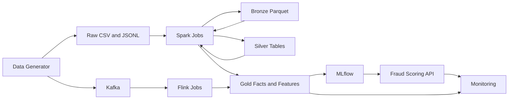

# FraudStream: Real-Time Financial Transaction Intelligence Platform

FraudStream is a data engineering and MLOps project for building a production-style fraud analytics platform. It generates realistic financial transaction data, preserves raw source behavior, and prepares the foundation for Spark, Flink, Parquet lakehouse processing, feature engineering, and model operations.

The project is built around a practical idea: fraud detection depends on reliable data pipelines before any model can be trusted. Real transaction systems produce late records, duplicates, schema changes, traffic spikes, high-cardinality IDs, skewed entities, and messy source values. FraudStream turns those problems into controlled, reproducible engineering scenarios.

## What This Project Demonstrates

FraudStream focuses on the data platform skills behind fraud analytics:

- realistic batch and streaming transaction data generation
- source-style raw data preservation before cleaning
- Kafka replay for real-time processing development
- Spark-oriented offline processing path from raw files to Parquet
- Flink-oriented streaming path from Kafka events to event-time logic
- deliberate data quality issues for Bronze, Silver, and Gold layers
- reproducible configs, manifests, and summary artifacts for validation

Detailed generator behavior, schemas, and configuration notes live in the `docs/` directory so the README can stay focused on the project as a whole.

## Current Implementation

The repository currently includes:

| Component | Purpose | Details |
|---|---|---|
| Offline transaction generator | Creates partitioned raw CSV transaction extracts with realistic source problems | [docs/01_data_generator.md](docs/01_data_generator.md) |
| Streaming transaction generator | Creates a reproducible JSONL event log that behaves like a Kafka topic export | [docs/02_streaming_generator.md](docs/02_streaming_generator.md) |
| Kafka replay producer | Publishes generated stream events to Kafka for future Flink jobs | [docs/02_streaming_generator.md](docs/02_streaming_generator.md) |
| Local Kafka stack | Runs Kafka, topic initialization, and Kafka UI with Docker Compose | [docker-compose.yml](docker-compose.yml) |
| Bronze transaction ingestion | Reads raw offline CSV partitions and writes metadata-rich Bronze Parquet | [docs/03_bronze_ingestion.md](docs/03_bronze_ingestion.md) |
| Silver transaction deduplication | Cleans typed transaction fields and writes one deterministic row per transaction ID | [docs/04_silver_transactions.md](docs/04_silver_transactions.md) |
| PostgreSQL serving schema | Creates Bronze, Silver, Gold, and metadata schemas for DBeaver and governance workflows | [docs/05_gold_tables.md](docs/05_gold_tables.md) |

Default configs generate more than 500,000 offline rows and more than 500,000 streaming records. Generated evidence files such as `_manifest.json`, `_quality_summary.json`, and `_stream_summary.json` capture row counts, quality issues, timing behavior, partitions, and output metadata.

## Architecture

FraudStream separates source simulation from processing layers. Raw CSV and JSONL files represent producer-owned source data. Spark will handle offline ingestion and Parquet transformation. Kafka and Flink support the streaming path.



The intended lakehouse flow is:

```text
raw source data -> Bronze Parquet -> Silver clean tables -> Gold features -> model and monitoring workflows
```

## Data Design

The offline path writes raw CSV partitions under:

```text
data/raw_source/offline_transactions/
```

These files simulate source-system extracts. They intentionally include duplicates, late arrivals, missing values, inconsistent formats, skew, high-cardinality IDs, fraud labels, and schema evolution.

The streaming path writes a local event log under:

```text
data/raw_stream/transactions/topic=financial_transactions/events.jsonl
```

That log can be replayed into Kafka topic `financial_transactions`. Each event keeps separate event time and production time fields so later Flink jobs can practice event-time windows, watermarks, deduplication, and late-event handling.

## Repository Structure

```text
financial-fraud-detection/
├── configs/generator/        # Generator runtime configs
├── data/                     # Generated local data outputs
├── docs/                     # Detailed implementation documentation
├── src/fraudstream/          # Python source code
│   ├── generators/           # Offline and streaming generators
│   └── producers/            # Kafka replay producer
├── tests/unit/               # Unit tests
├── docker-compose.yml        # Local Kafka stack
├── main.py
├── pyproject.toml
└── uv.lock
```

Generated data is reproducible output. Do not manually edit generated partitions or topic logs; update the generator or config and regenerate.

## Setup

FraudStream targets Python `>=3.14`.

Create and sync the local environment with `uv`:

```bash
uv sync
```

Install the optional Kafka dependency when using the replay producer:

```bash
uv sync --extra kafka
```

Install the optional Spark dependency when working on Bronze ingestion:

```bash
uv sync --extra spark
```

Install the optional PostgreSQL dependency when publishing Parquet outputs into
the local serving database:

```bash
uv sync --extra postgres
```

To keep Kafka, Spark, and PostgreSQL publishing extras installed locally:

```bash
uv sync --extra kafka --extra spark --extra postgres
```

Run commands from the repository root. During local development, commands use `PYTHONPATH=src` so the `fraudstream` package is importable without a full packaging workflow.

## Quick Start

Generate offline raw transaction data:

```bash
PYTHONPATH=src python -m fraudstream.generators.offline_transactions
```

Generate streaming event data:

```bash
PYTHONPATH=src python -m fraudstream.generators.streaming_transactions
```

Start local Kafka:

```bash
docker compose up -d kafka kafka-topic-init kafka-ui
```

Kafka listens on `localhost:9092`. Kafka UI is available at:

```text
http://localhost:18080
```

Start local PostgreSQL and create the serving schemas:

```bash
docker compose up -d postgres postgres-schema-init
```

PostgreSQL is available for DBeaver at `localhost:5432`, database
`fraudstream`, user `fraudstream`.

Replay generated events to Kafka:

```bash
PYTHONPATH=src python -m fraudstream.producers.stream_replay \
  --bootstrap-servers localhost:9092 \
  --topic financial_transactions \
  --events-per-second 5000
```

Verify local Spark execution:

```bash
PYTHONPATH=src python -m fraudstream.jobs.spark_local_check
```

Ingest raw offline CSV files into Bronze Parquet:

```bash
PYTHONPATH=src python -m fraudstream.jobs.bronze.ingest_transactions
```

Build deduplicated Silver transaction Parquet:

```bash
PYTHONPATH=src python -m fraudstream.jobs.silver.transactions
```

Build Gold transaction facts, dimensions, aggregates, and feature tables:

```bash
PYTHONPATH=src python -m fraudstream.jobs.gold.transactions
```

Publish Silver Parquet into PostgreSQL:

```bash
PYTHONPATH=src python -m fraudstream.jobs.postgres.publish --layer silver
```

Publish Gold Parquet into PostgreSQL:

```bash
PYTHONPATH=src python -m fraudstream.jobs.postgres.publish --layer gold
```

Stop the local Kafka stack:

```bash
docker compose down
```

## Validation

Run the current unit tests:

```bash
PYTHONPATH=src python -m unittest \
  tests.unit.test_offline_transactions \
  tests.unit.test_streaming_transactions \
  tests.unit.test_stream_replay \
  tests.unit.test_bronze_ingest_transactions \
  tests.unit.test_silver_transactions
```

Run a syntax and import compile check:

```bash
PYTHONPATH=src python -m compileall -q src tests main.py
```

## Documentation

Use the README for the project-level view. Use the docs for implementation details:

| Document | Covers |
|---|---|
| [docs/01_data_generator.md](docs/01_data_generator.md) | Offline generator behavior, configuration, output layout, and Bronze ingestion contract |
| [docs/02_streaming_generator.md](docs/02_streaming_generator.md) | Streaming generator, Kafka replay, event shape, streaming problems, and Flink contract |
| [docs/03_bronze_ingestion.md](docs/03_bronze_ingestion.md) | Bronze transaction schema, metadata fields, partitioning, and raw-preservation rules |
| [docs/04_silver_transactions.md](docs/04_silver_transactions.md) | Silver transaction schema, cleaned types, standardization, deduplication, and quality rules |
| [docs/05_gold_tables.md](docs/05_gold_tables.md) | Gold fact, dimension, OBT, feature, and PostgreSQL serving schema design |

## Engineering Direction

The next offline layer is Spark ingestion from raw CSV into Bronze Parquet, followed by Silver cleaning and Gold feature tables. The next streaming layer is a Flink job that consumes `financial_transactions` from Kafka, applies event-time processing, deduplicates events, and validates late or out-of-order behavior.

The long-term platform direction is an end-to-end fraud data system with orchestration, lineage, feature generation, model tracking, scoring, and monitoring built around the generated transaction data.
