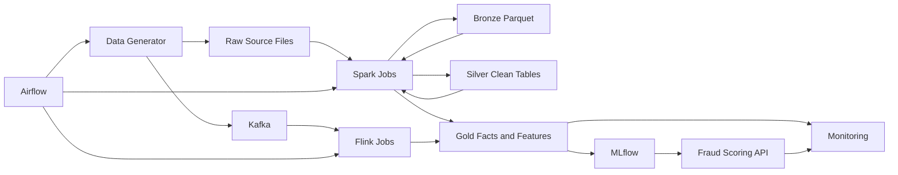

# FraudStream: Real-Time Financial Transaction Intelligence Platform

FraudStream is a data engineering and MLOps project for building a production-style fraud analytics platform. It simulates messy financial transaction data, preserves raw source records, and prepares the foundation for Spark-based lakehouse processing, fraud feature engineering, model training, and operational monitoring.

The project is built around a common real-world problem: fraud models depend on reliable data long before model training begins. Transaction data can arrive late, duplicate, shift schema, spike during short traffic bursts, contain missing values, or become heavily skewed toward a few merchants and cities. FraudStream turns those problems into explicit engineering requirements.

## What This Project Demonstrates

FraudStream is designed to show practical data platform skills:

- synthetic but realistic financial transaction data generation
- source-style raw data partitioning and reproducible generator configuration
- high-cardinality identifiers for customer, account, merchant, transaction, and device entities
- realistic data quality issues for downstream Bronze and Silver processing
- schema evolution across historical source partitions
- event-time and arrival-time semantics with `event_timestamp` and `created_ts`
- a lakehouse-oriented path toward Parquet, Spark, feature tables, and model operations

## Current Implementation

The current repository implements the offline source data generator. It creates partitioned CSV files under:

```text
data/raw_source/offline_transactions/
```

The generated source dataset currently contains:

| Metric | Value |
|---|---:|
| Base transactions | 500,000 |
| Rows after duplicate injection | 510,000 |
| Daily CSV partitions | 180 |
| Local output size | ~85 MB |
| Duplicate rows | 10,000 |
| Late-arriving rows | 20,574 |
| Rows with missing values | 7,655 |
| Rows with inconsistent formats | 5,076 |
| Fraud rows | 7,803 |
| Fraud-ring rows | 3,060 |
| Distinct customers | 197,404 |
| Distinct merchants | 40,000 |
| Distinct devices | 193,863 |

The generator writes evidence artifacts next to the source data:

```text
data/raw_source/offline_transactions/_manifest.json
data/raw_source/offline_transactions/_quality_summary.json
data/raw_source/offline_transactions/_quality_summary.csv
```

## System Architecture

FraudStream follows a layered data platform design. The current implementation produces the raw source data. The processing architecture is designed to extend into Spark, Flink, Airflow, DataHub, MLflow, and monitoring components.



## Data Lake Design

The project separates source data from analytical storage formats.

| Layer | Storage Intent | Example Tables |
|---|---|---|
| Raw source | Source-style CSV extracts, kept close to the producer format | `offline_transactions` files |
| Bronze | Ingested Parquet with source metadata and minimal transformation | `raw_transactions` |
| Silver | Cleaned, typed, deduplicated, schema-aligned Parquet | `stg_transactions`, `stg_customers`, `stg_merchants` |
| Gold | Business-ready facts, dimensions, and ML feature tables | `fact_transactions`, `dim_customer_scd2`, `feat_customer_transaction_rolling` |

CSV is intentionally used at the raw source boundary because many production systems ingest files from external systems before converting them into analytical formats. Spark jobs should read the raw CSV partitions, preserve source metadata, and write Bronze Parquet for efficient downstream processing.

## Transaction Source Design

Each generated row represents one transaction event at source-system grain.

Core columns include:

```text
transaction_id
account_id
customer_id
merchant_id
merchant_category
amount
currency
city
channel
transaction_status
is_fraud
event_timestamp
created_ts
```

Newer source partitions add evolved columns:

```text
device_id
ip_address
authentication_method
risk_signal_version
```

The generator uses two timestamps deliberately:

| Column | Meaning |
|---|---|
| `event_timestamp` | When the transaction actually happened. Use this for business logic, windows, features, and point-in-time correctness. |
| `created_ts` | When the record was produced or arrived. Use this for ingestion behavior, late-arrival analysis, and pipeline freshness. |

## Simulated Data Engineering Problems

The offline generator creates realistic, solvable data problems for Spark and lakehouse processing.

| Problem | How FraudStream Simulates It | Downstream Handling |
|---|---|---|
| Duplicates | Repeats a controlled percentage of source rows | Deduplicate in Silver by `transaction_id` |
| Late arrivals | Delays some `created_ts` values by more than 60 minutes | Use event-time logic and arrival-time monitoring |
| Schema evolution | Adds device/IP/auth columns after `schema_change_date` | Read old and new partitions with nullable evolved columns |
| Skew | Concentrates volume in New York and online marketplace transactions | Test Spark joins, partitioning, and aggregation behavior |
| High cardinality | Generates hundreds of thousands of customer/device IDs | Exercise joins, feature grouping, and distinct-count validation |
| Missing values | Blanks selected city, merchant, device, IP, or auth fields | Validate and standardize in Silver |
| Inconsistent formats | Injects padded cities, uppercase statuses, and lowercase currency | Normalize strings during cleaning |
| Bursty traffic | Sends a larger share of records to selected burst dates | Test partition imbalance and workload spikes |
| Fraud-ring behavior | Reuses suspicious device/IP pairs across risky transactions | Build fraud features around entity reuse and velocity |

## Repository Structure

```text
financial-fraud-detection/
├── AGENTS.md
├── README.md
├── configs/
│   └── generator/
├── data/
│   └── raw_source/
├── docs/
├── src/
│   └── fraudstream/
│       └── generators/
├── tests/
│   └── unit/
├── main.py
├── pyproject.toml
└── uv.lock
```

Important paths:

| Path | Purpose |
|---|---|
| `configs/generator/offline_transactions.json` | Runtime configuration for offline data generation |
| `src/fraudstream/generators/offline_transactions.py` | Offline transaction generator implementation |
| `data/raw_source/offline_transactions/` | Generated source-style transaction files |
| `docs/01_data_generator.md` | Detailed generator design and run documentation |
| `tests/unit/test_offline_transactions.py` | Unit coverage for generator behavior and evidence artifacts |

## Run Locally

Generate the default offline transaction dataset:

```bash
PYTHONPATH=src python -m fraudstream.generators.offline_transactions
```

Run through the project entry point:

```bash
PYTHONPATH=src python main.py
```

Write generated data to a temporary output directory:

```bash
PYTHONPATH=src python -m fraudstream.generators.offline_transactions \
  --output-dir /tmp/fraudstream_offline_transactions
```

Run unit tests:

```bash
PYTHONPATH=src python -m unittest tests.unit.test_offline_transactions
```

Run a syntax/import compile check:

```bash
PYTHONPATH=src python -m compileall -q src tests main.py
```

## Configuration

The default generator configuration lives at:

```text
configs/generator/offline_transactions.json
```

Key settings:

| Setting | Purpose |
|---|---|
| `n_transactions` | Unique base transaction count before duplicate injection |
| `n_customers`, `n_accounts`, `n_merchants` | Controls entity cardinality |
| `days_history` | Number of generated transaction dates |
| `skew_city_ratio` | Controls geographic skew |
| `skew_merchant_category_ratio` | Controls merchant-category skew |
| `duplicate_rate` | Controls repeated raw rows |
| `late_arrival_rate` | Controls delayed source records |
| `missing_value_rate` | Controls blank values in selected fields |
| `inconsistent_format_rate` | Controls easy-to-clean string format issues |
| `burst_day_count` | Controls number of high-volume dates |
| `fraud_ring_count` | Controls suspicious reused device/IP pairs |
| `schema_change_date` | Splits old and evolved source schemas |

## Engineering Direction

The next engineering layer is Spark ingestion from raw CSV into Bronze Parquet. That job should preserve source records, add ingestion metadata, handle schema evolution, and write partitioned Parquet. Silver processing should then deduplicate records, standardize formats, enforce types, and prepare clean transaction data for Gold feature tables.

This keeps the project aligned with a production data platform pattern:

```text
raw source files -> Bronze Parquet -> Silver clean tables -> Gold facts/features -> model training and monitoring
```