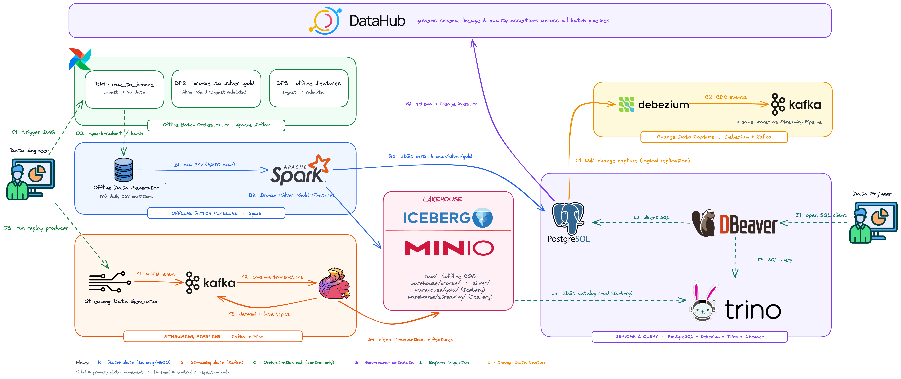
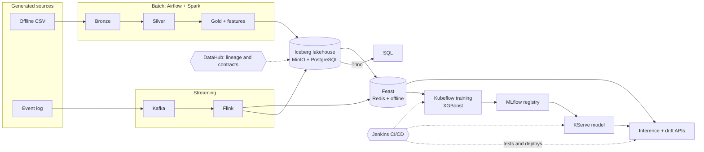

# FraudStream

**An end-to-end fraud detection platform that runs on a laptop.** Messy batch and
streaming transactions go in. A tested, autoscaled, CI/CD-deployed fraud model comes
out, with data quality, lineage and event-time correctness kept intact along the way.

A fraud model is only as good as the pipelines feeding it. Real transaction data has
late records, duplicates, schema changes, spikes and skew, so this project generates
those problems on purpose and builds the whole MLOps loop around handling them.



## Highlights

- **One lakehouse, two engines.** Spark (batch) and Flink (streaming) write to the same
  Iceberg catalog on MinIO, and Trino queries both. A fraud label that arrives weeks late
  joins the exact streaming features from that moment with a single query.
- **Event-time streaming done properly.** Flink dedupes, windows and handles late data
  using a watermark calibrated from measured p95 delay, not a guess.
- **Point-in-time-safe features.** Eight explicit leakage rules, and a Feast store (Redis
  online, Iceberg offline) so training and serving see the same features.
- **Real orchestration and governance.** Asset-driven Airflow DAGs with validation gates
  that stop bad data early. DataHub shows lineage, contracts and quality results.
- **Reproducible ML.** Distributed XGBoost on Kubeflow. Every model in MLflow is linked to
  the Iceberg snapshot of the exact rows it trained on.
- **Production-style serving.** KServe (scale-to-zero), an inference API and a drift API on
  Kubernetes, with KEDA autoscaling and automatic Helm rollback.
- **A real front door.** Every API sits behind an NGINX gateway with its own domain,
  HTTPS from a local CA, basic auth and a per-client rate limit. CI checks all four after
  each deploy and rolls back an API left open.
- **Tested with numbers.** 100% line and branch coverage on both APIs, 86% mutation score,
  property-based tests, and a load test judged against an SLA fixed in advance.
- **CI/CD.** Jenkins tests every branch and deploys the deploy branch. Every image is
  tagged with its commit, and secrets never leave Jenkins.
- **Measured, not claimed.** Spark AQE and Flink chaining experiments are captured from
  the runtime UIs, with before and after numbers.

## How it fits together


```mermaid
flowchart LR
    subgraph Sources["Generated sources"]
        csv[Offline CSV]
        events[Event log]
    end

    subgraph Batch["Batch: Airflow + Spark"]
        bronze[Bronze] --> silver[Silver] --> gold[Gold + features]
    end

    subgraph Stream["Streaming"]
        kafka[Kafka] --> flink[Flink]
    end

    lake[("Iceberg lakehouse<br/>MinIO + PostgreSQL")]
    feast[("Feast<br/>Redis + offline")]
    train["Kubeflow training<br/>XGBoost"]
    mlflow[MLflow registry]
    serve["KServe model"]
    apis["Inference + drift APIs"]

    csv --> bronze
    events --> kafka
    gold --> lake
    flink --> lake
    lake -->|Trino| sql[SQL]
    lake --> feast
    flink --> feast
    feast --> train --> mlflow --> serve --> apis
    feast --> apis

    datahub{{DataHub: lineage and contracts}} -.-> lake
    jenkins{{Jenkins CI/CD}} -.->|tests and deploys| apis
    jenkins -.-> serve
    jenkins -.-> train
```

## What's inside

| Area | What it does | Docs                                                                                                                                                                                      |
|---|---|-------------------------------------------------------------------------------------------------------------------------------------------------------------------------------------------|
| Data generators | 510,000 offline rows and 512,500 stream events with controlled duplicates, late and out-of-order data, skew and schema change | [01_offline_data_generator.md](docs/01_offline_data_generator.md)<br>[02_streaming_data_generator.md](docs/02_streaming_data_generator.md)                                                |
| Bronze, Silver, Gold | Raw preserved, then cleaned and deduplicated, then a star schema with daily aggregates. Written to Iceberg and PostgreSQL | [03_bronze_ingestion.md](docs/03_bronze_ingestion.md)<br>[04_silver_transactions.md](docs/04_silver_transactions.md)<br>[05_gold_tables.md](docs/05_gold_tables.md)                       |
| Feature engineering | Velocity, merchant risk, amount anomaly, device/IP reuse and late-arrival features | [06_feature_engineering.md](docs/06_feature_engineering.md)                                                                                                                               |
| Flink streaming | Validation, dedup, five-minute windows, late-event handling and alerts | [07_flink_streaming_pipeline.md](docs/07_flink_streaming_pipeline.md)<br>[08_flink_window_processing.md](docs/08_flink_window_processing.md)                                              |
| Orchestration | Three Airflow DAGs linked by validated data assets | [09_orchestration_flow.md](docs/09_orchestration_flow.md)<br>[10_airflow_workflow_demonstration.md](docs/10_airflow_workflow_demonstration.md)                                            |
| Governance | DataHub catalog, lineage, contracts and assertions; database ERDs; quality report | [11_data_governance_datahub.md](docs/11_data_governance_datahub.md)<br>[12_database_schema.md](docs/12_database_schema.md)<br>[13_data_quality_report.md](docs/13_data_quality_report.md) |
| Lakehouse and CDC | Iceberg on MinIO, Trino, and Debezium change capture | [14_lakehouse_iceberg.md](docs/14_lakehouse_iceberg.md)<br>[15_change_data_capture.md](docs/15_change_data_capture.md)                                                                    |
| Feature store | Feast with Redis online store and incremental materialization | [16_feature_store.md](docs/16_feature_store.md)                                                                                                                                           |
| Model training | XGBoost against a logistic baseline, split by date, and a Kubeflow pipeline | [17_ml_training.md](docs/17_ml_training.md)<br>[18_ml_pipeline.md](docs/18_ml_pipeline.md)                                                                                                |
| Versioning | MLflow registry tied to Iceberg data snapshots | [19_versioning.md](docs/19_versioning.md)                                                                                                                                                 |
| Kubernetes platform | Ingress with HTTPS, KEDA, Knative, and KServe | [20_local_k8s_platform.md](docs/20_local_k8s_platform.md)                                                                                                                                 |
| Web APIs | Inference and drift detection, with Helm rollout and rollback | [21_web_apis.md](docs/21_web_apis.md)                                                                                                                                                     |
| Testing | Coverage, mutation, property-based and load testing | [22_validation_and_verification.md](docs/22_validation_and_verification.md)                                                                                                               |
| CI/CD | Jenkins pipeline with a before and after of a real deploy | [23_ci_cd.md](docs/23_ci_cd.md)                                                                                                                                                           |
| Gateway | NGINX with a domain, HTTPS, basic auth and a rate limit in front of every web API | [24_gateway.md](docs/24_gateway.md)                                                                                                                                                       |
| Performance | Measured Spark and Flink tuning | [silver_job_optimization.md](docs/optimization/spark/silver_job_optimization.md)<br>[streaming_job_optimization.md](docs/optimization/flink/streaming_job_optimization.md)                |

## Quick start

You need Docker with Compose, Java, and [`uv`](https://docs.astral.sh/uv/) (root project
targets Python 3.14). Flink, Airflow, DataHub, Feast and the ML pieces each run in their
own isolated environment, because their Python versions don't match.

```bash
uv sync --extra kafka --extra spark --extra storage

# infrastructure
docker compose up -d minio minio-bucket-init postgres postgres-schema-init kafka kafka-topic-init kafka-ui

# generate data, then build the layers
PYTHONPATH=src python -m fraudstream.generators.offline_transactions
PYTHONPATH=src python -m fraudstream.generators.streaming_transactions
PYTHONPATH=src python -m fraudstream.jobs.bronze.ingest_transactions
PYTHONPATH=src python -m fraudstream.jobs.silver.transactions
PYTHONPATH=src python -m fraudstream.jobs.gold.transactions
```

Prefer orchestration? Start Airflow and trigger `fraudstream_raw_to_bronze` at
`http://localhost:18081`. The other DAGs follow on their own.

```bash
docker compose --profile orchestration up --build -d \
  airflow-db airflow-init airflow-api-server airflow-dag-processor airflow-scheduler
```

Everything else has its own run instructions in the docs above: Flink
([07](docs/07_flink_streaming_pipeline.md#run-locally)), Trino
([15](docs/14_lakehouse_iceberg.md#trino-querying-iceberg-tables)), DataHub
([11](docs/11_data_governance_datahub.md)), Feast ([17](docs/16_feature_store.md)) and
the Kubernetes stack ([21](docs/20_local_k8s_platform.md)). Add `--spark-ui` to any Spark
job, or `--flink-ui` to the Flink job, to watch it run. Stop the services with
`docker compose down`.

| Service | URL |
|---|---|
| Kafka UI | `http://localhost:18080` |
| Airflow | `http://localhost:18081` |
| Flink UI | `http://localhost:8081` |
| MinIO console | `http://localhost:19001` |
| DataHub | `http://localhost:9002` |
| Inference API | `https://inference.fraudstream.localhost` (gateway password) |
| Drift detection API | `https://drift-detection.fraudstream.localhost` (gateway password) |
| PostgreSQL | `localhost:5432`, database `fraudstream` |

Credentials are local-development defaults (`fraudstream` / `fraudstream_local_password`).

## Tests

```bash
PYTHONPATH=src python -m unittest discover -s tests/unit -p 'test_*.py'
```

The API suites, mutation tests and load test are covered in
[docs/23](docs/22_validation_and_verification.md), and CI runs all of them
([docs/24](docs/23_ci_cd.md)).

## Repository layout

```text
fraudstream/
├── airflow/                  # Airflow DAGs, shared configuration, and local runtime
├── api/                      # Isolated Python 3.12 web APIs: fraud inference and drift detection
│   └── loadtest/             # Locust load test and its SLA check
├── configs/                  # Generator configs and measured Flink latency profile
├── data/                     # Local raw source/stream generator output and job JSON summaries
├── datahub/                  # Isolated DataHub runtime, contracts, lineage, and assertions
├── docs/                     # Detailed implementation documentation
├── feature_store/            # Isolated Python 3.12 Feast runtime, feature repo, and push job
├── flink/                    # Isolated Python 3.12 PyFlink runtime and connector location
├── images/                   # Architecture and captured UI evidence
├── infra/postgres/           # PostgreSQL schema initialization SQL
├── k8s/                      # kind cluster bootstrap, service images, pipeline RBAC
│   ├── apis/                 # Helm values for the inference and drift detection releases
│   ├── charts/               # One Helm chart shared by both web APIs
│   ├── platform/             # Settings for the ingress, cert-manager, metrics-server, and KServe
│   ├── models/               # KServe InferenceService for the fraud model
│   └── smoke/                # Checks for ingress, HTTPS, KEDA, and Knative
├── ml/                       # Isolated Python 3.12 training runtime, notebook, and saved model
├── pipelines/                # Isolated Python 3.12 Kubeflow Pipelines definition and submitter
├── reports/                  # Generated human-readable reports and load test results
├── serving/                  # Isolated Python 3.12 predictor that serves the fraud model on KServe
├── src/fraudstream/          # Python source code
│   ├── generators/           # Offline and streaming generators
│   ├── jobs/                 # Spark, Flink, and shared MinIO/PostgreSQL warehouse helpers
│   ├── orchestration/        # Reusable Airflow validation functions
│   ├── producers/            # Kafka replay producer
│   └── reports/              # Data-quality report generator
├── tests/unit/               # Unit tests
├── docker-compose.yml        # Local Kafka, MinIO, PostgreSQL, and Airflow services
├── main.py
├── pyproject.toml
└── uv.lock
```

Generated data is reproducible output. Change the generator or its config and
regenerate instead of editing partitions by hand.
