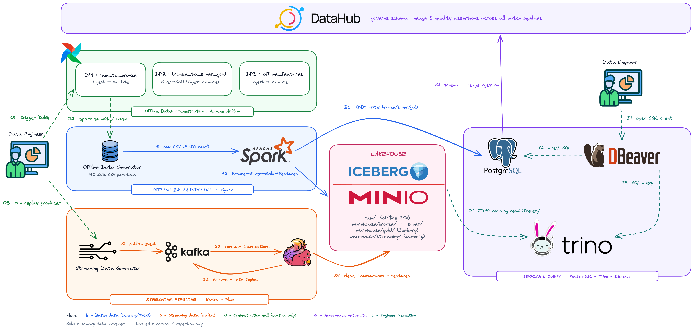

# FraudStream: Real-Time Financial Transaction Intelligence Platform

FraudStream is a data engineering project for building production-style fraud
analytics pipelines. It uses Python, Spark, Kafka, Flink, Airflow, MinIO,
PostgreSQL, and DataHub to process realistic batch and streaming transactions
while preserving data quality, event-time correctness, and lineage.

The project is built around a practical idea: fraud detection depends on reliable data pipelines before any model can be trusted. Real transaction systems produce late records, duplicates, schema changes, traffic spikes, high-cardinality IDs, skewed entities, and messy source values. FraudStream turns those problems into controlled, reproducible engineering scenarios.

## What This Project Demonstrates

FraudStream focuses on the data platform skills behind fraud analytics:

- realistic batch and streaming transaction data generation
- source-style raw data preservation before cleaning
- Kafka replay for real-time processing development
- Spark-oriented offline processing path from raw files to Parquet in MinIO
- Flink-oriented streaming path from Kafka events to event-time logic
- deliberate data quality issues for Bronze, Silver, and Gold layers
- reproducible configs, manifests, and summary artifacts for validation
- asset-aware Airflow orchestration for the offline batch dependencies
- direct Spark-to-PostgreSQL JDBC writes for engineering and analytical inspection
- DataHub catalog, lineage, contract properties, and validation assertions
- Spark UI and Flink UI performance analysis with captured baseline and optimized runs
- evidence-driven offline and streaming data-quality reporting

Detailed generator behavior, schemas, and configuration notes live in the `docs/` directory so the README can stay focused on the project as a whole.

## Current Implementation

The repository currently includes:

| Component | Purpose | Details |
|---|---|---|
| Offline transaction generator | Creates partitioned raw CSV extracts containing controlled duplicates, late arrivals, skew, schema evolution, and malformed values | [docs/01_offline_data_generator.md](docs/01_offline_data_generator.md) |
| Streaming transaction generator and replay | Creates deterministic JSONL events with bursts, out-of-order arrivals, late events, and duplicates, then replays them to Kafka | [docs/02_streaming_data_generator.md](docs/02_streaming_data_generator.md) |
| Local Kafka stack | Runs Kafka, topic initialization, and Kafka UI with Docker Compose | [docker-compose.yml](docker-compose.yml) |
| Local MinIO stack | Runs an S3-compatible object store and bucket initialization for Bronze/Silver/Gold/feature Parquet | [docker-compose.yml](docker-compose.yml) |
| Bronze transaction ingestion | Reads raw offline CSV partitions and writes metadata-rich Bronze Parquet to MinIO, then writes the ingest-run and raw-transaction tables directly to PostgreSQL over JDBC | [docs/03_bronze_ingestion.md](docs/03_bronze_ingestion.md) |
| Silver transaction deduplication | Cleans typed transaction fields, writes one deterministic row per transaction ID to MinIO, and writes the selected and quality-evidence tables directly to PostgreSQL over JDBC | [docs/04_silver_transactions.md](docs/04_silver_transactions.md) |
| Core Gold model | Builds dimensions, transaction facts, quality facts, and daily customer, account, merchant, city/category, and device/IP aggregates in MinIO, then writes every table directly to PostgreSQL over JDBC | [docs/05_gold_tables.md](docs/05_gold_tables.md) |
| Offline feature job | Builds point-in-time-safe customer velocity, amount anomaly, merchant risk, device/IP reuse, late-arrival, and transaction-training features from persisted core Gold facts, writing MinIO Parquet and PostgreSQL tables directly | [docs/06_feature_engineering.md](docs/06_feature_engineering.md) |
| Flink streaming feature job | Validates and deduplicates Kafka events, loads a measured p95 watermark delay, computes five-minute customer and merchant features, handles late data, and emits alerts | [docs/07_flink_streaming_pipeline.md](docs/07_flink_streaming_pipeline.md) |
| PostgreSQL serving layer | Creates metadata, Bronze, Silver, and Gold schemas that each Spark job writes into directly over JDBC | [docs/05_gold_tables.md](docs/05_gold_tables.md) |
| Airflow batch orchestration | Runs raw-to-Bronze, Bronze-to-Silver/Gold, and offline-feature DAGs with validation gates and asset dependencies | [docs/09_orchestration_flow.md](docs/09_orchestration_flow.md) |
| DataHub governance | Catalogs the three batch pipelines, PostgreSQL schemas, table lineage, versioned contracts, and measured validation assertions | [docs/11_data_governance_datahub.md](docs/11_data_governance_datahub.md) |
| Generated data quality report | Generates a readable HTML report of offline and streaming characteristics from existing evidence artifacts | [docs/13_data_quality_report.md](docs/13_data_quality_report.md) |
| Performance evidence | Documents measured Spark AQE/shuffle tuning and Flink chaining/parallelism experiments from their runtime UIs | [Spark](docs/optimization/spark/silver_job_optimization.md) and [Flink](docs/optimization/flink/streaming_job_optimization.md) |
| Database schema diagrams | Demonstrates the physical Bronze, Silver, and Gold models exported from DBeaver | [docs/12_database_schema.md](docs/12_database_schema.md) |

The deterministic default configurations produce 510,000 raw offline rows
(500,000 base transactions plus 10,000 duplicate rows) and 512,500 streaming
records (500,000 base events plus 12,500 duplicate replays). Generated manifests
and layer summaries record row counts, quality issues, timing behavior,
partitions, and output metadata.

## Architecture

FraudStream has two implemented processing paths that both write into a shared
**Apache Iceberg lakehouse on MinIO** -- Airflow orchestrates raw-data
generation and the Spark jobs that build Iceberg tables, and the streaming path
replays generated events through Kafka and uses PyFlink to produce cleaned
events, windowed features, late-event records, and fraud alerts, both as Kafka
topics and as upserts into the same Iceberg tables Spark reads and writes. See
[Lakehouse: Apache Iceberg on MinIO](docs/15_lakehouse_iceberg.md) for how the
two engines share one catalog and how to run it.



The implemented offline data flow is:

```text
raw CSV in MinIO -> Spark (Bronze -> Silver -> Gold -> Features) -> Iceberg tables in MinIO
                                                                  -> PostgreSQL (direct JDBC write)
```

Each Bronze, Silver, Gold, and offline-feature Spark job reads and writes its
own Iceberg table in MinIO and writes its own PostgreSQL tables directly over
JDBC at the end of its run; there is no separate publisher step. **Trino**
queries the Iceberg tables directly (same JDBC catalog Spark/Flink use, no
Hive Metastore) -- see
[Lakehouse: Apache Iceberg on MinIO](docs/15_lakehouse_iceberg.md#trino-querying-iceberg-tables).

The implemented streaming flow is:

```text
JSONL event log -> Kafka -> PyFlink -> derived Kafka topics
                                     -> Iceberg tables in MinIO (clean transactions, customer/merchant features)
```

Both paths write into the same Iceberg catalog, so a table Spark builds in a
batch run and a table Flink upserts into in real time are queryable together --
the delayed-label join a fraud model needs (today's streaming features joined
weeks later against a confirmed fraud/chargeback label) is a single query
across both, not a data-movement job. Airflow currently orchestrates the batch
path only. DataHub catalogs the PostgreSQL schemas and publishes governance
metadata for the three batch pipelines.

The local runtimes are deliberately isolated because their Python requirements
do not match:

| Runtime | Version boundary | Responsibility |
|---|---|---|
| Root `uv` project | Python `>=3.14`; PySpark 4.1.x optional | Generators, replay, Spark layers, quality report, and unit tests |
| `flink/` project | Python 3.12; Apache Flink 2.1.3 | PyFlink Kafka streaming job, Iceberg lakehouse sink, and local Flink UI |
| Airflow containers | Airflow 3.3.0 on Python 3.12; PySpark 4.1.2 | Offline DAG parsing, scheduling, task execution, and validation gates |
| `datahub/` project | Python 3.11; DataHub 1.6.0 | PostgreSQL metadata ingestion and custom governance publication |

Docker Compose provides the `confluentinc/cp-kafka:7.7.1` image, Kafka UI,
MinIO (S3-compatible object storage backing the Iceberg lakehouse), PostgreSQL
16, Trino (SQL query engine over the Iceberg tables), and the optional Airflow
profile. Spark reaches PostgreSQL, MinIO, and the
Iceberg catalog through the `org.postgresql:postgresql`,
`org.apache.hadoop:hadoop-aws`, and `org.apache.iceberg:iceberg-spark-runtime`
JDBC/S3A/Iceberg drivers, fetched automatically via `spark.jars.packages`.
PyFlink reaches the same catalog through the equivalent JARs, checked in
manually (see [docs/15](docs/15_lakehouse_iceberg.md)) since Flink has no
`spark.jars.packages`-style auto-fetch. DataHub runs through its separate
Docker quickstart wrapper.

## Data Design

The offline path writes raw CSV partitions to MinIO:

```text
s3a://fraudstream/raw/offline_transactions/
```

Only the small manifest and quality-summary evidence files stay local, under
`data/raw_source/offline_transactions/`. These 180 daily CSV partitions
simulate source-system extracts. They intentionally include duplicates, late
arrivals, missing values, inconsistent formats, skew, high-cardinality IDs,
fraud labels, and a v1-to-v2 schema change.

The streaming path writes a local event log under:

```text
data/raw_stream/transactions/topic=financial_transactions/events.jsonl
```

That JSONL log represents a 24-partition Kafka topic and can be replayed into
`financial_transactions`. Each event keeps separate event and production times
so Flink can apply event-time windows, a bounded-out-of-orderness watermark
calibrated from measured p95 source delay, deduplication, and late-event handling.

Bronze, Silver, Gold, and offline-feature Parquet tables are not written to
local disk. Each Spark job writes them under one shared MinIO warehouse root:

```text
s3a://fraudstream/warehouse/bronze/raw_transactions
s3a://fraudstream/warehouse/silver/transactions
s3a://fraudstream/warehouse/silver/transaction_quality_issues
s3a://fraudstream/warehouse/gold/<table_name>
```

Local `data/bronze`, `data/silver`, and `data/gold` paths still exist for each
job's own JSON summary and quality-report evidence files, since those are
lightweight metadata rather than the bulk table data.

## Repository Structure

```text
fraudstream/
├── airflow/                  # Airflow DAGs, shared configuration, and local runtime
├── configs/                  # Generator configs and measured Flink latency profile
├── data/                     # Local raw source/stream generator output and job JSON summaries
├── datahub/                  # Isolated DataHub runtime, contracts, lineage, and assertions
├── docs/                     # Detailed implementation documentation
├── flink/                    # Isolated Python 3.12 PyFlink runtime and connector location
├── images/                   # Architecture and captured UI evidence
├── infra/postgres/           # PostgreSQL schema initialization SQL
├── reports/                  # Generated human-readable reports
├── src/fraudstream/          # Python source code
│   ├── generators/           # Offline and streaming generators
│   ├── jobs/                 # Spark, Flink, and shared MinIO/PostgreSQL warehouse helpers
│   ├── orchestration/        # Reusable Airflow validation functions
│   ├── producers/            # Kafka replay producer
│   └── reports/              # Data-quality report generator
├── tests/unit/               # Unit tests
├── docker-compose.yml        # Local Kafka, MinIO, PostgreSQL, and Airflow services
├── main.py
├── pyproject.toml
└── uv.lock
```

Generated data is reproducible output. Do not manually edit generated partitions or topic logs; update the generator or config and regenerate.

## Setup

The root project targets Python `>=3.14`. Local Spark and Flink execution also
requires Java. Maven is used once to download the Flink Kafka connector. Docker
with Compose is required for the local services.

Create and sync the local environment with `uv`:

```bash
uv sync
```

Install the optional Kafka dependency when using the replay producer:

```bash
uv sync --extra kafka
```

Install the optional Spark dependency when working on Bronze, Silver, Gold, or
offline feature jobs. Each job downloads its own MinIO (S3A) and PostgreSQL
JDBC driver jars automatically on first run through `spark.jars.packages`:

```bash
uv sync --extra spark
```

Install the optional `storage` dependency (`boto3`) when running the
generator or Bronze jobs, which now write/read raw CSV partitions in MinIO:

```bash
uv sync --extra storage
```

To keep the Kafka, Spark, and storage extras installed locally:

```bash
uv sync --extra kafka --extra spark --extra storage
```

Activate the root environment:

```bash
source .venv/bin/activate
```

Run commands from the repository root. They use `PYTHONPATH=src` so the
`fraudstream` package is importable without a separate packaging step.

## Quick Start

Start local MinIO first (see below) -- the generator writes raw CSV
partitions there, not to local disk. Then generate offline raw transaction
data:

```bash
PYTHONPATH=src python -m fraudstream.generators.offline_transactions
```

Generate streaming event data:

```bash
PYTHONPATH=src python -m fraudstream.generators.streaming_transactions
```

Start local Kafka:

```bash
docker compose up -d kafka kafka-topic-init kafka-ui
```

Kafka listens on `localhost:9092`. Kafka UI is available at:

```text
http://localhost:18080
```

Start local PostgreSQL and create the serving schemas:

```bash
docker compose up -d postgres postgres-schema-init
```

PostgreSQL is available for DBeaver at `localhost:5432`, database
`fraudstream`, user `fraudstream`, and password
`fraudstream_local_password`. These defaults are for local development only.

Start local MinIO and create the `fraudstream` bucket used for Bronze, Silver,
Gold, and offline-feature Parquet:

```bash
docker compose up -d minio minio-bucket-init
```

MinIO's S3 API is available at `localhost:19000` and its console at
`localhost:19001` (not MinIO's usual 9000/9001 -- see `docker-compose.yml`'s
comment on the `minio` service for why), using the same `fraudstream` / `fraudstream_local_password`
local-development defaults.

Start Trino to query Iceberg tables (`bronze.*`, `silver.*`, `gold.*`,
`streaming.*`) directly over SQL:

```bash
docker compose up -d trino
```

```bash
docker exec -it fraudstream-trino trino --catalog iceberg --schema bronze
```

See [`docs/15_lakehouse_iceberg.md`](docs/15_lakehouse_iceberg.md#trino-querying-iceberg-tables)
for the JDBC connection details and why no Hive Metastore is needed.

Prepare the isolated PyFlink environment and its connector JARs (Kafka, plus
Iceberg + PostgreSQL + hadoop-aws for the lakehouse sink -- see
[`docs/15_lakehouse_iceberg.md`](docs/15_lakehouse_iceberg.md) for what each
one is for and [`docs/07_flink_streaming_pipeline.md`](docs/07_flink_streaming_pipeline.md#run-locally)
for the full command list):

```bash
UV_CACHE_DIR=/tmp/fraudstream-uv-cache \
  uv sync --project flink --python 3.12

mvn dependency:copy \
  -Dartifact=org.apache.flink:flink-sql-connector-kafka:5.0.0-2.1 \
  -DoutputDirectory=flink/lib
```

Start the unbounded Flink feature job in one terminal:

```bash
PYTHONPATH=src UV_CACHE_DIR=/tmp/fraudstream-uv-cache \
  uv run --project flink --python 3.12 \
  python -m fraudstream.jobs.flink.transactions --flink-ui
```

The local Flink UI is available at `http://localhost:8081`. Replay the generated
events from another terminal:

```bash
PYTHONPATH=src python -m fraudstream.producers.stream_replay \
  --bootstrap-servers localhost:9092 \
  --topic financial_transactions \
  --events-per-second 5000
```

Ingest raw offline CSV files into Bronze Parquet in MinIO and write the
ingest-run and raw-transaction tables directly to PostgreSQL:

```bash
PYTHONPATH=src python -m fraudstream.jobs.bronze.ingest_transactions
```

Build deduplicated Silver transaction Parquet in MinIO and write the selected
and quality-evidence tables directly to PostgreSQL:

```bash
PYTHONPATH=src python -m fraudstream.jobs.silver.transactions
```

Add `--skip-postgres-write` to any job to build Parquet only, for example when
PostgreSQL is not running locally.

Generate a readable report from the offline generator, Silver, and streaming
evidence artifacts:

```bash
PYTHONPATH=src python -m fraudstream.reports.data_quality \
  --dataset all \
  --output reports/data_quality_report.html
```

Build Gold transaction facts, dimensions, aggregates, and feature tables in
MinIO, writing every table directly to PostgreSQL:

```bash
PYTHONPATH=src python -m fraudstream.jobs.gold.transactions
```

Alternatively, reproduce Airflow's separate core-Gold and offline-feature
boundaries:

```bash
PYTHONPATH=src python -m fraudstream.jobs.gold.transactions --core-only
PYTHONPATH=src python -m fraudstream.jobs.gold.offline_features
```

Start Airflow for the three batch DAGs:

```bash
docker compose --profile orchestration up --build -d \
  airflow-db airflow-init airflow-api-server \
  airflow-dag-processor airflow-scheduler
```

The Airflow DAGs are an orchestrated alternative to running the batch commands
manually. Each Spark task writes its own Parquet to MinIO and its own tables to
PostgreSQL directly, the same as running the commands by hand.

Open `http://localhost:18081`, unpause the three `fraudstream_*` DAGs, and
trigger `fraudstream_raw_to_bronze`. Validated asset events start the other DAGs
in order. See [docs/09_orchestration_flow.md](docs/09_orchestration_flow.md).

Start DataHub and publish the governed batch-pipeline catalog:

```bash
uv sync --project datahub --python 3.11
docker compose up -d postgres postgres-schema-init
./datahub/scripts/start.sh
./datahub/scripts/publish.sh
```

Open `http://localhost:9002` with `datahub` / `datahub`. See
[docs/11_data_governance_datahub.md](docs/11_data_governance_datahub.md) for the
lineage, validation, and contract screenshot workflow.

### Observe the offline pipeline in Spark UI

The raw-data generator is Python, so Spark UI begins at Bronze. Enable it on
any Bronze, Silver, or Gold Spark job with `--spark-ui`. The command prints the
actual URL chosen by Spark; it is normally `http://localhost:4040`.

For example, Silver provides the clearest view of how Spark handles the
deliberate offline data problems:

```bash
PYTHONPATH=src python -m fraudstream.jobs.silver.transactions \
  --spark-ui \
  --spark-ui-port 4040 \
  --spark-ui-retain-seconds 300
```

Open the printed URL while the command is running. The retention option keeps
the live UI open for five minutes after the final Spark action so there is time
to inspect. It does not slow the transformations;

The Spark Jobs page uses readable FraudStream groups:

| Layer | What to notice in Spark UI                                                                                                                           |
|---|------------------------------------------------------------------------------------------------------------------------------------------------------|
| Bronze | Raw CSV scans, schema-version unions, source-lineage columns, Parquet partition writes, and duplicate profiling.                                     |
| Silver | Type cleanup, late-arrival rules, quality classification, the shuffle/sort window used for deterministic deduplication, and quality-evidence writes. |
| Gold | Daily aggregations, rolling windows, point-in-time feature joins, merchant category broadcast joins, and adaptive skew handling.                     |

Use **Jobs** for the named business steps, **SQL/DataFrame** for physical query
plans, **Stages** for shuffle and task details, and **Storage** for the reused
Bronze, Silver, or Gold frames. Run the layers sequentially if they use the same
preferred UI port. If that port is busy, use the actual URL printed by Spark.

### Observe the streaming pipeline in Flink UI

Run the Flink command above with `--flink-ui`, then inspect the job at
`http://localhost:8081`. The most useful views are the job graph, per-operator
records in/out, watermarks, backpressure, busy time, pending Kafka records, and
checkpoint history. The controlled benchmark profiles are `baseline`, `chained`,
and `optimized`; their measured comparison is documented in
[the Flink optimization report](docs/optimization/flink/streaming_job_optimization.md).

Stop the Compose services:

```bash
docker compose down
```

## Validation

Run the current unit tests:

```bash
PYTHONPATH=src python -m unittest discover -s tests/unit -p 'test_*.py'
```

Run the isolated DataHub model tests:

```bash
UV_CACHE_DIR=/tmp/fraudstream-datahub-uv-cache \
  uv run --project datahub --python 3.11 \
  python -m unittest discover -s datahub/tests -p 'test_*.py'
```

Run a syntax and import compile check:

```bash
PYTHONPATH=src python -m compileall -q src tests main.py
```

## Documentation

Use the README for the project-level view. Use the docs for implementation details:

| Document | Covers |
|---|---|
| [docs/01_offline_data_generator.md](docs/01_offline_data_generator.md) | Offline generator behavior, configuration, output layout, and Bronze ingestion contract |
| [docs/02_streaming_data_generator.md](docs/02_streaming_data_generator.md) | Streaming generator, Kafka replay, event shape, streaming problems, and Flink contract |
| [docs/03_bronze_ingestion.md](docs/03_bronze_ingestion.md) | Bronze transaction schema, metadata fields, partitioning, and raw-preservation rules |
| [docs/04_silver_transactions.md](docs/04_silver_transactions.md) | Silver transaction schema, cleaned types, standardization, deduplication, and quality rules |
| [docs/05_gold_tables.md](docs/05_gold_tables.md) | Gold fact, dimension, OBT, feature, and PostgreSQL serving schema design |
| [docs/06_feature_engineering.md](docs/06_feature_engineering.md) | Fraud feature definitions, event-time windows, point-in-time joins, leakage rules, and validation expectations |
| [docs/07_flink_streaming_pipeline.md](docs/07_flink_streaming_pipeline.md) | Flink Kafka topology, watermarks, deduplication, streaming features, alerts, late events, state, and recovery |
| [docs/08_flink_window_processing.md](docs/08_flink_window_processing.md) | Keyed five-minute Flink windows and late-event side outputs |
| [docs/09_orchestration_flow.md](docs/09_orchestration_flow.md) | Airflow DAGs, ingest/validate stages, asset dependencies, shared configuration, and local startup |
| [docs/10_airflow_workflow_demonstration.md](docs/10_airflow_workflow_demonstration.md) | Airflow UI evidence for the successful Raw, Bronze, Silver, Gold, and offline-feature workflow |
| [docs/11_data_governance_datahub.md](docs/11_data_governance_datahub.md) | DataHub catalog, batch lineage, validation assertions, and repository-owned data contracts |
| [docs/12_database_schema.md](docs/12_database_schema.md) | DBeaver diagrams for the physical Bronze, Silver, and Gold PostgreSQL schemas |
| [docs/13_data_quality_report.md](docs/13_data_quality_report.md) | Generated HTML evidence for offline and streaming volume, skew, cardinality, schema evolution, duplicates, bursts, and late events |
| [docs/14_novel_idea_realtime_analytics.md](docs/14_novel_idea_realtime_analytics.md) | Proposed ClickHouse and Grafana real-time analytics extension; design only, not implemented |
| [docs/15_lakehouse_iceberg.md](docs/15_lakehouse_iceberg.md) | Apache Iceberg lakehouse on MinIO: shared catalog design, Spark and Flink table writes, Trino querying, and how to run it locally |
| [docs/optimization/flink/streaming_job_optimization.md](docs/optimization/flink/streaming_job_optimization.md) | Controlled Flink UI benchmark for operator chaining, parallelism, backpressure, throughput, and checkpoints |
| [docs/optimization/spark/silver_job_optimization.md](docs/optimization/spark/silver_job_optimization.md) | Spark UI baseline, Silver bottleneck analysis, AQE and shuffle-partition optimization, measured tradeoffs, and evidence |

## Current Engineering Scope

The offline path runs from raw CSV through Bronze, Silver, and Gold Parquet in
MinIO, with every layer's Spark job writing its own tables directly to
PostgreSQL over JDBC for serving. The streaming path
replays generated events through Kafka and uses Flink for validation,
deduplication, event-time windows, late-event handling, features, and alerts.
Airflow orchestrates the offline dependencies, while DataHub presents the batch
catalog, lineage, contract metadata, and validation results.

The repository does not currently contain model training, MLflow, a fraud
scoring API, an online feature store, or a deployed monitoring dashboard.
ClickHouse and Grafana are documented only as a proposed novel extension in
[docs/14_novel_idea_realtime_analytics.md](docs/14_novel_idea_realtime_analytics.md);
they are not part of the implemented architecture or Docker Compose stack.
