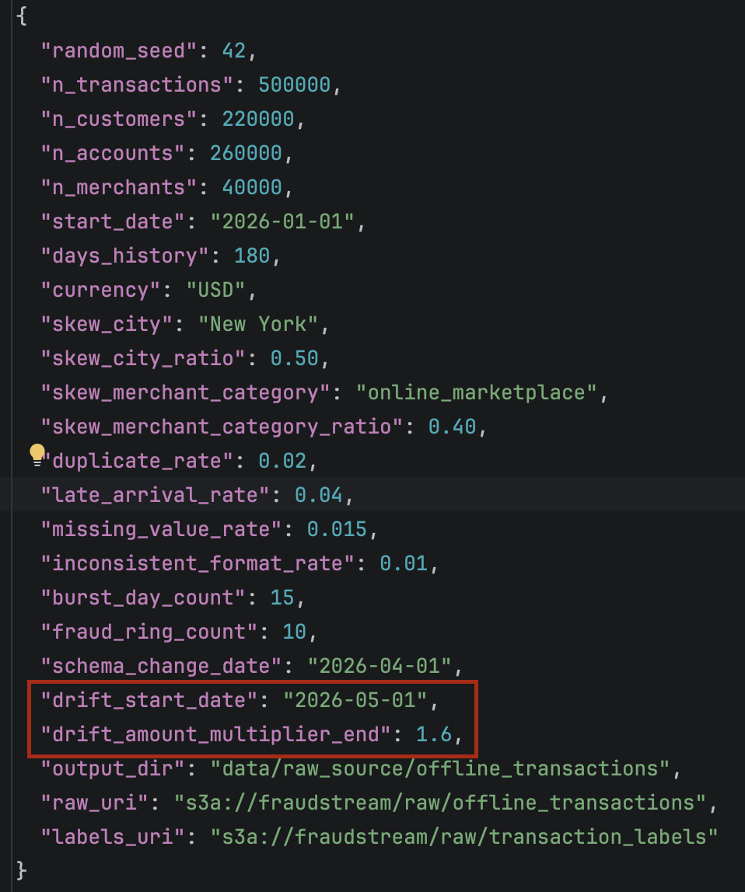
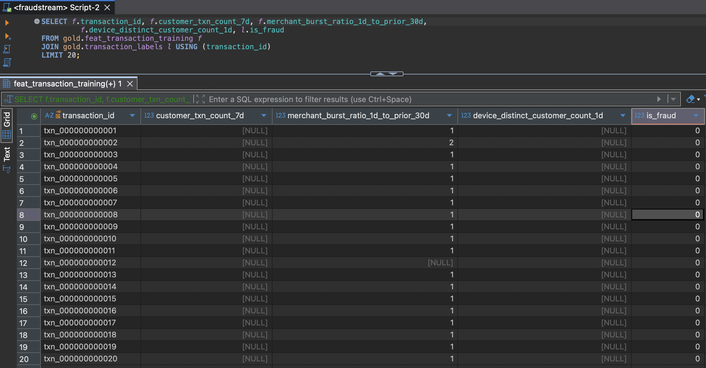
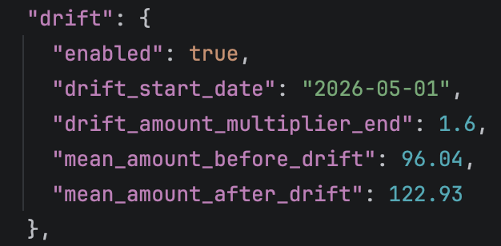

# Offline Data Generator

A Python tool that creates raw transaction files with deliberate problems, so the
Bronze and Silver pipelines have something real to clean. It behaves like data
owned by another team: raw, messy and untouched.

## What it simulates

| Problem | How |
|---|---|
| Skew | `city` leans toward `skew_city`, `merchant_category` toward `skew_merchant_category` |
| High cardinality | Many unique transaction, customer, account, merchant and device IDs |
| Schema change | Files before `schema_change_date` are `v1`, files from that date are `v2` with four more columns |
| Duplicates | About `duplicate_rate` rows repeated (default: ~10,000 on 500,000) |
| Bursty and late data | Peak hours, burst days, shuffled files, delayed `created_ts` |
| Messy fields | Small rates of missing values and odd formats (padded cities, lowercase currency) |
| Fraud | Rare labels, with higher risk for large, online, cross-border, late-night and fraud-ring activity |
| Drift | From `drift_start_date`, `amount` ramps linearly up to `drift_amount_multiplier_end` |

## Run it

```bash
PYTHONPATH=src python -m fraudstream.generators.offline_transactions
# or override where things go
PYTHONPATH=src python -m fraudstream.generators.offline_transactions \
  --output-dir /tmp/fraudstream_offline_transactions \
  --raw-uri s3a://fraudstream/raw/offline_transactions_dev
```

Settings live in `configs/generator/offline_transactions.json`:

| Setting | Meaning |
|---|---|
| `n_transactions` | Unique base transactions, before duplicates |
| `n_customers`, `n_accounts`, `n_merchants` | ID cardinality |
| `skew_city`, `skew_merchant_category` (and `_ratio`) | Which value dominates, and by how much |
| `duplicate_rate`, `late_arrival_rate` | Share of repeated rows, and of rows arriving late |
| `missing_value_rate`, `inconsistent_format_rate` | Share of messy fields |
| `burst_day_count`, `fraud_ring_count` | Heavy-traffic days, and reusable suspicious device/IP pairs |
| `schema_change_date` | The `v1` / `v2` split |
| `drift_start_date`, `drift_amount_multiplier_end` | Drift window and size. Unset `drift_start_date` to turn drift off |
| `raw_uri` | MinIO location of the CSVs (default `s3a://fraudstream/raw/offline_transactions`) |
| `labels_uri` | MinIO location of the label table (default `s3a://fraudstream/raw/transaction_labels`) |
| `output_dir` | Local folder for the small evidence files only |

**Drift is on by default** (`2026-05-01`, up to `1.6x`), so amounts and the fraud rate
rise over the last ~60 days. Numbers from older default runs are stale.



## What it writes

```text
s3a://fraudstream/raw/offline_transactions/        # raw CSVs, in MinIO
  schema_version=v1|v2/transaction_date=YYYY-MM-DD/transactions.csv
s3a://fraudstream/raw/transaction_labels/          # label table, in MinIO
  transaction_labels.csv
data/raw_source/offline_transactions/              # evidence, local
  _manifest.json  _quality_summary.json  _quality_summary.csv
```

`v1` files lack `device_id`, `ip_address`, `authentication_method` and
`risk_signal_version`; `v2` has them. Both prefixes are deleted and rewritten on
every run.

The label table has three columns, `transaction_id`, `is_fraud`, `event_timestamp`.
It is kept apart from the transactions so a feature view carries features only, and
the label is joined in at training time:



## Handing over to Bronze

The files are raw on purpose. Bronze reads the URIs in `_manifest.json` (or lists
`raw_uri`), keeps `schema_version` and `transaction_date` as partitions, reads `v1`
and `v2` together with missing columns allowed, and does no cleaning or
deduplication. That is Silver's job. `transaction_id` identifies duplicates.

## Quality evidence

`_quality_summary.json` and `.csv` report volume (about 510,000 rows after
duplicates), duplicate rate (~0.0196), skew, burst traffic, late arrivals (over 60
minutes), messy-field counts, fraud and fraud-ring rows, ID cardinality, rows either
side of the schema change, the label table, and drift. The `drift` section holds the
mean amount before and after `drift_start_date`:



## Test it

```bash
PYTHONPATH=src python -m unittest tests.unit.test_offline_transactions
PYTHONPATH=src python -m compileall -q src tests main.py
```
