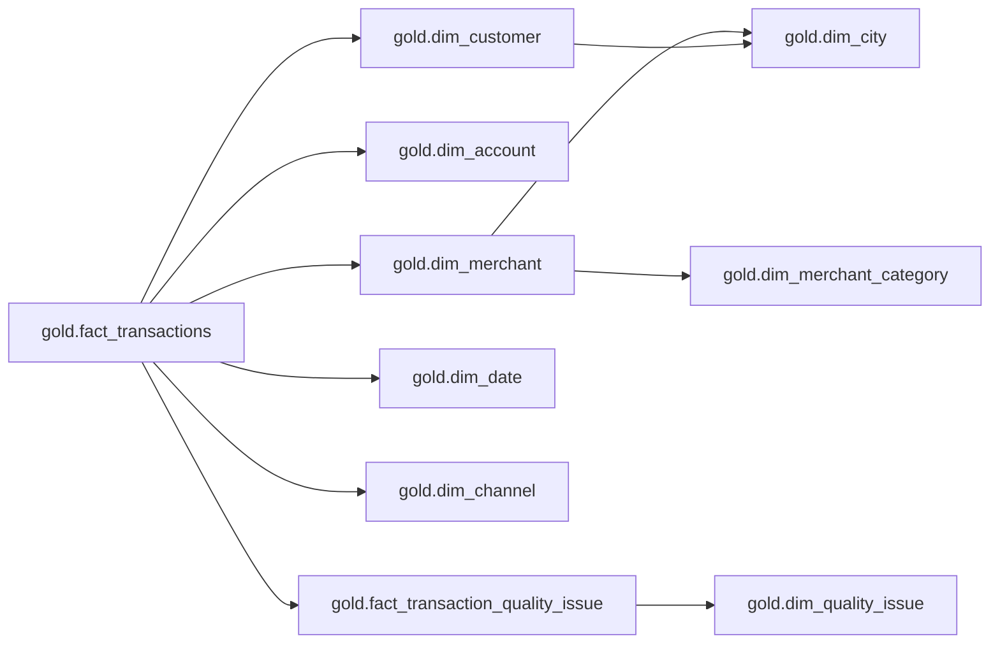

# Gold Layer Data Model

The Gold layer is the business-ready layer of the platform. It contains facts,
dimensions, aggregate facts, one-big-table views, and feature tables used for
fraud analytics, reporting, governance, and future model training.

## Architecture

FraudStream uses two storage patterns:

| Area | Storage | Purpose |
|---|---|---|
| Lakehouse processing | Parquet under `data/bronze/`, `data/silver/`, and `data/gold/` | Efficient Spark reads, writes, partitioning, and reproducible batch processing. |
| Serving and inspection | PostgreSQL database `fraudstream` | DBeaver exploration, ER diagrams, DataHub-style lineage, data contracts, and future API access. |

PostgreSQL is not the replacement for Parquet. Spark still performs the core
Bronze, Silver, and Gold transformations. PostgreSQL stores a relational serving
copy of the curated tables so they are easy to inspect and connect to external
tools.

```text
Raw CSV/JSONL
-> Bronze Parquet
-> Silver Parquet
-> Gold Parquet
-> PostgreSQL serving tables
```

## PostgreSQL Layout

Local PostgreSQL runs from Docker Compose and creates one database with multiple
schemas:

```text
database: fraudstream

schemas:
  metadata
  bronze
  silver
  gold
```

This design keeps the three data zones visible in DBeaver without creating
separate physical databases for each zone.

| Schema | Role |
|---|---|
| `metadata` | Pipeline run logs, validation reports, and data contract records. |
| `bronze` | Raw-preserved table representation for lineage and governance. |
| `silver` | Clean staged table representation used as the Gold source. |
| `gold` | Dimensional model, aggregate facts, feature tables, and reporting views. |

## Local Setup

Create PostgreSQL and initialize the schemas:

```bash
docker compose up -d postgres postgres-schema-init
```

DBeaver connection:

| Setting | Value |
|---|---|
| Host | `localhost` |
| Port | `5432` |
| Database | `fraudstream` |
| Username | `fraudstream` |
| Password | `fraudstream_local_password` |

If port `5432` is already used locally:

```bash
POSTGRES_PORT=15432 docker compose up -d postgres postgres-schema-init
```

The initializer is idempotent. Re-running it creates missing objects without
dropping existing data.

Implementation files:

| File | Purpose |
|---|---|
| `docker-compose.yml` | Runs PostgreSQL and the one-shot schema initializer. |
| `infra/postgres/init/001_create_fraudstream_schema.sql` | Defines schemas, tables, constraints, indexes, comments, and the Gold OBT view. |
| `src/fraudstream/jobs/gold/transactions.py` | Builds Gold Parquet facts, dimensions, aggregates, and feature tables from Silver. |
| `src/fraudstream/jobs/postgres/publish.py` | Publishes Silver and Gold Parquet datasets into PostgreSQL tables. |

## Naming Standards

Table prefixes identify the layer and modeling purpose.

| Layer | Prefix | Example |
|---|---|---|
| Bronze | `raw_` | `bronze.raw_transactions` |
| Silver | `stg_` | `silver.stg_transactions` |
| Gold dimension | `dim_` | `gold.dim_customer` |
| Gold fact | `fact_` | `gold.fact_transactions` |
| Gold one-big table | `obt_` | `gold.obt_transaction_enriched` |
| Gold feature table | `feat_` | `gold.feat_customer_total_orders_90d` |

Column names use lowercase `snake_case`. Technical processing columns keep the
leading underscore convention, such as `_gold_processed_at`.

Time columns follow this convention:

| Column | Meaning |
|---|---|
| `event_time` | Business transaction timestamp from Silver. |
| `event_date` | Date derived from `event_time`. |
| `event_timestamp` | Business timestamp used by feature tables. |
| `created` | Timestamp when a feature value was created. |
| `created_at` | Metadata record creation time. |
| `_gold_processed_at` | Time a Gold job processed the row. |

## Source Tables

Gold is built from Silver, not directly from Bronze.

| Table | Purpose |
|---|---|
| `silver.stg_transactions` | Clean, typed, deduplicated transaction records. One selected row per `transaction_id`. |
| `silver.stg_transaction_quality_issues` | Evidence rows for warnings, quarantines, and rejected duplicate candidates. |

The canonical Spark source path remains:

```text
data/silver/transactions/
data/silver/transaction_quality_issues/
```

## Snowflake Model

The Gold PostgreSQL schema uses a light snowflake model. The central transaction
fact joins to dimensions, and selected dimensions normalize into smaller lookup
dimensions.



## Metadata Schema

The `metadata` schema stores operational records for orchestration and
governance.

| Table | Grain | Purpose |
|---|---|---|
| `metadata.pipeline_runs` | One row per pipeline run | Tracks run ID, layer, status, source path, target table, and row count. |
| `metadata.data_quality_reports` | One row per validation report | Stores quality status, issue count, report path, and report JSON. |
| `metadata.data_contracts` | One row per table contract version | Stores active table contracts for governance checks. |

These tables support Airflow and DataHub workflows without mixing operational
metadata into business fact tables.

## Bronze Serving Tables

Bronze tables expose raw-preserved data in PostgreSQL for lineage and DBeaver
inspection. They mirror the Bronze Parquet contract and keep source values as
text.

| Table | Grain | Purpose |
|---|---|---|
| `bronze.raw_transaction_ingest_runs` | One row per Bronze ingestion run | Tracks source path, manifest path, ingest date, status, and summary JSON. |
| `bronze.raw_transactions` | One row per raw source record | Stores raw transaction columns, source metadata, partition columns, and raw record hash. |

Bronze records can contain duplicates, blank strings, casing issues, missing
evolved columns, and corrupt-record evidence. Cleanup belongs in Silver.

## Silver Serving Tables

Silver tables expose the cleaned transaction contract in PostgreSQL.

| Table | Grain | Purpose |
|---|---|---|
| `silver.stg_transactions` | One row per selected `transaction_id` | Clean typed transaction table used as the Gold source. |
| `silver.stg_transaction_quality_issues` | One row per quality evidence record | Stores quarantined rows, duplicate-rejected rows, and warning evidence. |

`silver.stg_transactions` uses `event_time` as the business timestamp and
`event_date` as the business-date partition field.

## Gold Dimensions

Gold dimensions describe entities used by the transaction fact table.

| Table | Primary Key | Business Key | Notes |
|---|---|---|---|
| `gold.dim_date` | `date_key` | `event_date` | Calendar attributes for joins and reporting. |
| `gold.dim_city` | `city_key` | `city`, `country_code` | Standardized location lookup. |
| `gold.dim_channel` | `channel_key` | `channel` | Channel grouping such as digital, card, or cash. |
| `gold.dim_quality_issue` | `quality_issue_code` | `quality_issue_code` | Human-readable quality issue definitions. |
| `gold.dim_merchant_category` | `merchant_category_key` | `merchant_category` | Normalized merchant-category lookup. |
| `gold.dim_customer` | `customer_key` | `customer_id` | SCD Type 2 customer behavior dimension. |
| `gold.dim_account` | `account_key` | `account_id` | SCD Type 2 account behavior dimension. |
| `gold.dim_merchant` | `merchant_key` | `merchant_dim_id` | SCD Type 2 merchant behavior dimension. |

### SCD Type 2 Dimensions

The customer, account, and merchant dimensions use Slowly Changing Dimension
Type 2 columns:

| Column | Meaning |
|---|---|
| `valid_from_ts` | Start timestamp for the dimension version. |
| `valid_to_ts` | End timestamp for the dimension version. `NULL` means current. |
| `is_current` | Indicates the active version for the natural business key. |

Current rows are enforced with partial unique indexes, for example one current
`customer_id` in `gold.dim_customer`. Historical versions remain available for
point-in-time joins.

## Gold Fact Tables

### `gold.fact_transactions`

Grain: one row per selected Silver transaction.

Primary key: `transaction_id`.

This is the central transaction fact table. It stores transaction measures,
foreign keys to dimensions, quality metadata, and lineage fields copied through
Silver.

Key column groups:

| Group | Columns |
|---|---|
| Transaction identity | `transaction_id`, `event_time`, `event_date`, `date_key` |
| Dimension keys | `customer_key`, `account_key`, `merchant_key`, `channel_key`, `city_key` |
| Business identifiers | `customer_id`, `account_id`, `merchant_id`, `merchant_dim_id` |
| Measures | `amount`, `transaction_count`, `arrival_delay_minutes` |
| Status flags | `is_approved`, `is_declined`, `is_reversed`, `is_fraud` |
| Quality | `quality_status`, `quality_issue_codes`, `quality_issue_count`, `duplicate_record_count` |
| Lineage | `_bronze_raw_record_hash`, `_silver_processed_at`, `_gold_processed_at` |

`is_fraud` is a historical label. It is useful for analytics and model training
after the label is known, but it is not a prediction input for production
scoring.

### `gold.fact_transaction_quality_issue`

Grain: one row per transaction and quality issue code.

This bridge table normalizes the `quality_issue_codes` array from
`fact_transactions`. It allows SQL queries and ER diagrams to show a direct
relationship between transactions and `gold.dim_quality_issue`.

### Aggregate Fact Tables

Aggregate fact tables store reusable daily metrics built from
`gold.fact_transactions`.

| Table | Grain | Purpose |
|---|---|---|
| `gold.fact_customer_daily` | `customer_key`, `feature_date` | Daily customer activity, amount, merchant diversity, warning count, late-arrival count, and fraud count. |
| `gold.fact_account_daily` | `account_key`, `feature_date` | Daily account amount, merchant diversity, city diversity, decline count, and fraud count. |
| `gold.fact_merchant_daily` | `merchant_key`, `feature_date` | Daily merchant volume, customer diversity, fraud rate, and warning count. |
| `gold.fact_city_category_daily` | `city_key`, `merchant_category_key`, `feature_date` | Daily geographic and merchant-category activity. |
| `gold.fact_device_ip_daily` | `network_identifier`, `identifier_type`, `feature_date` | Daily device/IP sharing behavior across customers and accounts. |

Daily aggregate counts must reconcile back to `gold.fact_transactions` for the
same date range.

## Feature Tables

Feature tables use the `feat_` prefix and include the required feature-time
columns:

| Column | Meaning |
|---|---|
| `event_timestamp` | Timestamp the feature value represents. |
| `created` | Timestamp the feature was computed or published. |

| Table | Grain | Purpose |
|---|---|---|
| `gold.feat_customer_rolling` | `customer_key`, `event_timestamp` | Rolling 7-day and 30-day customer behavior features. |
| `gold.feat_customer_total_orders_90d` | `customer_key`, `event_timestamp` | Example 90-day offline feature table. |
| `gold.feat_merchant_risk_rolling` | `merchant_key`, `event_timestamp` | Rolling merchant burst, historical fraud-rate, and merchant-category comparison features. |
| `gold.feat_transaction_training` | `transaction_id` | Model-training table joining transaction facts with point-in-time-safe features. |

Feature computation prevents future leakage by joining each transaction only to
features created from data available before that transaction's business time.
The feature definitions, formulas, missing-history rules, and validation contract
are documented in [`docs/06_feature_engineering.md`](06_feature_engineering.md).

## One-Big Table View

`gold.obt_transaction_enriched` is a flattened PostgreSQL view for DBeaver and
ad hoc analysis.

It joins:

```text
gold.fact_transactions
gold.dim_customer
gold.dim_account
gold.dim_merchant
gold.dim_channel
```

The OBT view is convenient for exploration, but the normalized fact and
dimension tables remain the authoritative model.

## Loading Pattern

PostgreSQL data loading is handled by a publisher job that runs after Spark has
produced Parquet outputs.

Pipeline loading pattern:

| Pipeline | Spark Output | PostgreSQL Publish Target |
|---|---|---|
| DP1 Bronze ingestion | `data/bronze/raw_transactions/` | `bronze.raw_transaction_ingest_runs`, `bronze.raw_transactions` |
| DP2 Silver and Gold build | `data/silver/transactions/`, `data/gold/*` | `silver.stg_*`, `gold.dim_*`, `gold.fact_*`, `gold.obt_*` |
| DP3 Offline features | `data/gold/feat_*` | `gold.feat_*` |

For local development, full refresh loading is acceptable for facts, daily
aggregates, and feature tables. SCD2 dimensions require change detection before
closing old records and inserting new current versions.

Install the Spark and PostgreSQL extras:

```bash
uv sync --extra spark --extra postgres
```

Publish Silver Parquet tables:

```bash
PYTHONPATH=src python -m fraudstream.jobs.postgres.publish \
  --layer silver \
  --write-mode overwrite
```

Build Gold Parquet tables from Silver:

```bash
PYTHONPATH=src python -m fraudstream.jobs.gold.transactions \
  --silver-dir data/silver/transactions \
  --output-dir data/gold \
  --write-mode overwrite
```

To inspect Gold feature engineering in Spark UI:

```bash
PYTHONPATH=src python -m fraudstream.jobs.gold.transactions \
  --silver-dir data/silver/transactions \
  --output-dir data/gold \
  --write-mode overwrite \
  --spark-ui \
  --spark-ui-retain-seconds 300
```

Open the URL printed by Spark, normally `http://localhost:4040`. Each table has
its own `Gold: materialize and write ...` job group. The most useful captures
for feature engineering are `feat_customer_rolling`,
`feat_merchant_risk_rolling`, and `feat_transaction_training`; their SQL plans
show rolling windows, daily pre-aggregation, broadcast category joins,
point-in-time lookups, and adaptive skew handling.

Publish Gold Parquet tables:

```bash
PYTHONPATH=src python -m fraudstream.jobs.postgres.publish \
  --layer gold \
  --write-mode overwrite
```

During development, missing Gold tables can be skipped while individual tables
are still being implemented:

```bash
PYTHONPATH=src python -m fraudstream.jobs.postgres.publish \
  --layer gold \
  --tables dim_customer,fact_transactions \
  --skip-missing
```

The publisher validates source columns before writing. If a Parquet dataset is
missing a required target column, the job fails before loading that table.

## Validation Expectations

These checks define the minimum quality bar for Gold publishing:

| Check | Expected Result |
|---|---|
| Fact row count | `gold.fact_transactions` matches the selected row count from Silver. |
| Transaction uniqueness | `transaction_id` is unique in `gold.fact_transactions`. |
| Foreign keys | Fact rows join successfully to customer, account, merchant, date, and channel dimensions. |
| SCD2 current records | Each natural key has at most one current dimension row. |
| Date logic | `event_date` is derived from business `event_time`. |
| Quality lineage | Warning rows remain visible through `quality_status` and issue tables. |
| Aggregate reconciliation | Daily aggregate counts reconcile to transaction facts. |
| Feature time safety | Feature values use only data available before the feature `event_timestamp`. |
