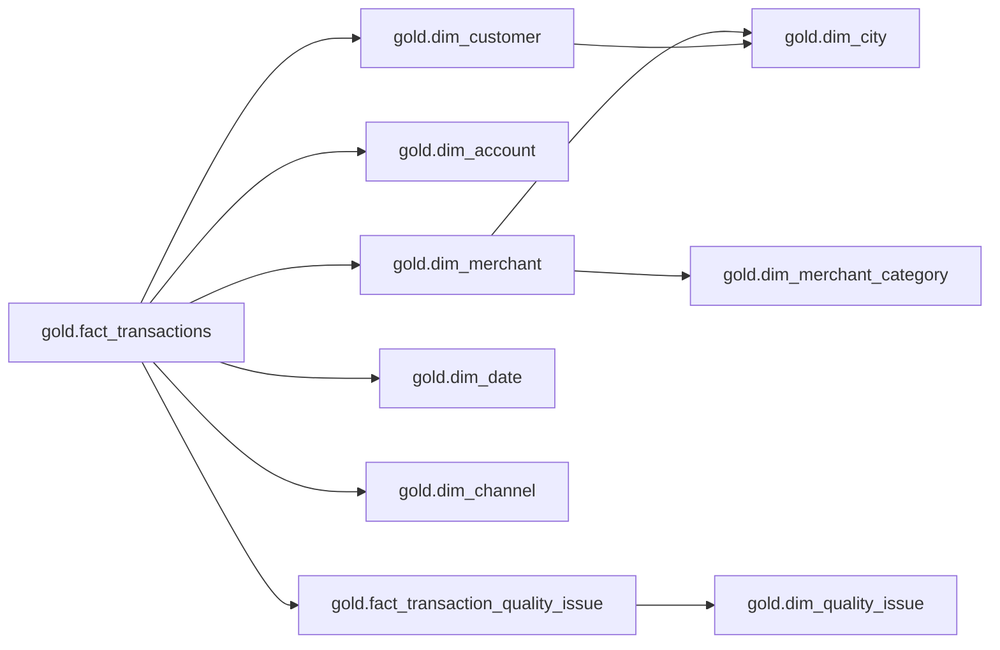

# Gold Layer

Gold is the business-ready layer: facts, dimensions, daily aggregates, one flat view
for exploring, and the feature tables that feed model training. It is built from
Silver, never straight from Bronze.

## Two stores, one flow

| Store | Holds | For |
|---|---|---|
| Iceberg on MinIO (`iceberg.bronze.*`, `.silver.*`, `.gold.*`) | The lakehouse tables (see [15_lakehouse_iceberg.md](14_lakehouse_iceberg.md)) | Spark and Flink processing |
| PostgreSQL database `fraudstream` | A relational copy of the curated tables | DBeaver, ER diagrams, DataHub lineage, contracts |

PostgreSQL does not replace the lakehouse. Each Spark job writes its Iceberg table,
then writes its PostgreSQL tables over JDBC in the same session, so the two never
drift apart:

```text
Raw CSV/JSONL -> Spark (Bronze -> Silver -> Gold -> Features)
                   |-> Iceberg tables in MinIO
                   `-> PostgreSQL tables (direct JDBC write)
```

One database, four schemas:

| Schema | Role |
|---|---|
| `metadata` | Pipeline runs (`pipeline_runs`), validation reports (`data_quality_reports`), data contracts (`data_contracts`) |
| `bronze` | `raw_transactions`, `raw_transaction_ingest_runs` |
| `silver` | `stg_transactions`, `stg_transaction_quality_issues` |
| `gold` | Dimensions, facts, aggregates, features, labels and the flat view |

```bash
docker compose up -d postgres postgres-schema-init   # POSTGRES_PORT=15432 if 5432 is taken
```

DBeaver: `localhost:5432`, database `fraudstream`, user `fraudstream`, password
`fraudstream_local_password`. The initialiser is idempotent.

## Naming

Prefixes show the layer: `raw_` (Bronze), `stg_` (Silver), `dim_`, `fact_`, `obt_`,
`feat_` (Gold). Columns are lowercase `snake_case`, and technical columns start with
`_` (for example `_gold_processed_at`).

| Column | Meaning |
|---|---|
| `event_time` / `event_date` | Business time from Silver, and its date |
| `event_timestamp` | Business time as feature tables use it |
| `created` | When a feature value was computed |
| `created_at` | When a metadata record was created |

## Model

A light snowflake: one transaction fact, its dimensions, and a few normalised lookups.


```mermaid
flowchart LR
    fact[gold.fact_transactions]
    customer[gold.dim_customer]
    account[gold.dim_account]
    merchant[gold.dim_merchant]
    category[gold.dim_merchant_category]
    city[gold.dim_city]
    date[gold.dim_date]
    channel[gold.dim_channel]
    issue_bridge[gold.fact_transaction_quality_issue]
    issue[gold.dim_quality_issue]

    fact --> customer
    fact --> account
    fact --> merchant
    fact --> date
    fact --> channel
    fact --> issue_bridge
    issue_bridge --> issue
    merchant --> category
    merchant --> city
    customer --> city
```

### Dimensions

| Table | Key | Business key |
|---|---|---|
| `dim_date` | `date_key` | `event_date` |
| `dim_city` | `city_key` | `city`, `country_code` |
| `dim_channel` | `channel_key` | `channel` |
| `dim_quality_issue` | `quality_issue_code` | `quality_issue_code` |
| `dim_merchant_category` | `merchant_category_key` | `merchant_category` |
| `dim_customer` | `customer_key` | `customer_id` (SCD2) |
| `dim_account` | `account_key` | `account_id` (SCD2) |
| `dim_merchant` | `merchant_key` | `merchant_dim_id` (SCD2) |

The three SCD2 dimensions carry `valid_from_ts`, `valid_to_ts` (`NULL` means current)
and `is_current`. A partial unique index allows only one current row per business
key, and old versions stay for point-in-time joins.

### Facts

**`gold.fact_transactions`**, one row per selected Silver transaction, key `transaction_id`.

| Group | Columns |
|---|---|
| Identity | `transaction_id`, `event_time`, `event_date`, `date_key` |
| Dimension keys | `customer_key`, `account_key`, `merchant_key`, `channel_key`, `city_key` |
| Business IDs | `customer_id`, `account_id`, `merchant_id`, `merchant_dim_id` |
| Measures | `amount`, `transaction_count`, `arrival_delay_minutes` |
| Status | `is_approved`, `is_declined`, `is_reversed`, `is_fraud` |
| Quality | `quality_status`, `quality_issue_codes`, `quality_issue_count`, `duplicate_record_count` |
| Lineage | `_bronze_raw_record_hash`, `_silver_processed_at`, `_gold_processed_at` |

`is_fraud` is a historical label, useful for analytics and training. It is never an
input when scoring live.

**`fact_transaction_quality_issue`**, one row per transaction and issue code. It
unpacks the `quality_issue_codes` array so SQL and ER diagrams can join to
`dim_quality_issue`.

**Daily aggregates**, built from the fact and reconciling back to it:

| Table | Grain |
|---|---|
| `fact_customer_daily` | `customer_key`, `feature_date` |
| `fact_account_daily` | `account_key`, `feature_date` |
| `fact_merchant_daily` | `merchant_key`, `feature_date` |
| `fact_city_category_daily` | `city_key`, `merchant_category_key`, `feature_date` |
| `fact_device_ip_daily` | `network_identifier`, `identifier_type`, `feature_date` |

### Features and labels

Feature tables carry `event_timestamp` (what the value represents) and `created`
(when it was computed). Each transaction only joins to features built from data
available before it. Definitions are in [06_feature_engineering.md](06_feature_engineering.md).

| Table | Grain |
|---|---|
| `feat_customer_rolling` | `customer_key`, `event_timestamp` (7 and 30 days) |
| `feat_customer_total_orders_90d` | `customer_key`, `event_timestamp` |
| `feat_merchant_risk_rolling` | `merchant_key`, `event_timestamp` (bursts, fraud rate) |
| `feat_transaction_training` | `transaction_id` (facts joined to safe features) |
| `transaction_labels` | `transaction_id`: `is_fraud`, `event_timestamp` |

`transaction_labels` is loaded straight from the generator's label CSV, not derived
from Silver, so feature tables stay features-only and the label is joined at training.

`gold.obt_transaction_enriched` is a flat view of the fact plus customer, account,
merchant and channel, for exploring in DBeaver. The normalised tables stay the
source of truth.

## Loading

| Job | Iceberg table | PostgreSQL |
|---|---|---|
| Bronze | `iceberg.bronze.raw_transactions` | `bronze.raw_transaction_ingest_runs`, `bronze.raw_transactions` |
| Silver | `iceberg.silver.stg_*` | `silver.stg_*` |
| Core Gold | `iceberg.gold.*` | `gold.dim_*`, `gold.fact_*` |
| Offline features | `iceberg.gold.feat_*` | `gold.feat_*` |
| Labels | `iceberg.gold.transaction_labels` | `gold.transaction_labels` |

Locally, every table reloads in full: the Gold job truncates all Gold tables together
before reinserting. There is no incremental change detection yet.

```bash
uv sync --extra spark      # the MinIO, Iceberg and JDBC jars download on first run
# core Gold first, features second (this is the Airflow boundary)
PYTHONPATH=src python -m fraudstream.jobs.gold.transactions --output-dir data/gold --write-mode overwrite --core-only
PYTHONPATH=src python -m fraudstream.jobs.gold.offline_features --gold-dir data/gold --write-mode overwrite
```

Drop `--core-only` to build features in the same run, add `--skip-postgres-write` for
Iceberg only, and add `--spark-ui --spark-ui-retain-seconds 300` to inspect the plans.
Each job checks its required columns (`GOLD_TABLE_COLUMNS` in `gold/transactions.py`)
before writing anything, so a missing column fails the job before either store is touched.

Code: `src/fraudstream/jobs/warehouse.py` (shared config and write helpers),
`jobs/gold/transactions.py`, `jobs/gold/offline_features.py`,
`jobs/gold/transaction_labels.py`, and the schema in
`infra/postgres/init/001_create_fraudstream_schema.sql`.

## What "correct" looks like

| Check | Expected |
|---|---|
| Row count | `fact_transactions` matches Silver's selected rows |
| Uniqueness | `transaction_id` is unique |
| Foreign keys | Every fact row joins to its dimensions |
| SCD2 | At most one current row per business key |
| Date logic | `event_date` comes from `event_time` |
| Quality lineage | Warning rows stay visible through `quality_status` |
| Aggregates | Daily counts reconcile to the fact |
| Time safety | Features use only data from before their `event_timestamp` |
