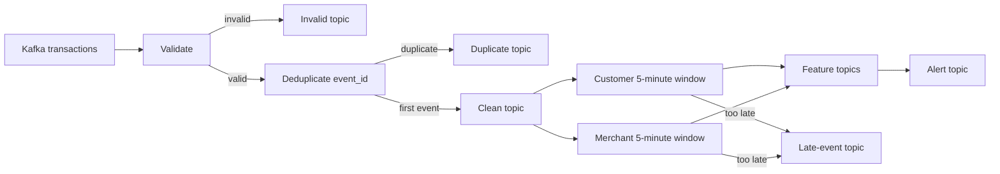

# Flink Streaming Transaction Pipeline

This job consumes transaction events from Kafka and produces clean events,
five-minute fraud features, alerts, and audit records.

The core problem is that transactions do not always arrive in event-time order.
Flink therefore groups records by when the transaction happened, while a
watermark decides when a time window is ready to produce a result.

## Pipeline Flow



For every Kafka record, the job:

1. validates the JSON envelope and required fields;
2. keeps the first occurrence of each `event_id`;
3. publishes the normalized transaction to the clean topic;
4. adds it to customer and merchant event-time windows;
5. produces features and fraud alerts;
6. audits invalid, duplicate, and too-late records instead of silently dropping
   them.

## Source Contract

| Setting | Value |
|---|---|
| Kafka topic | `financial_transactions` |
| Partitions | 24 |
| Consumer group | `fraudstream-flink-features-v1` |
| Event type | `transaction.created` |
| Schema version | `stream_v1` |

The most important input fields are:

| Field | Use |
|---|---|
| `value.event_id` | Deduplication key |
| `value.event_timestamp` | Event time used by windows |
| `produced_at` | Arrival-time evidence used to measure source delay |
| `value.customer_id` | Customer feature key |
| `value.merchant_id` | Merchant feature key |
| `value.amount`, `value.transaction_status` | Feature measures |

`value.is_fraud` is evaluation truth. The online feature job does not use it,
because doing so would leak the answer into the fraud features.

## Event Time And Watermarks

Two timestamps have different meanings:

- `event_timestamp`: when the transaction happened;
- `produced_at`: when the source published the transaction.

Windows use `event_timestamp`. If a transaction happened at 10:02 but arrived
at 10:08, it still belongs to the 10:00–10:05 window.

### Watermark intuition

The job uses a **bounded out-of-orderness watermark**:

```text
watermark = largest event_timestamp observed - measured p95 source delay
```

When the watermark passes 10:05, Flink considers the 10:00–10:05 window ready
and emits its first result. A larger delay waits longer for out-of-order events
but also makes features slower. A smaller delay produces features faster but
classifies more events as late.

The delay is not hard-coded. It is loaded from a measured latency profile:

```text
source delay = produced_at - event_timestamp
configured delay = nearest-rank p95 of first-seen event IDs
```

P95 means 95% of the measured first arrivals had this delay or less.

The calibrator excludes duplicate replays, invalid records, and negative delays.
Idle Kafka subtasks are ignored after 60 seconds so an empty partition cannot
stop the watermark for the whole pipeline.

### Current local measurement

The committed profile was measured from the generated local source:

| Metric | Value |
|---|---:|
| Records scanned | 512,500 |
| Unique events measured | 500,000 |
| Duplicate replays excluded | 12,500 |
| p50 delay | 68 seconds |
| p95 watermark delay | 11,900 seconds (3h 18m 20s) |
| p99 delay | 37,032 seconds |

The p95 is large because the generator intentionally includes very late events.
This is development evidence, not production telemetry.

Measure a representative production export before deployment:

```bash
PYTHONPATH=src python -m fraudstream.jobs.flink.watermark_calibration \
  --source /path/to/production-events.jsonl \
  --output /path/to/production-latency-profile.json \
  --environment production
```

Then start the job with that profile:

```bash
PYTHONPATH=src python -m fraudstream.jobs.flink.transactions \
  --latency-profile /path/to/production-latency-profile.json
```

Recalibrate when the producer, network, source system, or latency distribution
changes.

## Windows And Features

The current job implements two five-minute tumbling windows. A transaction
belongs to exactly one window of each type.

| Window key | Features |
|---|---|
| `customer_id` | Transaction count, total/average/maximum amount, decline count, distinct merchants, distinct devices |
| `merchant_id` | Transaction count, total/average/maximum amount, decline count, distinct customers, merchant category |

The job emits alerts when configured thresholds are reached:

- high customer transaction velocity;
- high customer transaction amount;
- merchant transaction burst.

Feature and alert IDs are deterministic. If a window is corrected later, the
same ID is emitted with `is_correction = true`, allowing downstream systems to
upsert instead of creating duplicate rows.

## Late Events

Watermark delay and allowed lateness solve different problems:

- watermark delay controls how long Flink waits before the first result;
- allowed lateness keeps closed-window state for another 40 minutes so the
  result can still be corrected.

| Arrival condition | Result |
|---|---|
| Before the watermark closes the window | Included in the first result |
| After first result but within 40-minute allowed lateness | Feature is corrected |
| After window state is removed | Written to `financial_transactions_late` |

A too-late transaction still remains in the clean transaction topic. The online
window is not changed, but the offline Spark pipeline can use the complete clean
history to rebuild exact features.

## Kafka Outputs

| Topic | Contents |
|---|---|
| `financial_transactions_clean` | Valid, normalized, first-seen transactions |
| `financial_transactions_invalid` | Invalid JSON or contract violations |
| `financial_transactions_duplicate` | Replayed IDs and conflicting duplicate payloads |
| `financial_transactions_late` | Events received after window state expired |
| `fraud_features_customer_5m` | Customer window features |
| `fraud_features_merchant_5m` | Merchant window features |
| `fraud_alerts` | Customer velocity, amount, and merchant burst alerts |

Kafka sinks use transactional exactly-once delivery. Consumers should use
`isolation.level=read_committed`. Derived topics use `LogAppendTime` so Kafka
retention is based on when the result was written, not its historical event time.

## State And Recovery

| Setting | Value |
|---|---:|
| Checkpoint interval | 30 seconds |
| Checkpoint mode | Exactly once |
| Deduplication state TTL | 24 hours |
| Allowed lateness | 40 minutes |
| Idle partition timeout | 60 seconds |
| Local parallelism | 4 |

Checkpoints store Kafka offsets, deduplication state, window state, and timers.
After a failure, Flink restores them together and resumes from the checkpointed
Kafka offsets. Production checkpoints must use durable shared storage.

## Run Locally

Create the Python 3.12 PyFlink environment:

```bash
UV_CACHE_DIR=/tmp/fraudstream-uv-cache \
  uv sync --project flink --python 3.12
```

Download the Kafka connector and start Kafka:

```bash
mvn dependency:copy \
  -Dartifact=org.apache.flink:flink-sql-connector-kafka:5.0.0-2.2 \
  -DoutputDirectory=flink/lib

docker compose up -d kafka kafka-topic-init kafka-ui
```

Start Flink:

```bash
PYTHONPATH=src UV_CACHE_DIR=/tmp/fraudstream-uv-cache \
  uv run --project flink --python 3.12 \
  python -m fraudstream.jobs.flink.transactions --flink-ui
```

The local Flink UI is available at `http://localhost:8081`. For a controlled
baseline and optimized comparison, follow
[`optimization/flink/streaming_job_optimization.md`](optimization/flink/streaming_job_optimization.md).

Replay events from another terminal:

```bash
PYTHONPATH=src python -m fraudstream.producers.stream_replay \
  --bootstrap-servers localhost:9092 \
  --topic financial_transactions \
  --events-per-second 5000
```

Print the resolved configuration without starting Flink:

```bash
PYTHONPATH=src python -m fraudstream.jobs.flink.transactions --dry-run
```

## What To Monitor

Focus on:

- Kafka consumer lag and pending records;
- current watermark and watermark lag;
- records entering and leaving each operator;
- invalid, duplicate, corrected, and too-late event counts;
- checkpoint duration and failures;
- operator busy time and backpressure;
- keyed-state size.

For the generated source, the main reconciliation checks are:

```text
512,500 source records
= 500,000 first-seen events + 12,500 duplicate replays

valid deduplicated window memberships
= accepted memberships + too-late memberships
```

## Code Map

| File | Responsibility |
|---|---|
| `src/fraudstream/jobs/flink/transactions.py` | Configuration, validation, feature contracts, CLI |
| `src/fraudstream/jobs/flink/runtime.py` | PyFlink operators and Kafka topology |
| `src/fraudstream/jobs/flink/watermark_calibration.py` | Measures source delay and writes the p95 profile |
| `configs/flink/streaming_latency_profile.json` | Current measured local profile |
