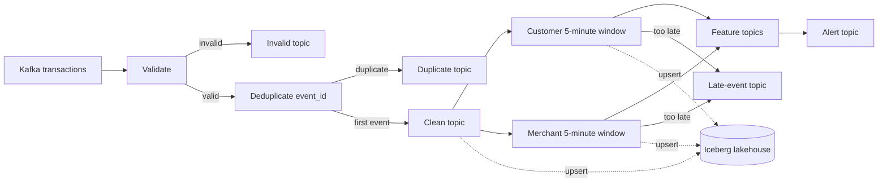

# Flink Streaming Pipeline

Reads transactions from Kafka and produces clean events, five-minute fraud features,
alerts and audit records.

Transactions don't arrive in the order they happened. So Flink groups them by *when
they happened*, and a watermark decides when a window is ready to emit.

## Flow


```mermaid
flowchart LR
    source[Kafka transactions] --> validate[Validate]
    validate -->|invalid| invalid[Invalid topic]
    validate -->|valid| dedupe[Deduplicate event_id]
    dedupe -->|duplicate| duplicates[Duplicate topic]
    dedupe -->|first event| clean[Clean topic]
    clean --> customer[Customer 5-minute window]
    clean --> merchant[Merchant 5-minute window]
    customer --> features[Feature topics]
    merchant --> features
    features --> alerts[Alert topic]
    customer -->|too late| late[Late-event topic]
    merchant -->|too late| late
    clean -.upsert.-> iceberg[(Iceberg lakehouse)]
    customer -.upsert.-> iceberg
    merchant -.upsert.-> iceberg
```

Nothing is dropped silently: invalid, duplicate and too-late records each get their own topic.

## Input

Topic `financial_transactions` (24 partitions, consumer group
`fraudstream-flink-features-v1`, schema `stream_v1`). Fields the job relies on:

| Field | Use |
|---|---|
| `value.event_id` | Deduplication key |
| `value.event_timestamp` | Event time for windows |
| `produced_at` | When the source published it; measures delay |
| `value.customer_id`, `value.merchant_id` | Feature keys |
| `value.amount`, `value.transaction_status` | Feature measures |

`value.is_fraud` is evaluation truth only. The job never reads it, or it would leak the
answer into the features.

## Watermarks

Windows use `event_timestamp`: a transaction from 10:02 that arrives at 10:08 still
belongs to the 10:00–10:05 window. The watermark says when to stop waiting:

```text
watermark = largest event_timestamp seen - measured p95 source delay
```

A longer delay waits for stragglers but makes features slower. A shorter one is faster
but marks more events late. The delay isn't hard-coded. It comes from a measured profile
(`produced_at - event_timestamp`, p95 of first-seen events; duplicates, invalid rows and
negative delays are excluded). Idle Kafka partitions are ignored after 60 seconds so
one empty partition can't stall everything.

Local measurement (from the generated source, not production):

| Metric | Value |
|---|---:|
| Records scanned | 512,500 |
| Unique events | 500,000 |
| Duplicate replays excluded | 12,500 |
| p50 delay | 68 s |
| p95 watermark delay | 11,900 s (3h 18m) |

The p95 is large because the generator injects very late events on purpose. Before a
real deployment, measure a production export and start the job with it:

```bash
PYTHONPATH=src python -m fraudstream.jobs.flink.watermark_calibration \
  --source /path/to/production-events.jsonl \
  --output /path/to/production-latency-profile.json --environment production

PYTHONPATH=src python -m fraudstream.jobs.flink.transactions \
  --latency-profile /path/to/production-latency-profile.json
```

## Windows and alerts

Two five-minute tumbling windows, so each transaction lands in one of each:

| Key | Features |
|---|---|
| `customer_id` | Count, total / average / max amount, declines, distinct merchants, distinct devices |
| `merchant_id` | Count, total / average / max amount, declines, distinct customers, category |

Alerts fire on high customer velocity, high customer amount and merchant bursts. Feature
and alert IDs are deterministic, so a corrected window re-emits the same ID with
`is_correction = true` and downstream can upsert.

## Late events

The watermark controls when the *first* result comes out. Allowed lateness (40 minutes)
keeps closed-window state so a result can still be *corrected*.

| Arrival | Result |
|---|---|
| Before the window closes | In the first result |
| After it, within 40 minutes | Feature corrected |
| After the state is removed | Sent to `financial_transactions_late` |

A too-late event is still in the clean topic, so the offline Spark job can rebuild exact
features from the full history.

## Outputs

| Topic | Contents |
|---|---|
| `financial_transactions_clean` | Valid, first-seen transactions |
| `financial_transactions_invalid` | Bad JSON or contract violations |
| `financial_transactions_duplicate` | Replayed IDs and conflicting duplicates |
| `financial_transactions_late` | Events past allowed lateness |
| `fraud_features_customer_5m` / `fraud_features_merchant_5m` | Window features |
| `fraud_alerts` | Velocity, amount and burst alerts |

Kafka sinks are transactional (exactly-once), so consumers should use
`isolation.level=read_committed`.

Three streams also **upsert** into Iceberg (see [15_lakehouse_iceberg.md](15_lakehouse_iceberg.md)),
so a batch job can later join streaming features with labels that arrive weeks after the
transaction. A correction replaces the row instead of duplicating it.

| Iceberg table | Source | Key |
|---|---|---|
| `iceberg.streaming.clean_transactions` | clean topic | `event_id` |
| `iceberg.streaming.customer_features_5m` | customer features | `feature_id` |
| `iceberg.streaming.merchant_features_5m` | merchant features | `feature_id` |

## State and recovery

Checkpoints every 30 seconds (exactly-once) store Kafka offsets, dedup state, window
state and timers together. After a failure Flink restores all of it and resumes from the
checkpointed offsets. Dedup state expires after 24 hours; local parallelism is 4.
Production checkpoints need durable shared storage.

## Run Locally

```bash
UV_CACHE_DIR=/tmp/fraudstream-uv-cache uv sync --project flink --python 3.12

# Kafka connector, then Kafka
mvn dependency:copy -Dartifact=org.apache.flink:flink-sql-connector-kafka:5.0.0-2.1 \
  -DoutputDirectory=flink/lib
docker compose up -d kafka kafka-topic-init kafka-ui

# Iceberg jars (why these three: see doc 15), then MinIO + PostgreSQL
mvn dependency:copy -Dartifact=org.apache.iceberg:iceberg-flink-runtime-2.1:1.11.0 \
  -DoutputDirectory=flink/lib/iceberg
mvn dependency:copy -Dartifact=org.postgresql:postgresql:42.7.4 \
  -DoutputDirectory=flink/lib/iceberg
mvn dependency:copy-dependencies -Dartifact=org.apache.hadoop:hadoop-aws:3.4.1 \
  -DoutputDirectory=flink/lib/iceberg -DincludeScope=runtime
docker compose up -d minio minio-bucket-init postgres postgres-schema-init

# Start the job (Flink UI: http://localhost:8081)
PYTHONPATH=src UV_CACHE_DIR=/tmp/fraudstream-uv-cache \
  uv run --project flink --python 3.12 \
  python -m fraudstream.jobs.flink.transactions --flink-ui
```

Replay events from another terminal:

```bash
PYTHONPATH=src python -m fraudstream.producers.stream_replay \
  --bootstrap-servers localhost:9092 --topic financial_transactions --events-per-second 5000
```

`--dry-run` prints the resolved configuration without starting Flink. Tuning results are
in [optimization/flink/streaming_job_optimization.md](optimization/flink/streaming_job_optimization.md).

## What to watch

Consumer lag, watermark lag, records in and out of each operator, invalid / duplicate /
corrected / too-late counts, checkpoint duration, backpressure and keyed-state size.

For the generated source, the counts should reconcile:

```text
512,500 source records = 500,000 first-seen events + 12,500 duplicate replays
valid deduplicated window memberships = accepted + too-late memberships
```

## Code

| File | Does |
|---|---|
| `src/fraudstream/jobs/flink/transactions.py` | Config, validation, feature contracts, CLI |
| `src/fraudstream/jobs/flink/runtime.py` | PyFlink operators, Kafka topology, Iceberg classpath |
| `src/fraudstream/jobs/flink/iceberg_sink.py` | Iceberg table DDL and sink wiring (see [doc 15](15_lakehouse_iceberg.md)) |
| `src/fraudstream/jobs/flink/watermark_calibration.py` | Measures delay, writes the p95 profile |
| `configs/flink/streaming_latency_profile.json` | Current local profile |
