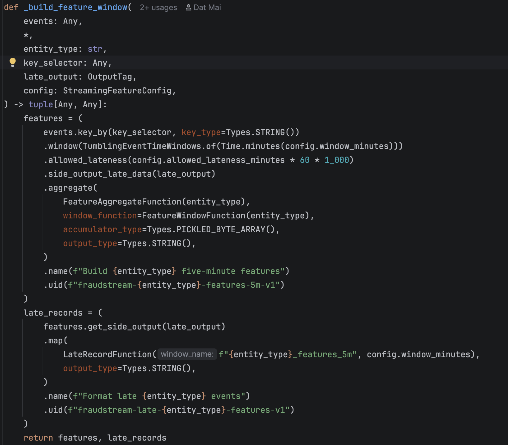
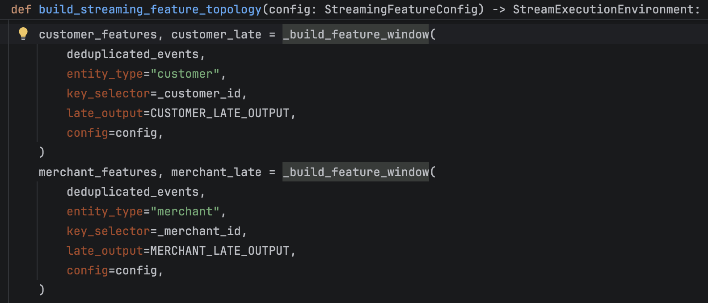

# Flink Window Processing

The streaming job uses **five-minute tumbling event-time windows** to calculate
fraud features independently for each customer and merchant.

## Window Implementation



The reusable `_build_feature_window()` function performs the core processing:

1. `key_by` separates events by customer or merchant ID.
2. `TumblingEventTimeWindows` assigns each event to one non-overlapping
   five-minute window.
3. `allowed_lateness` keeps closed-window state temporarily so late events can
   correct a result.
4. `side_output_late_data` sends events arriving after state cleanup to a
   separate audit stream.
5. `aggregate` incrementally calculates the feature values without retaining
   every event in memory.

For example, a transaction with event time `10:03` belongs to the
`10:00–10:05` window, even if it reaches Flink later.

## Customer And Merchant Windows



The same window function is reused for two keyed streams:

| Stream | Key | Result |
|---|---|---|
| Customer features | `customer_id` | Five-minute customer velocity and amount features |
| Merchant features | `merchant_id` | Five-minute merchant activity and burst features |

Each call returns both the completed feature stream and its too-late event
stream. This keeps feature computation reusable while preserving late-event
evidence.

## Processing Behavior

```text
Deduplicated transaction
        ├── key by customer_id → 5-minute customer window
        └── key by merchant_id → 5-minute merchant window

Window result → feature stream
Too-late event → late-event side output
```

This implementation demonstrates keyed event-time windows, incremental
aggregation, allowed lateness, side outputs, and reusable window logic.
