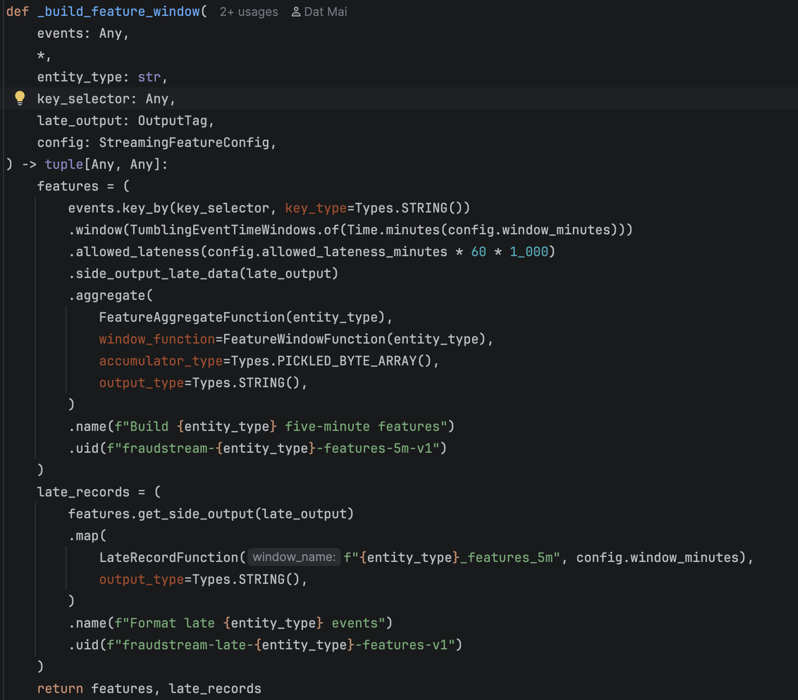
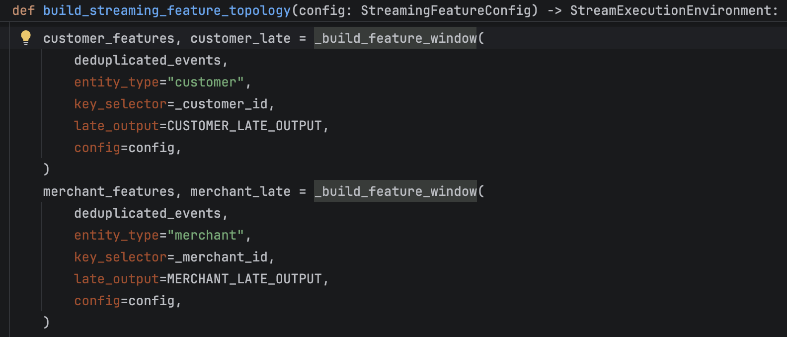

# Flink Window Processing

The streaming job computes fraud features over **five-minute tumbling event-time
windows**, separately for each customer and merchant. A transaction at `10:03` lands in
the `10:00–10:05` window even if it reaches Flink later.

## One window function

`_build_feature_window()` does the work:

1. `key_by` splits events by customer or merchant ID.
2. `TumblingEventTimeWindows` puts each event in one five-minute window.
3. `allowed_lateness` keeps closed-window state a while, so late events can correct a result.
4. `side_output_late_data` sends events that arrive after cleanup to an audit stream.
5. `aggregate` computes features incrementally, without holding every event in memory.

## Used twice

| Stream | Key | Result |
|---|---|---|
| Customer features | `customer_id` | Velocity and amount features |
| Merchant features | `merchant_id` | Activity and burst features |

Each call returns the feature stream and its too-late stream, so late events are kept as
evidence. Watermarks, lateness and topics are covered in
[07_flink_streaming_pipeline.md](07_flink_streaming_pipeline.md).
