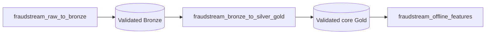

# Airflow Batch Orchestration

FraudStream uses three Airflow DAGs. Each transformation is followed by a
quality gate, and only a successful gate publishes the asset event that starts
the next DAG.



## DAGs And Visible Stages

| DAG | Airflow task groups | Validation gate |
|---|---|---|
| `fraudstream_raw_to_bronze` | `ingest`: generate, verify manifest, write Bronze; `validate`: reconcile raw and Bronze | Source rows and files must match Bronze |
| `fraudstream_bronze_to_silver_gold` | `silver_ingest` -> `silver_validate` -> `gold_ingest` -> `gold_validate` | Silver has no unexplained row loss; Gold facts match selected Silver rows |
| `fraudstream_offline_features` | `ingest`: read core Gold and build features; `validate`: check outputs | Training rows match facts and transaction IDs are unique |

The second and third DAGs use Airflow asset scheduling. A failed validation task
does not emit an asset event, so downstream processing does not start.

Core Gold and offline features are separate Spark jobs:

- `fraudstream.jobs.gold.transactions --core-only` writes dimensions, facts,
  and daily aggregates;
- `fraudstream.jobs.gold.offline_features` reads those persisted facts and
  writes the four `feat_*` tables.

This makes warehouse construction and feature computation independently
observable and rerunnable.

## Shared Airflow Configuration

| Airflow object | Repository source | Purpose |
|---|---|---|
| Variables | `airflow/config/variables.json` | Project paths, Spark master, write mode, pool size |
| Connections | `airflow/config/connections.json` | Reusable PostgreSQL and Kafka endpoints |
| Pool | `fraudstream_spark` | One slot serializes local Spark jobs |

`airflow-init` imports these objects into the Airflow metadata database.
Connection secrets come from Docker Compose environment variables.

## Run In Airflow UI

Start the isolated Airflow 3.3.0 / Python 3.12 environment:

```bash
docker compose --profile orchestration up --build -d \
  airflow-db airflow-init airflow-api-server \
  airflow-dag-processor airflow-scheduler
```

Open `http://localhost:18081`. The local stack uses Airflow's simple auth
manager with automatic admin access.

1. Unpause all three `fraudstream_*` DAGs.
2. Trigger only `fraudstream_raw_to_bronze`.
3. Use **Grid** or **Graph** to follow the ingest and validate stages.
4. Use **Assets** to see validated Bronze and core-Gold events connect the DAGs.

The first DAG is manual because generation is expensive. The other two start
from successful asset events. Deterministic validation failures are not retried;
execution failures get one bounded retry.

This Compose runtime is for local engineering. Override the Fernet, JWT, API,
and service-secret defaults before using it in a shared environment.

## Implementation Map

| Area | Location |
|---|---|
| DAGs | `airflow/dags/` |
| Shared commands and assets | `airflow/include/fraudstream_airflow/` |
| Variables, Connections, bootstrap | `airflow/config/` |
| Runtime | `airflow/Dockerfile`, `docker-compose.yml` |
| Quality gates | `src/fraudstream/orchestration/validation.py` |
| Offline feature job | `src/fraudstream/jobs/gold/offline_features.py` |

See [Airflow Workflow Demonstration](10_airflow_workflow_demonstration.md) for
captured UI evidence of a successful end-to-end run.
