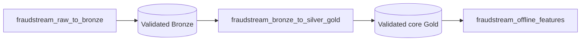

# Airflow Batch Orchestration

Three Airflow DAGs run the batch pipeline. Each transformation is followed by a quality
gate, and only a passing gate publishes the asset event that starts the next DAG.


```mermaid
flowchart LR
    raw[fraudstream_raw_to_bronze]
    bronze[(Validated Bronze)]
    warehouse[fraudstream_bronze_to_silver_gold]
    gold[(Validated core Gold)]
    features[fraudstream_offline_features]

    raw --> bronze --> warehouse --> gold --> features
```

## DAGs

| DAG | Stages | Gate |
|---|---|---|
| `fraudstream_raw_to_bronze` | `ingest` (generate, verify manifest, write Bronze), `validate` | Source rows and files match Bronze |
| `fraudstream_bronze_to_silver_gold` | `silver_ingest`, `silver_validate`, `gold_ingest`, `gold_validate` | No unexplained Silver row loss; Gold facts match Silver |
| `fraudstream_offline_features` | `ingest` (read core Gold, build features), `validate` | Training rows match facts; transaction IDs unique |

The first DAG is manual because generation is expensive. The other two start from asset
events, so a failed validation stops everything downstream. Validation failures aren't
retried (they're deterministic); execution failures get one retry.

Core Gold (`gold.transactions --core-only`) and offline features
(`gold.offline_features`) are separate Spark jobs, so each can be watched and rerun on
its own.

## Shared config

| Object | Source | Purpose |
|---|---|---|
| Variables | `airflow/config/variables.json` | Paths, Spark master, write mode, pool size |
| Connections | `airflow/config/connections.json` | PostgreSQL and Kafka endpoints |
| Pool `fraudstream_spark` | | One slot, so local Spark jobs run one at a time |

`airflow-init` imports these. Connection secrets come from Compose environment variables.

## Run it

```bash
docker compose --profile orchestration up --build -d \
  airflow-db airflow-init airflow-api-server airflow-dag-processor airflow-scheduler
```

Open `http://localhost:18081` (simple auth, automatic admin), unpause the three
`fraudstream_*` DAGs, and trigger only `fraudstream_raw_to_bronze`. Follow it in **Grid**
or **Graph**, and see the DAGs connect in **Assets**. Screenshots of a full run are in
[10_airflow_workflow_demonstration.md](10_airflow_workflow_demonstration.md).

This setup is for local use. Change the Fernet, JWT, API and service secrets before
sharing it.

## Where things are

| Area | Location |
|---|---|
| DAGs | `airflow/dags/` |
| Shared commands and assets | `airflow/include/fraudstream_airflow/` |
| Variables, connections, bootstrap | `airflow/config/` |
| Runtime | `airflow/Dockerfile`, `docker-compose.yml` |
| Quality gates | `src/fraudstream/orchestration/validation.py` |
