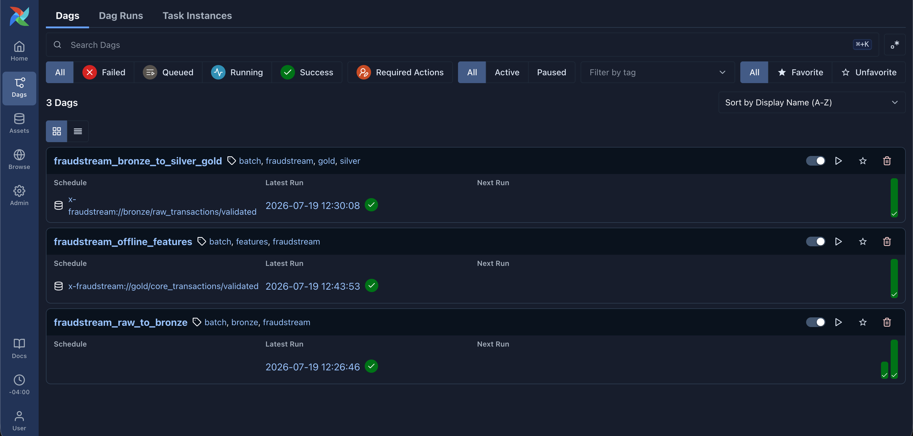
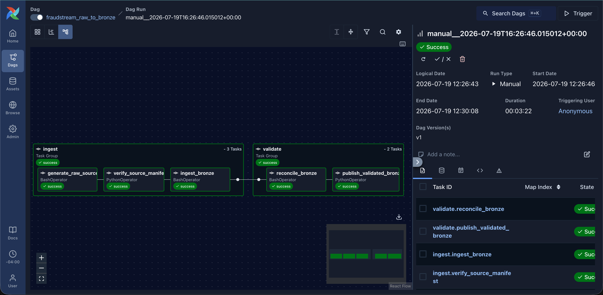
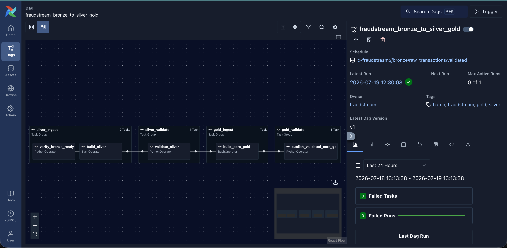
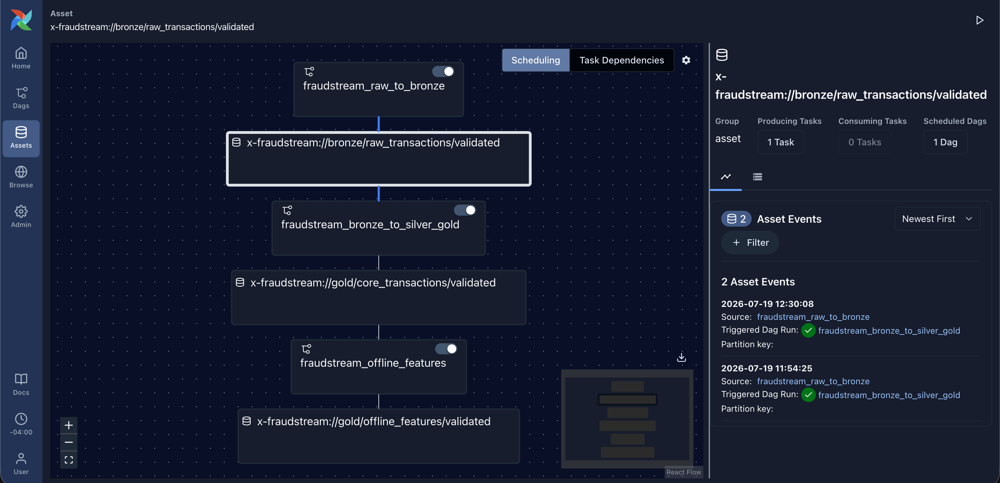
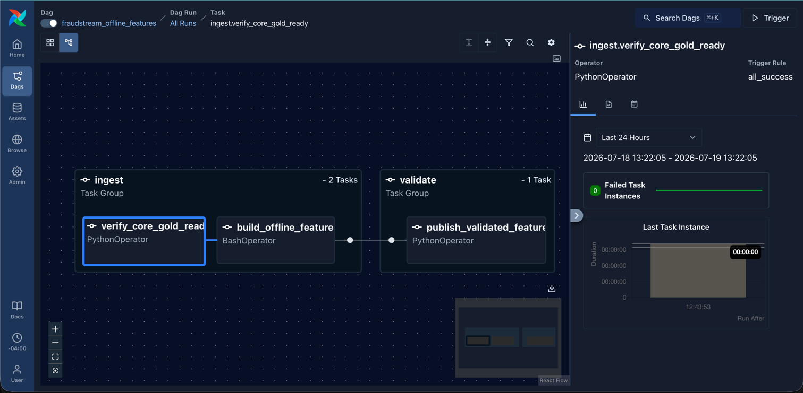

# Airflow Workflow Demonstration

This captured run demonstrates the complete offline dependency chain:

```text
Raw generation and Bronze validation
    -> Silver and core Gold validation
    -> Offline feature validation
```

## Observed Result

| Evidence | Observed result |
|---|---|
| Raw-to-Bronze run | Started at `12:26:46`, ended at `12:30:08`, completed in `3m 22s` |
| Bronze asset handoff | Event at `12:30:08` automatically triggered `fraudstream_bronze_to_silver_gold` |
| Core Gold handoff | The offline-feature DAG started at `12:43:53` after core Gold validation |
| Final status | All three DAGs succeeded |



## 1. Generate, Ingest, And Validate Bronze

The first DAG is triggered manually. Its `ingest` group generates source files,
checks the manifest, and writes Bronze. The `validate` group reconciles Bronze
with the source before publishing the validated asset. All five tasks succeeded.



## 2. Build Silver And Core Gold

The validated Bronze asset starts the second DAG. Silver is built and validated
before core Gold is allowed to run. The graph exposes four clear processing
boundaries and shows zero failed tasks and zero failed runs.



## 3. Schedule With Validated Assets

The Asset view proves that DAGs are connected by data readiness rather than by
time or manual ordering. The `12:30:08` Bronze event records its producer and
the downstream DAG run it triggered. Core Gold uses the same pattern to start
offline features.



## 4. Build And Validate Offline Features

The final DAG verifies that core Gold is ready, builds the feature tables, and
publishes a validated offline-feature asset only after the output checks pass.



This workflow demonstrates explicit ingest/validate stages, fail-fast quality
gates, asset-driven dependencies, and independently rerunnable Spark jobs.
