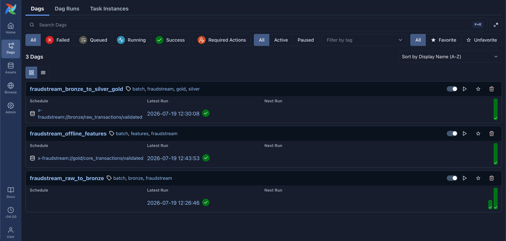
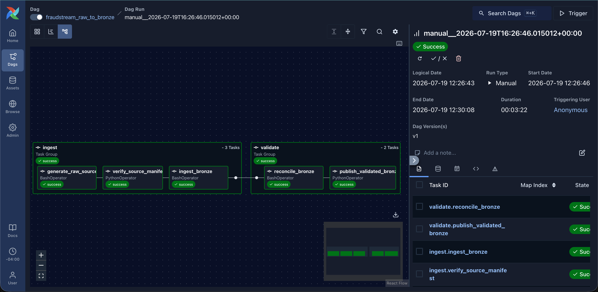
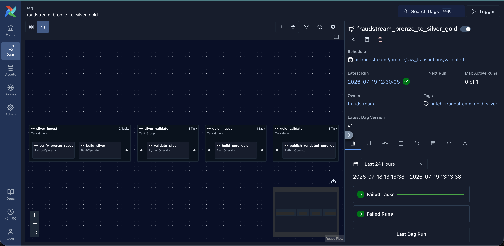
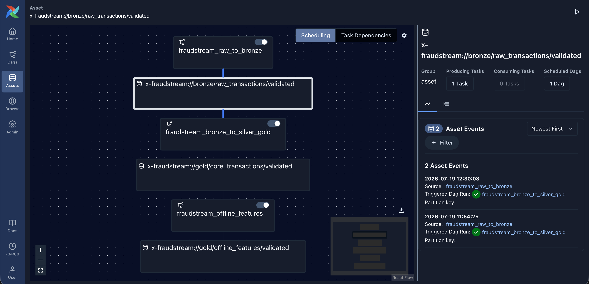
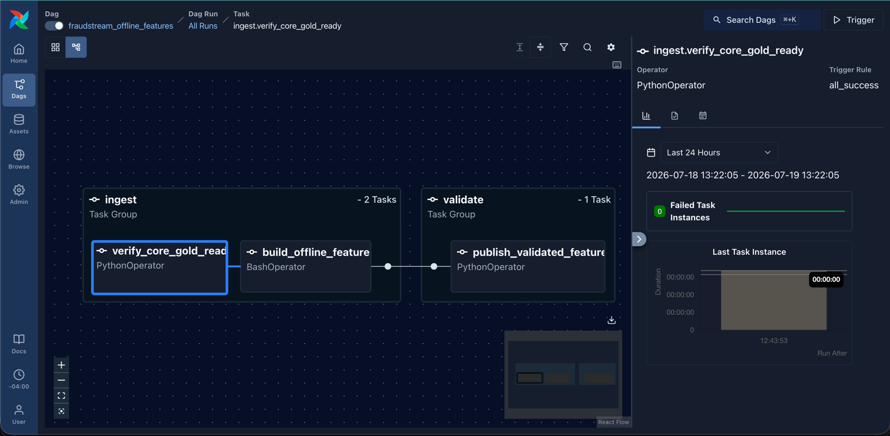

# Airflow Workflow Demonstration

A captured run of the whole offline chain: raw generation and Bronze, Silver and core
Gold, then offline features. Setup is in [09_orchestration_flow.md](09_orchestration_flow.md).

| Evidence | Result |
|---|---|
| Raw-to-Bronze run | `12:26:46` to `12:30:08`, `3m 22s` |
| Bronze handoff | The `12:30:08` asset event triggered `fraudstream_bronze_to_silver_gold` automatically |
| Core Gold handoff | Offline features started at `12:43:53` after Gold validation |
| Final status | All three DAGs succeeded |

## 1. Raw to Bronze

Triggered by hand. `ingest` generates the files, checks the manifest and writes Bronze;
`validate` reconciles it with the source before publishing the asset. All five tasks passed.

## 2. Silver and core Gold

The Bronze asset starts this DAG. Silver is built and validated before Gold runs, with
zero failed tasks and runs.

## 3. Assets connect the DAGs

DAGs are linked by data readiness, not by time. The `12:30:08` event shows its producer
and the downstream run it triggered. Core Gold does the same for offline features.

## 4. Offline features

Checks that core Gold is ready, builds the feature tables, and publishes the validated
asset only after the output checks pass.

