# Data Governance With DataHub

FraudStream publishes its PostgreSQL catalog, Airflow pipeline lineage, data
contracts, and measured quality results to DataHub. This provides one place to
answer three engineering questions:

- Where did this table come from?
- Did the latest pipeline validation pass?
- What schema and data-quality guarantees does the table provide?

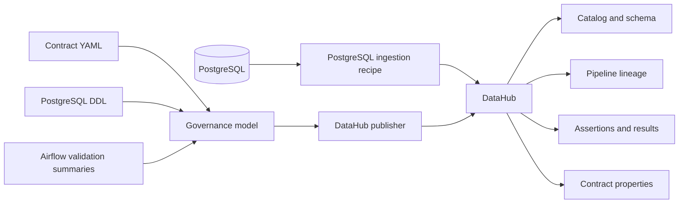

## Catalog

DataHub discovers the `bronze`, `silver`, `gold`, and `metadata` PostgreSQL
schemas. Tables remain grouped by their physical database and schema, so the
catalog reflects the actual serving model rather than a separate logical copy.

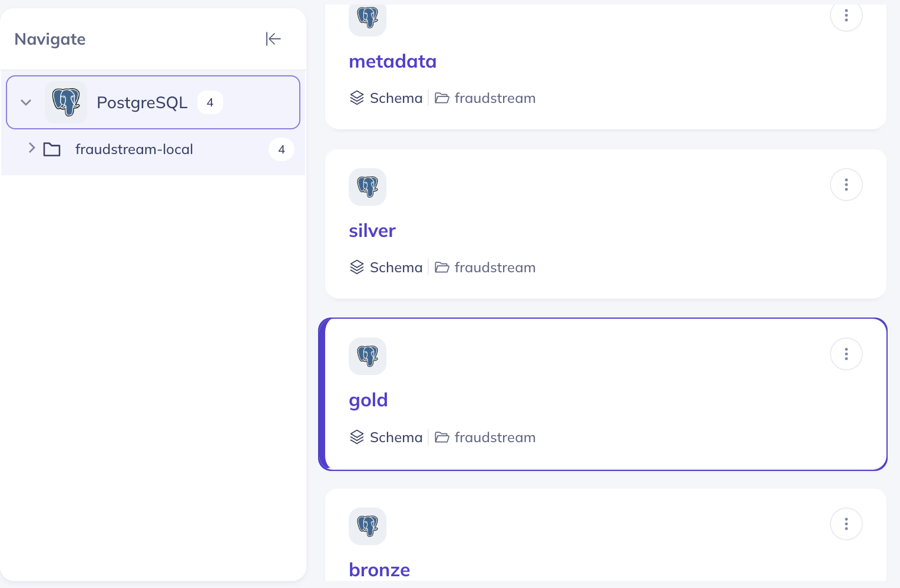

## Lineage

The lineage graph includes both datasets and the Airflow task responsible for
the transformation.

### Raw to Bronze

The generated raw transaction files enter `fraudstream_raw_to_bronze`, which
produces the source-faithful Bronze transaction table and an ingestion audit
table.

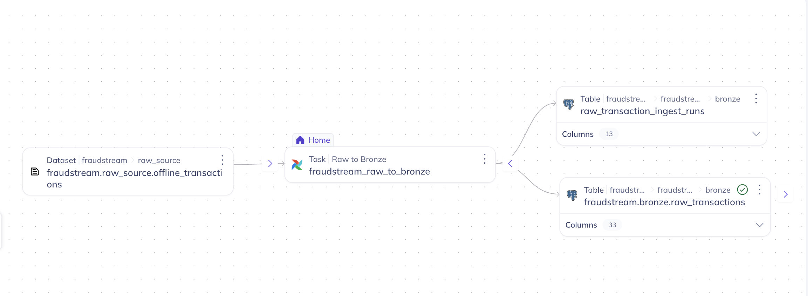

### Bronze to Silver and Gold

`fraudstream_bronze_to_silver_gold` reads Bronze transactions, produces cleaned
Silver records and quality evidence, then materializes 15 Gold facts and
dimensions. DataHub groups the additional outputs in the graph to keep this
high-fan-out pipeline readable.

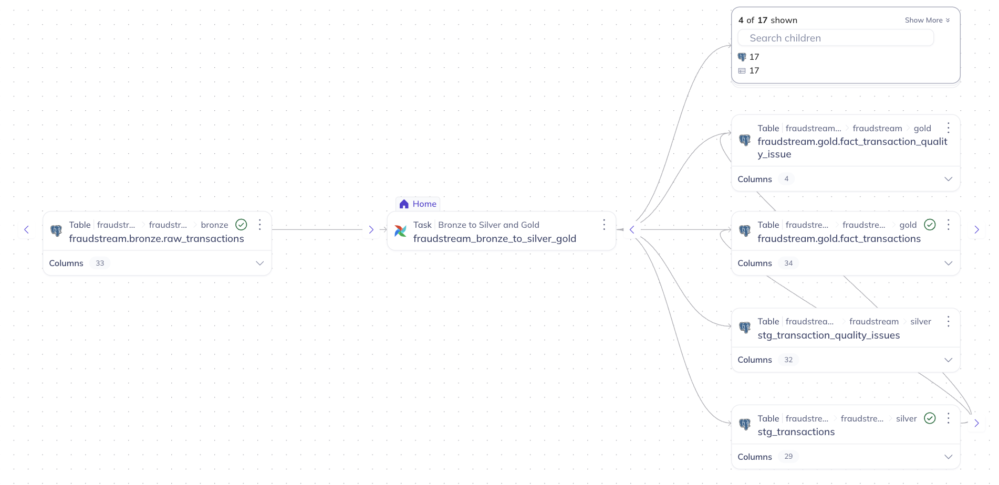

### Offline Features

The offline feature pipeline reads transaction and daily Gold aggregates and
produces four point-in-time feature tables. The graph makes the dependencies of
`feat_transaction_training` visible, including customer, account, merchant, and
transaction inputs.

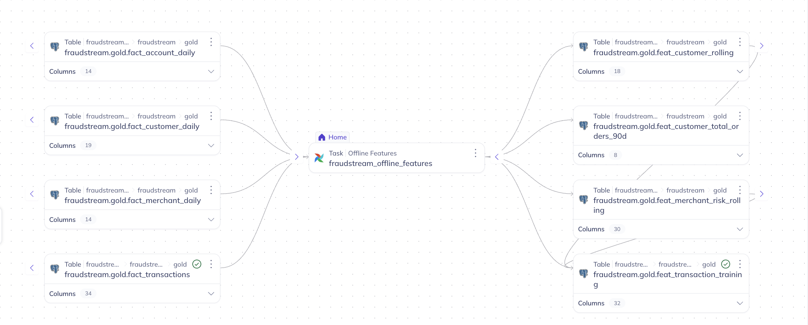

## Validation

Airflow writes measured validation summaries after each batch. The DataHub
publisher evaluates the contract rules from those summaries and reports the
results as custom assertions. Missing or malformed evidence becomes `ERROR`,
not a false success.

### Silver and Gold reconciliation

The selected Silver transaction count and Gold fact count are both **500,000**.
This proves the Gold build preserved the required one-row-per-transaction grain.

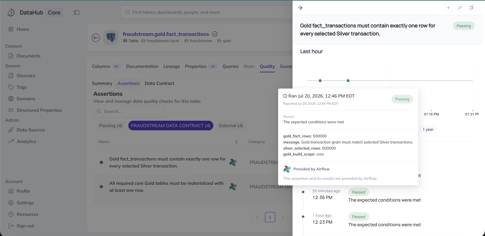

The completeness assertion also confirms that all **15 expected Gold tables**
were reported, with no missing or empty tables.

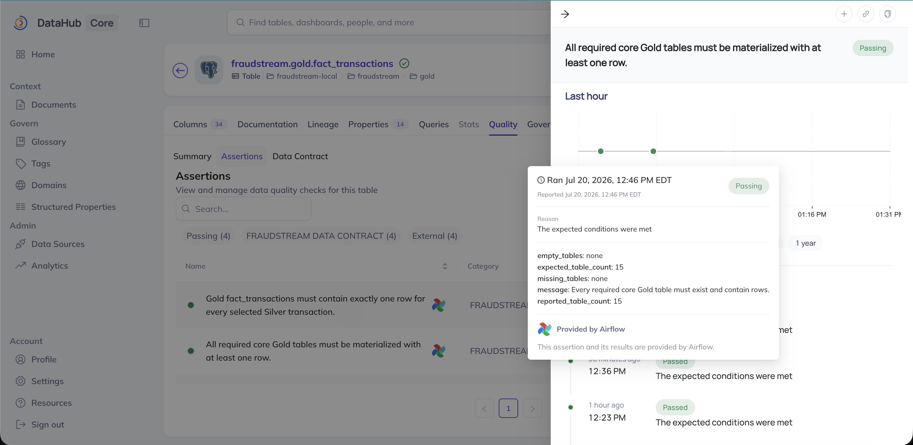

### Training-table integrity

The training table contains **500,000 rows**, equal to the **500,000 source fact
transactions**. This prevents transactions from being silently lost or
multiplied during feature joins.

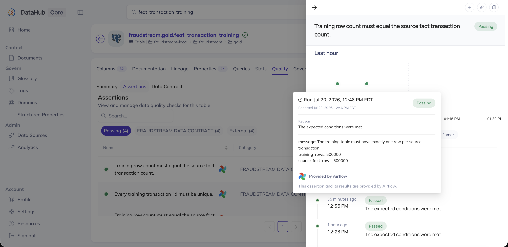

The uniqueness check reports **500,000 distinct transaction IDs** across
**500,000 training rows**, confirming exactly one training record per
transaction.

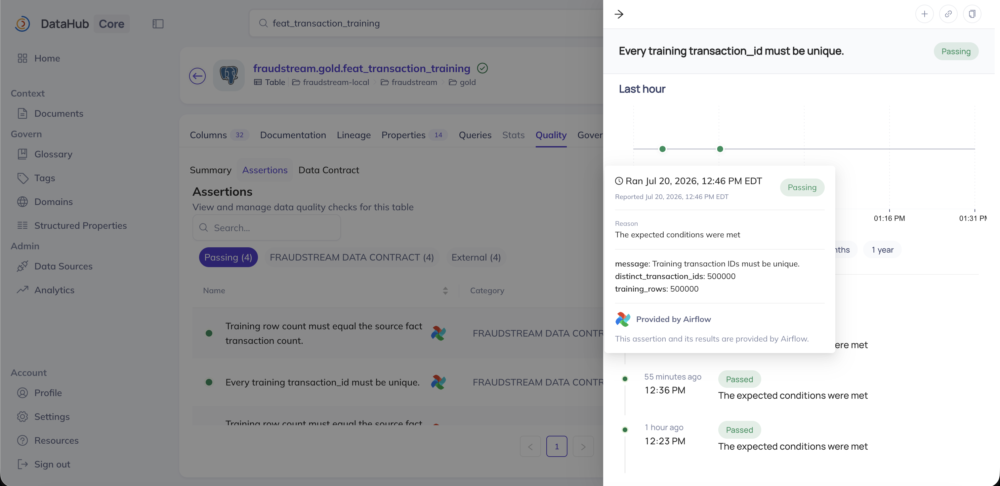

## Data Contract

The version-controlled YAML files in `datahub/contracts/` are the source of
truth. Each contract defines its owner, producing pipeline, dataset grain,
required fields, and quality rules. The publisher validates required fields
against the PostgreSQL DDL before it sends metadata to DataHub.

For `feat_transaction_training`, DataHub shows:

- contract status `ACTIVE` and schema check `SUCCESS`;
- pipeline `fraudstream_offline_features`;
- exactly one point-in-time-safe row per `transaction_id`;
- two assertions, both passing.

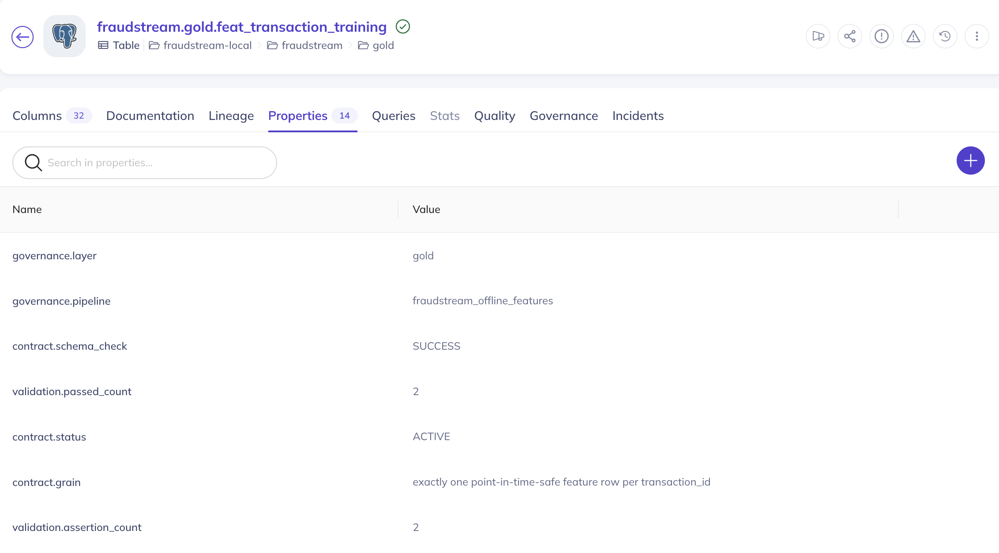

The remaining properties connect the UI back to the governed source file and
identify the contract owner, version, ID, and required columns.

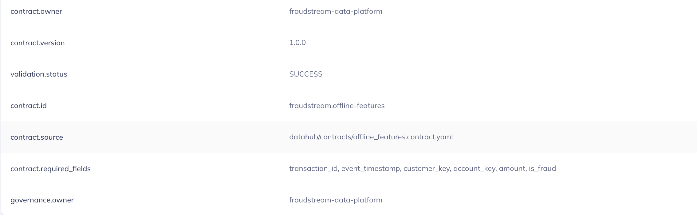

The contract is therefore presented in three complementary views:

| DataHub view | Evidence |
|---|---|
| Properties | Contract definition, ownership, grain, version, and required fields |
| Quality | Latest assertion status and measured row-count evidence |
| Lineage | Upstream datasets, responsible Airflow pipeline, and governed outputs |

## Publish The Governance Metadata

```bash
uv sync --project datahub --python 3.11
docker compose up -d postgres postgres-schema-init
./datahub/scripts/start.sh
./datahub/scripts/publish.sh
```

Open `http://localhost:9002` and sign in with `datahub` / `datahub`.
`publish.sh` is idempotent: it ingests PostgreSQL schemas, then upserts pipeline
lineage, contract properties, assertions, and their latest results.

Implementation locations:

| Concern | Location |
|---|---|
| Pipeline and lineage model | `datahub/src/fraudstream_datahub/model.py` |
| Metadata and assertion publisher | `datahub/src/fraudstream_datahub/publish.py` |
| Versioned contracts | `datahub/contracts/` |
| PostgreSQL ingestion recipe | `datahub/recipes/postgres.dhub.yaml` |
