# Data Governance With DataHub

FraudStream publishes its PostgreSQL catalog, Airflow lineage, data contracts and
measured quality results to DataHub. One place to answer:

- Where did this table come from?
- Did the latest validation pass?
- What schema and quality guarantees does it give?

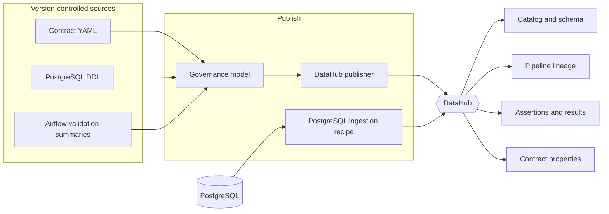
```mermaid
flowchart LR
    subgraph Sources["Version-controlled sources"]
        contract[Contract YAML]
        ddl[PostgreSQL DDL]
        evidence[Airflow validation summaries]
    end

    subgraph Publish["Publish"]
        model[Governance model]
        publisher[DataHub publisher]
        recipe[PostgreSQL ingestion recipe]
    end

    postgres[(PostgreSQL)]
    datahub{{DataHub}}

    contract --> model
    ddl --> model
    evidence --> model
    model --> publisher --> datahub
    postgres --> recipe --> datahub

    datahub --> catalog[Catalog and schema]
    datahub --> lineage[Pipeline lineage]
    datahub --> quality[Assertions and results]
    datahub --> properties[Contract properties]
```

## Catalog

DataHub discovers the `bronze`, `silver`, `gold` and `metadata` schemas, grouped as they
exist in the database.

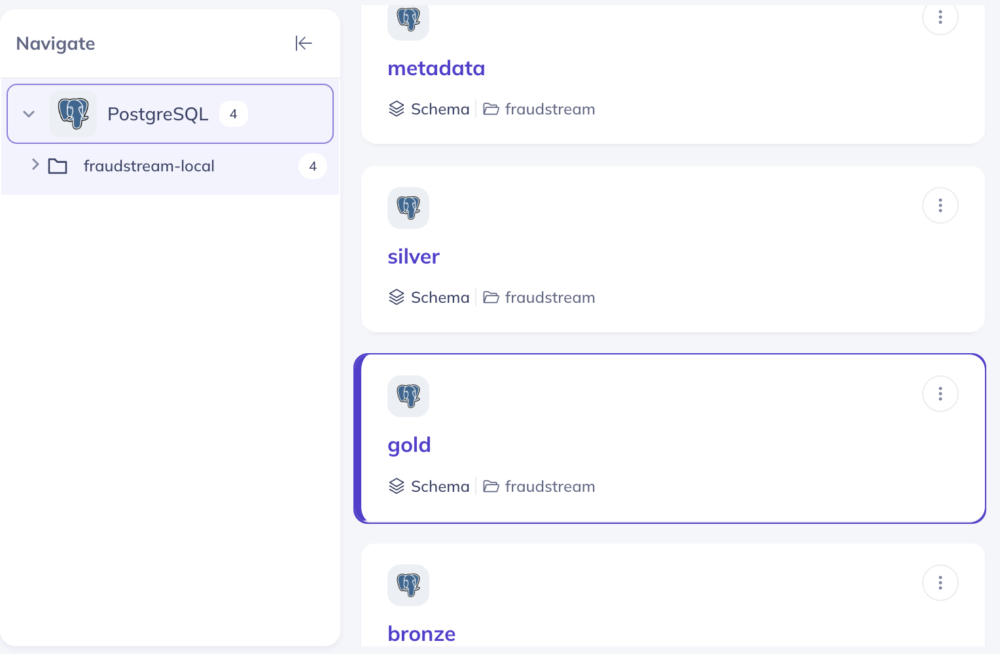

## Lineage

Each graph shows the datasets and the Airflow task that transforms them.

**Raw to Bronze.** Raw files enter `fraudstream_raw_to_bronze`, which produces the Bronze
table and an ingestion audit table.

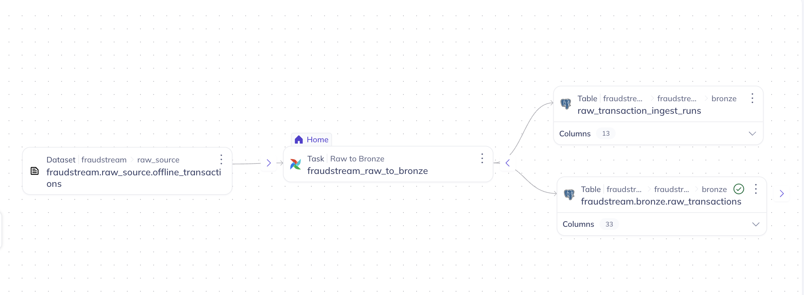

**Bronze to Silver and Gold.** `fraudstream_bronze_to_silver_gold` produces Silver plus
quality evidence, then 15 Gold facts and dimensions (grouped in the graph to stay readable).

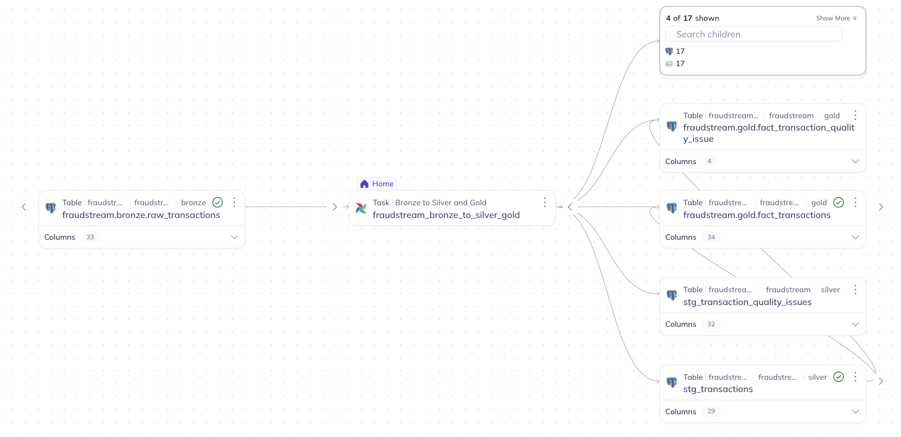

**Offline features.** Gold facts and daily aggregates feed four point-in-time feature
tables, and you can see everything `feat_transaction_training` depends on.

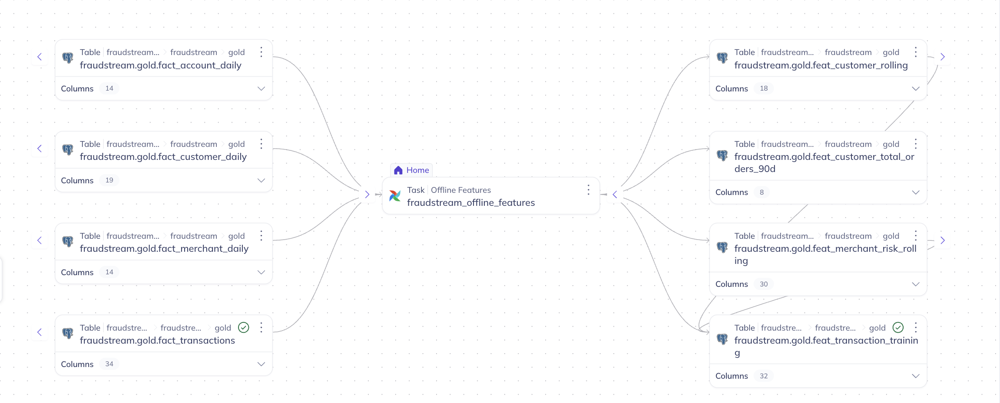

## Validation

After each batch, Airflow writes measured validation summaries. The publisher checks the
contract rules against them and reports custom assertions. Missing or malformed evidence
becomes `ERROR`, never a false pass.

Silver and Gold both have **500,000** transactions, so Gold kept one row per transaction.

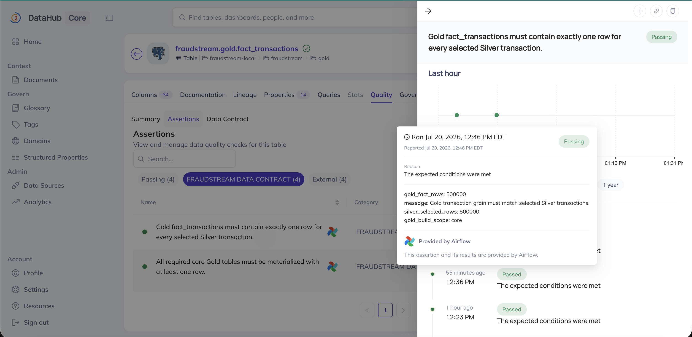

All **15 expected Gold tables** were reported, none missing or empty.

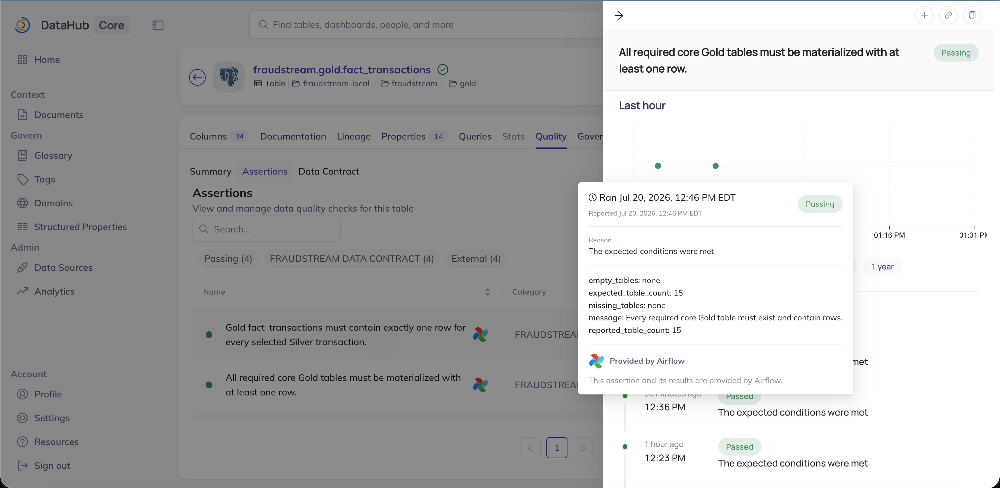

The training table has **500,000 rows**, equal to the 500,000 source facts, so feature
joins lost or multiplied nothing.

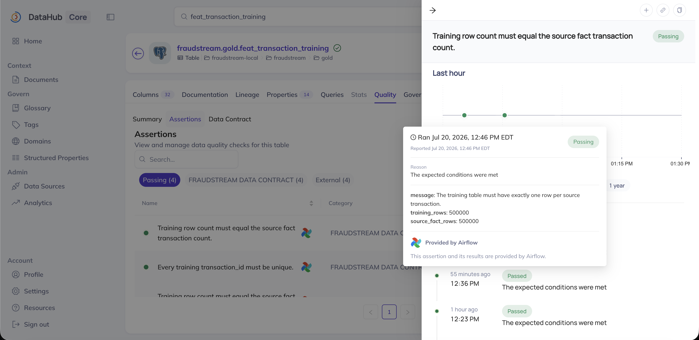

There are **500,000 distinct transaction IDs** across 500,000 training rows: exactly one
record per transaction.

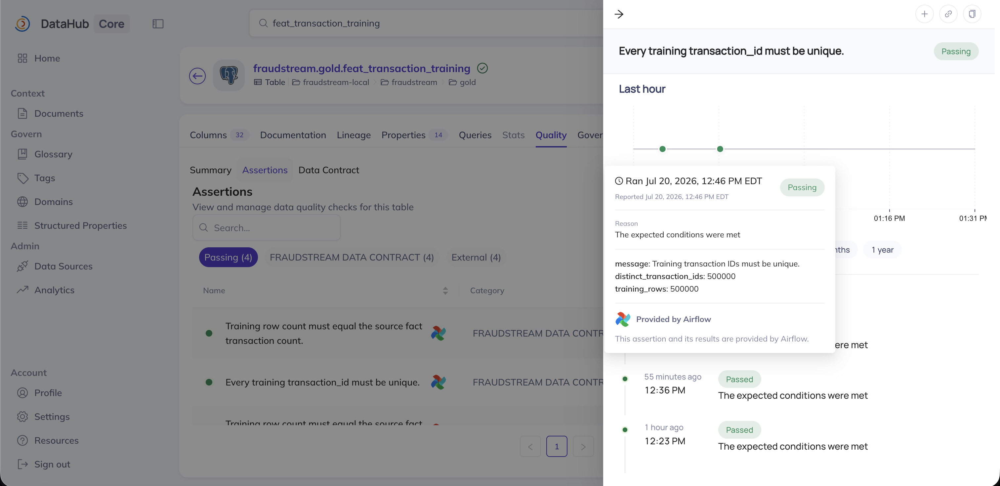

## Data contract

The YAML files in `datahub/contracts/` are the source of truth: owner, producing
pipeline, grain, required fields and quality rules. The publisher checks required fields
against the PostgreSQL DDL before sending anything.

For `feat_transaction_training` DataHub shows status `ACTIVE`, schema check `SUCCESS`,
pipeline `fraudstream_offline_features`, one point-in-time-safe row per `transaction_id`,
and two passing assertions.

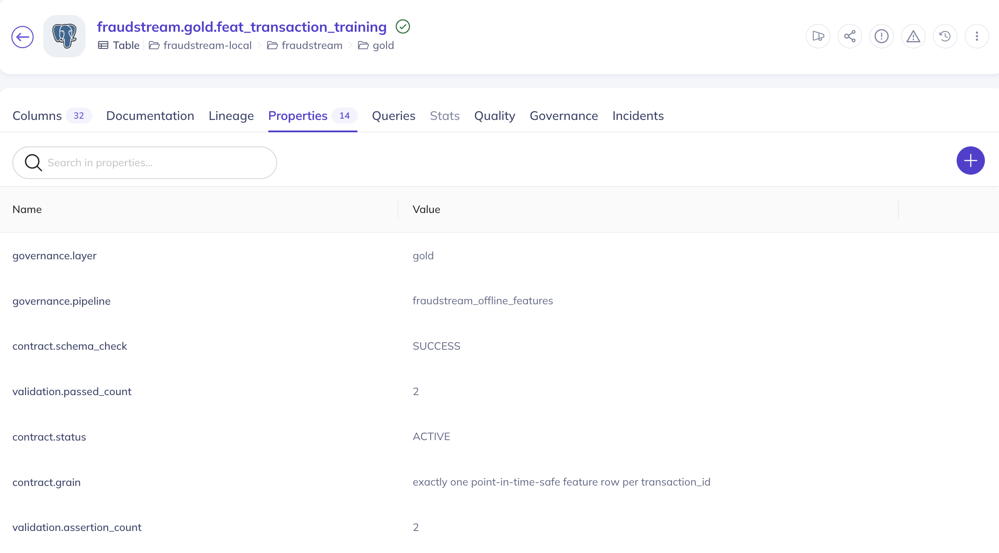

The rest of the properties point back to the source file and list the owner, version, ID
and required columns.

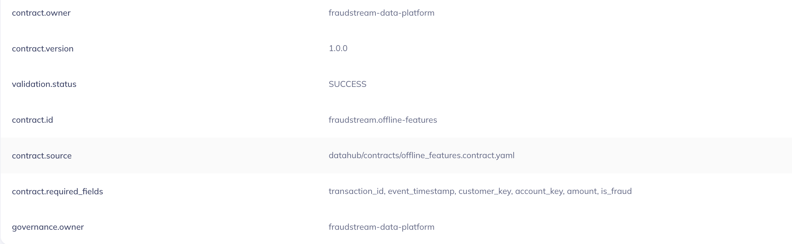

| DataHub view | Shows |
|---|---|
| Properties | Definition, owner, grain, version, required fields |
| Quality | Latest assertion status and row-count evidence |
| Lineage | Upstream datasets and the responsible Airflow pipeline |

## Publish

```bash
uv sync --project datahub --python 3.11
docker compose up -d postgres postgres-schema-init
./datahub/scripts/start.sh
./datahub/scripts/publish.sh
```

Open `http://localhost:9002` (`datahub` / `datahub`). `publish.sh` is idempotent: it
ingests the PostgreSQL schemas, then upserts lineage, contracts, assertions and results.

| Concern | Location |
|---|---|
| Pipeline and lineage model | `datahub/src/fraudstream_datahub/model.py` |
| Metadata and assertion publisher | `datahub/src/fraudstream_datahub/publish.py` |
| Contracts | `datahub/contracts/` |
| Ingestion recipe | `datahub/recipes/postgres.dhub.yaml` |
