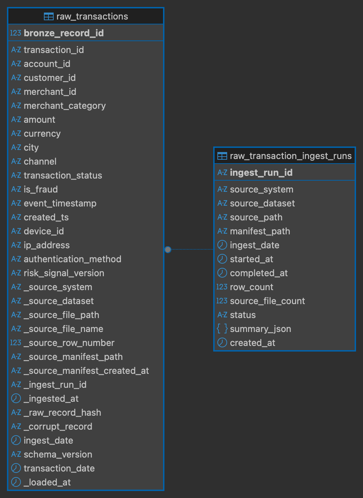
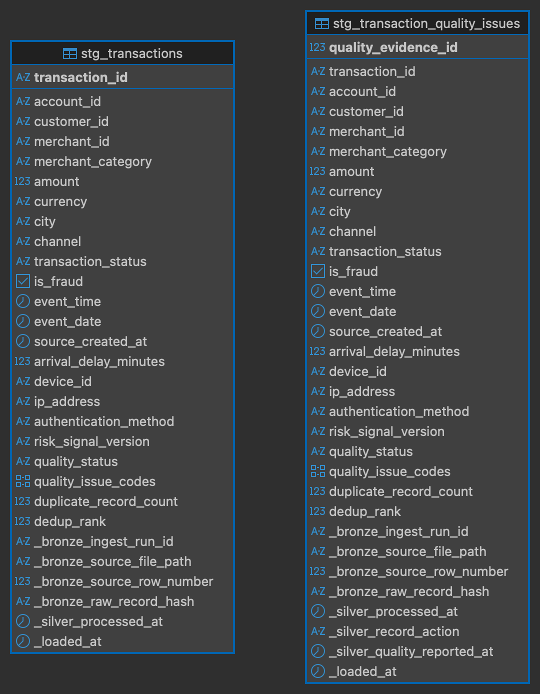
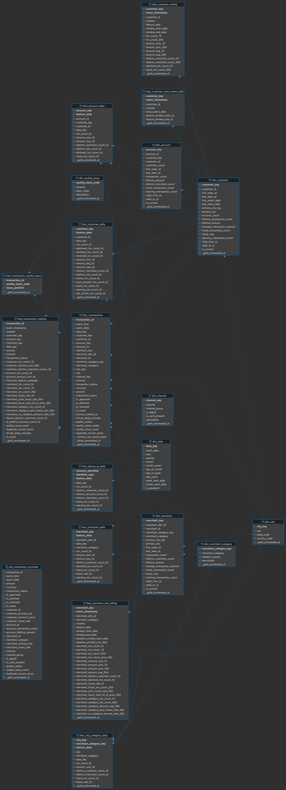

# FraudStream Database Schema

FraudStream publishes offline pipeline outputs to PostgreSQL database
`fraudstream`. The database separates storage by processing responsibility:

```text
bronze (source fidelity) → silver (data quality) → gold (analytics and ML)
```

The diagrams below were exported from DBeaver and reflect the physical tables,
columns, keys, and relationships created by the PostgreSQL schema.

## Bronze: Preserve The Source



`bronze.raw_transactions` stores source records without deduplication. Business
fields are preserved together with ingestion metadata such as source file,
source row number, schema version, raw-record hash, and ingestion timestamp.

`bronze.raw_transaction_ingest_runs` records one audit entry per load, including
its source, file count, row count, status, and validation summary. The
`_ingest_run_id` on each transaction connects a row to the load that produced
it. This makes every Bronze record traceable to its original ingestion run.

## Silver: Select Clean Records And Preserve Evidence



`silver.stg_transactions` contains the deterministic winner for each
`transaction_id`. It converts raw strings into typed values, calculates arrival
delay, ranks duplicates, and assigns `quality_status` and quality issue codes.

`silver.stg_transaction_quality_issues` preserves evidence for selected,
quarantined, and duplicate-rejected records. It retains Bronze identifiers and
the Silver action, so cleaning improves usability without erasing why a record
was accepted or rejected.

The main design invariant is:

```text
Bronze inputs = Silver selected + quarantined + duplicate-rejected
```

## Gold: Serve Analytics And Machine Learning

[](../images/schema/gold-schema-erd.png)

`gold.fact_transactions` is the central transaction fact at one row per
selected transaction. It connects transaction measures such as `amount` and
`is_fraud` to conformed date, customer, account, merchant, city, channel, and
merchant-category dimensions.

The Gold schema contains four main table groups:

| Group | Purpose | Examples |
|---|---|---|
| Dimensions | Reusable descriptive entities and surrogate keys | `dim_customer`, `dim_account`, `dim_merchant`, `dim_date` |
| Facts and aggregates | Transaction detail and daily analytical summaries | `fact_transactions`, `fact_customer_daily`, `fact_merchant_daily` |
| Feature tables | Point-in-time customer and merchant signals for ML | `feat_customer_rolling`, `feat_merchant_risk_rolling`, `feat_transaction_training` |
| Exploration view | Flattened transaction record for convenient analysis | `obt_transaction_enriched` |

Customer, account, and merchant dimensions include `valid_from_ts`,
`valid_to_ts`, and `is_current`, allowing historical versions to be represented
without overwriting prior attributes. Daily fact tables support reusable
aggregations, while feature tables keep model inputs separate from the core
dimensional model.

The result is a clear progression:

- Bronze answers: **What exactly arrived, and from which load?**
- Silver answers: **Which record was selected, and what quality decisions were made?**
- Gold answers: **How can the cleaned data support reporting, investigation, and model training?**

The complete DDL is defined in
`infra/postgres/init/001_create_fraudstream_schema.sql`; Spark-to-PostgreSQL
publication is implemented in `src/fraudstream/jobs/postgres/publish.py`.
