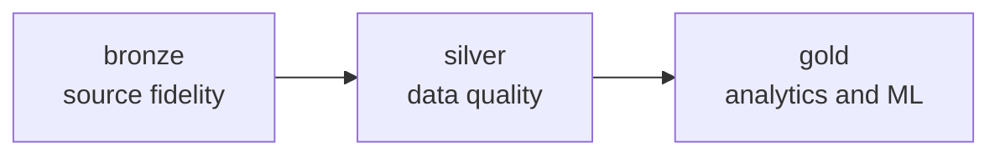
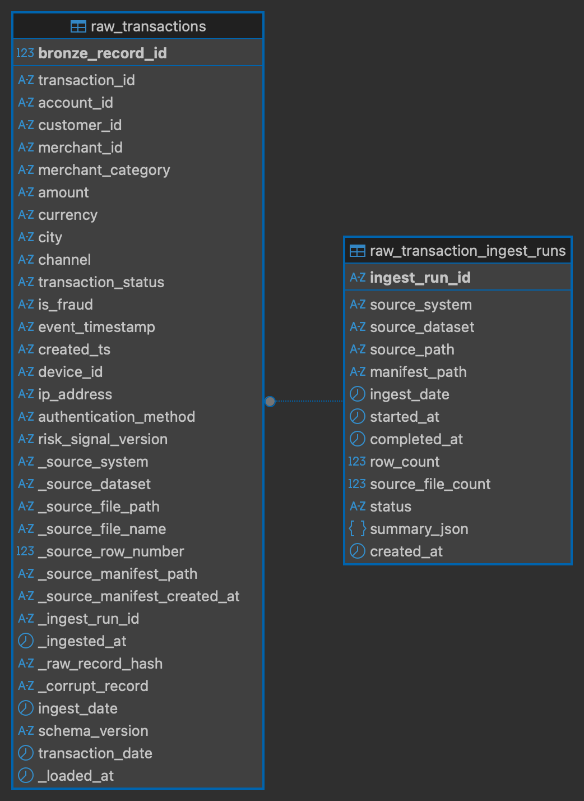
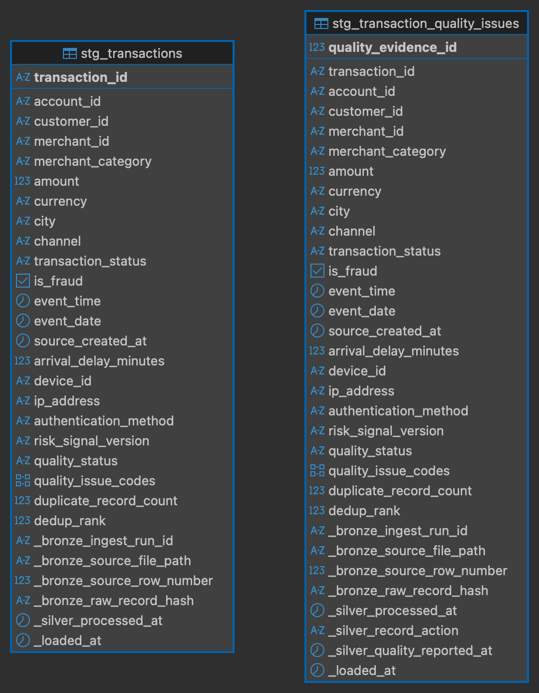
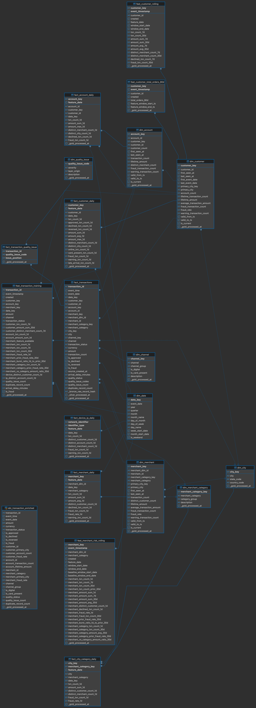

# Database Schema

Offline pipeline outputs are published to the PostgreSQL database `fraudstream`, one
schema per job of the data:


```mermaid
flowchart LR
    bronze["bronze<br/>source fidelity"] --> silver["silver<br/>data quality"] --> gold["gold<br/>analytics and ML"]
```

The ERDs below were exported from DBeaver and show the real tables, keys and relationships.

## Bronze: keep the source



`bronze.raw_transactions` holds source records as they arrived, with no deduplication,
plus ingestion metadata (file, row number, schema version, hash, timestamp).
`bronze.raw_transaction_ingest_runs` has one audit row per load, and `_ingest_run_id` ties
each transaction to the load that produced it.

## Silver: pick clean records, keep the evidence



`silver.stg_transactions` holds the single winner per `transaction_id`, typed, with arrival
delay, duplicate rank and quality status. `silver.stg_transaction_quality_issues` keeps
the selected, quarantined and duplicate-rejected records, so cleaning never erases why a
record was accepted or rejected.

```text
Bronze inputs = Silver selected + quarantined + duplicate-rejected
```

## Gold: serve analytics and ML

[](../images/schema/gold-schema-erd.png)

`gold.fact_transactions` is the central fact, one row per selected transaction, joined to
the date, customer, account, merchant, city, channel and category dimensions.

| Group | Purpose | Examples |
|---|---|---|
| Dimensions | Descriptive entities with surrogate keys | `dim_customer`, `dim_merchant`, `dim_date` |
| Facts and aggregates | Transaction detail and daily summaries | `fact_transactions`, `fact_customer_daily` |
| Features | Point-in-time signals for ML | `feat_customer_rolling`, `feat_transaction_training` |
| View | Flat record for exploring | `obt_transaction_enriched` |

Customer, account and merchant dimensions carry `valid_from_ts`, `valid_to_ts` and
`is_current`, so history is versioned instead of overwritten.

In short: Bronze says *what arrived*, Silver says *which record won and why*, Gold says
*how the data serves reporting and training*.

The DDL is `infra/postgres/init/001_create_fraudstream_schema.sql`. Each Spark job writes
its own tables over JDBC through `src/fraudstream/jobs/warehouse.py`. There is no separate
publisher.
