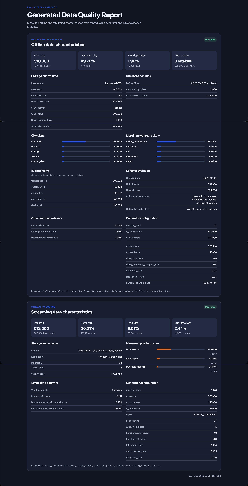

# Generated Data Quality Report

FraudStream already measures its generated data problems in JSON artifacts. The
`fraudstream-data-quality` command turns those artifacts into a standalone HTML
report with summary cards, tables, and percentage bars. It does not rescan
500,000 records or start Spark.

[](../images/data_quality/data_quality_report.png)

## Capture the report

Generate the two datasets first:

```bash
PYTHONPATH=src python -m fraudstream.generators.offline_transactions
PYTHONPATH=src python -m fraudstream.generators.streaming_transactions
```

After regenerating the offline source, refresh Bronze and Silver before
capturing the before/after deduplication result:

```bash
PYTHONPATH=src python -m fraudstream.jobs.bronze.ingest_transactions \
  --source-dir data/raw_source/offline_transactions \
  --output-dir data/bronze/raw_transactions \
  --write-mode overwrite

PYTHONPATH=src python -m fraudstream.jobs.silver.transactions \
  --bronze-dir data/bronze/raw_transactions \
  --output-dir data/silver/transactions \
  --quality-output-dir data/silver/transaction_quality_issues \
  --write-mode overwrite
```

Generate the combined report:

```bash
PYTHONPATH=src python -m fraudstream.reports.data_quality \
  --dataset all \
  --output reports/data_quality_report.html
```

Open `reports/data_quality_report.html` in a browser to capture screenshots or
print it to PDF. The report is self-contained and does not require a server.

Generate separate reports when you want shorter screenshots:

```bash
PYTHONPATH=src python -m fraudstream.reports.data_quality \
  --dataset offline \
  --output reports/offline_data_quality.html

PYTHONPATH=src python -m fraudstream.reports.data_quality \
  --dataset streaming \
  --output reports/streaming_data_quality.html
```

Use `--top-n 3` to limit the displayed city and merchant-category distributions.

## Evidence and characteristics

| Dataset | Stored data | Default volume | Evidence read by the report |
|---|---|---:|---|
| Offline source | CSV partitioned by schema version and transaction date | 500,000 base rows plus 2% duplicates | `_quality_summary.json` |
| Silver offline | Parquet partitioned by event date | One selected row per transaction ID | `_silver_transactions_summary.json` |
| Streaming source | JSONL Kafka-replay log | 500,000 base events plus 2.5% duplicates | `_stream_summary.json` |

The offline section shows measured city/category skew, ID cardinality, old-schema
rows and their absent columns, raw duplicate rate, Silver deduplication result,
late arrivals, physical storage size, and file count.

The streaming section shows measured burst, late, duplicate, and out-of-order
events plus event-time window concentration. If the stream has not been
generated, the report labels its values as configured targets rather than
measured results.

## Generator configuration

The report displays the most important settings from:

- `configs/generator/offline_transactions.json`
- `configs/generator/streaming_transactions.json`

Change these files to create another reproducible scenario, regenerate the
data, and capture the new measured report. The random seeds make comparisons
repeatable.
