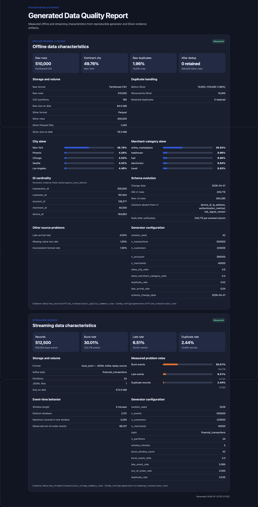

# Data Quality Report

The generators already write their measured problems to JSON. `fraudstream-data-quality`
turns those files into one self-contained HTML report (cards, tables, percentage bars).
It doesn't rescan 500,000 records or start Spark.

[](../images/data_quality/data_quality_report.png)

## Generate it

```bash
# 1. data
PYTHONPATH=src python -m fraudstream.generators.offline_transactions
PYTHONPATH=src python -m fraudstream.generators.streaming_transactions

# 2. refresh Bronze and Silver (for the before/after dedup result)
PYTHONPATH=src python -m fraudstream.jobs.bronze.ingest_transactions \
  --source-dir data/raw_source/offline_transactions \
  --output-dir data/bronze/raw_transactions --write-mode overwrite
PYTHONPATH=src python -m fraudstream.jobs.silver.transactions \
  --bronze-dir data/bronze/raw_transactions \
  --output-dir data/silver/transactions \
  --quality-output-dir data/silver/transaction_quality_issues --write-mode overwrite

# 3. report
PYTHONPATH=src python -m fraudstream.reports.data_quality \
  --dataset all --output reports/data_quality_report.html
```

Open the HTML in a browser, or print it to PDF. For shorter screenshots use
`--dataset offline` or `--dataset streaming` with their own `--output`, and
`--top-n 3` to limit the city and category lists.

## What it reads

| Dataset | Default volume | Evidence file |
|---|---:|---|
| Offline source (CSV) | 500,000 rows + 2% duplicates | `_quality_summary.json` |
| Silver | One selected row per transaction ID | `_silver_transactions_summary.json` |
| Streaming source (JSONL) | 500,000 events + 2.5% duplicates | `_stream_summary.json` |

- **Offline:** city and category skew, ID cardinality, old-schema rows, raw duplicate
  rate, the Silver dedup result, late arrivals, storage size, file count.
- **Streaming:** burst, late, duplicate and out-of-order events, and how concentrated the
  event-time windows are. If the stream hasn't been generated, values are labelled as
  targets, not measurements.

To try another scenario, change `configs/generator/offline_transactions.json` or
`streaming_transactions.json` and regenerate. The fixed seeds keep comparisons repeatable.
