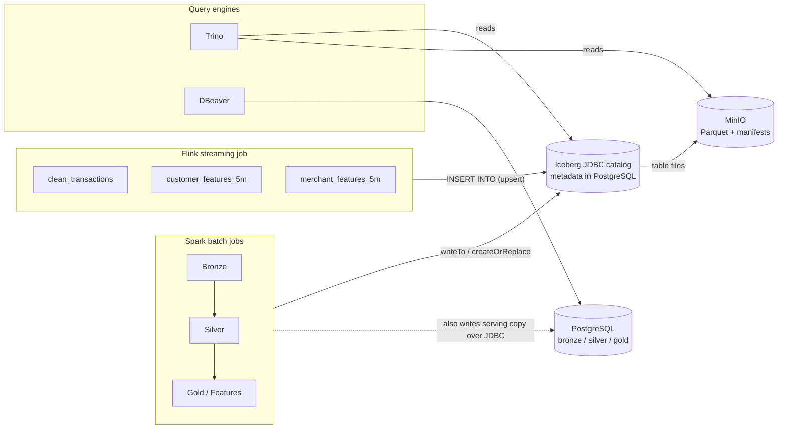

# Lakehouse: Apache Iceberg On MinIO

Every Bronze, Silver, Gold and feature table from Spark, plus three real-time tables from
Flink, lives in one Iceberg catalog on MinIO. Iceberg is a metadata layer, not another
storage system: the data is still Parquet in MinIO, but a versioned metadata tree gives
both engines schemas, snapshots and row-level upserts that a bare `s3a://` folder can't.

## Why

Fraud labels arrive late. A transaction happens now, and its confirmed label may take
weeks. A later batch job has to attach that label to the *exact* streaming features that
existed at the time. A Kafka topic with finite retention can't do that. A durable,
queryable Iceberg table can.

## Design



- **JDBC catalog on the existing PostgreSQL.** No new service. Iceberg creates its own
  bookkeeping tables in the `fraudstream` database, apart from the serving schemas. The
  catalog only tracks *which files make up which table version*, never rows.
- **`HadoopFileIO`** reuses the `fs.s3a.*` / `core-site.xml` MinIO settings both engines
  already have.
- **Names** mirror PostgreSQL under the `iceberg` catalog: `iceberg.bronze.raw_transactions`,
  `iceberg.silver.*`, `iceberg.gold.*` and `iceberg.streaming.*` for Flink's three tables.

## Spark

`src/fraudstream/jobs/warehouse.py` provides `configure_iceberg_catalog(...)` and
`write_iceberg_table(dataframe, table, partition_columns, mode)`. Every job reads with
`spark.table("iceberg.<layer>.<name>")` and writes through that helper. Unit tests use a
local `hadoop` catalog, so they don't need Postgres.

## Flink

PyFlink's DataStream API has no Iceberg sink, only the Table API does.
`src/fraudstream/jobs/flink/iceberg_sink.py` bridges them: it wraps the streaming
environment in a `StreamTableEnvironment`, creates the three tables with
`'write.upsert.enabled' = 'true'` (a late correction replaces its window's row), and joins
the Iceberg inserts with the Kafka sinks in one `StatementSet`, so it's still one Flink job.

**Version pins:**

- `apache-flink==2.1.3`, not 2.2.x, because Iceberg 1.11.0 only ships a Flink 2.1 runtime jar.
- `iceberg-spark-runtime-4.0_2.13:1.11.0`, matching `pyspark==4.1.2` (Spark 4, Scala 2.13).

## Trino: Querying Iceberg Tables

DBeaver's PostgreSQL connection only sees the serving schemas, not the Iceberg tables.
Trino reads them straight from MinIO through the same JDBC catalog (no Hive Metastore
needed). Config: `infra/trino/catalog/iceberg.properties`.

```bash
docker compose up -d minio minio-bucket-init postgres postgres-schema-init trino
docker exec -it fraudstream-trino trino --catalog iceberg --schema bronze
trino:bronze> SELECT count(*) FROM raw_transactions;
```

Any JDBC client works too: `localhost:18082`, catalog `iceberg`, schemas `bronze`,
`silver`, `gold`, `streaming`.

## Running it

The Spark jobs run as before (docs 01 to 06 and the README Quick Start), because the
Iceberg settings are the defaults. The Flink job needs the extra jars listed in
[doc 07](07_flink_streaming_pipeline.md#run-locally).

If a job or the test suite dies with `java.lang.OutOfMemoryError` (Iceberg adds JVM
classloading on top of the default driver heap), rerun with:

```bash
PYSPARK_SUBMIT_ARGS="--driver-memory 4g pyspark-shell" PYTHONPATH=src python -m ...
```

## Where things are

| Area | Location |
|---|---|
| Shared Iceberg config (Spark and Flink) | `src/fraudstream/jobs/warehouse.py` |
| Flink Table API bridge | `src/fraudstream/jobs/flink/iceberg_sink.py` |
| Trino catalog config | `infra/trino/catalog/iceberg.properties` |
| Tests | `tests/unit/test_warehouse.py`, `test_flink_iceberg_sink.py` |
