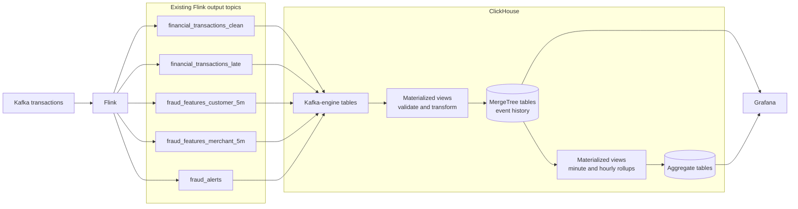

# Novel Idea: Real-Time Fraud Analytics

Flink already writes clean transactions, five-minute features, late events and alerts to
Kafka. Kafka moves them well, but it isn't built for history or interactive
investigation. The idea is to add a real-time analytics layer:

- **ClickHouse** stores and aggregates the streaming results.
- **Grafana** shows operational and fraud dashboards on top of it.

PostgreSQL keeps serving the batch tables (Bronze, Silver, Gold, features). ClickHouse
serves recent streaming analytics.

## Data flow

## What it stores

| Data product | Use |
|---|---|
| Transaction history | Investigate recent customer and merchant activity |
| Customer feature history | Velocity and amount changes by window |
| Merchant feature history | Burst and risk signals by window |
| Alert history | Search by time, customer, merchant and alert type |
| Late-event history | Measure event-time reliability |

Grafana dashboards: transactions and alerts per minute, p95 event-to-alert latency,
late and duplicate rates, highest-risk customers and merchants, and fraud by city and
category.

## Why it's worth building

It adds a real-time OLAP and visualisation stack without replacing anything, and exercises
direct Kafka-to-database ingestion, columnar table and sorting-key design, incremental
aggregation, retention, and dashboard design.

The useful experiment: aggregate raw rows at query time versus reading the pre-aggregated
tables. Report query time, rows and bytes read, memory, and dashboard refresh latency. No
speed-up gets claimed without measurements.

## Boundaries

No fraud model or scoring API here, and it doesn't replace Flink, Kafka, PostgreSQL,
Airflow or DataHub. It only stores, queries and visualises what the platform already
produces.

## References

- [ClickHouse Kafka table engine](https://clickhouse.com/docs/engines/table-engines/integrations/kafka)
- [ClickHouse incremental materialized views](https://clickhouse.com/docs/materialized-view/incremental-materialized-view)
- [Grafana ClickHouse data source](https://grafana.com/docs/plugins/grafana-clickhouse-datasource/latest/)
