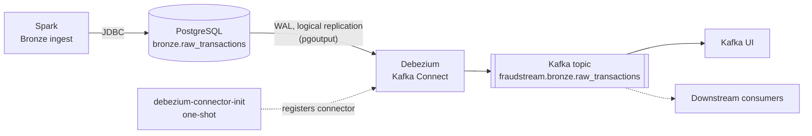

# Change Data Capture: Debezium on `bronze.raw_transactions`

Debezium watches one PostgreSQL table, `bronze.raw_transactions`, and streams every
row change to Kafka as it happens. A consumer can react the moment Bronze lands data,
without polling Postgres or waiting for the next Airflow run.

## Why only this table

- **It's the earliest "new data has landed" signal.** Bronze is the first layer raw
  records reach PostgreSQL. Silver and Gold are derived from it, so they don't need a
  second change path.
- **It's structurally stable.** The Bronze write path always `TRUNCATE`s then re-inserts
  and never drops the table. A Debezium publication is tied to the table existing, so a
  dropped table would silently stop being captured, while `TRUNCATE` is a proper
  replication event.
- **Real runs use `append`**, so CDC emits events only for genuinely new rows. (`overwrite`
  is a local-regeneration convenience, see [doc 03](03_bronze_ingestion.md).)

Any table could be wired up the same way. This shows the pattern end to end on the one
where it matters most.

## Architecture



Debezium runs as a Kafka Connect source connector (`quay.io/debezium/connect` bundles
Connect and the Postgres connector). It reads the write-ahead log through `pgoutput`,
which is built into PostgreSQL, so no extension is installed. There's no new database or
storage: it reuses the Kafka cluster the streaming pipeline already runs.

## What changed

- `postgres` starts with `-c wal_level=logical`. It takes effect on a container restart,
  with no data loss.
- Two new services in `docker-compose.yml`:
  - `debezium-connect`: the Connect worker, REST API on `localhost:18083`.
  - `debezium-connector-init`: a one-shot container that registers the connector once
    Connect is healthy, like the other `*-init` containers.
- `infra/debezium/bronze-raw-transactions-connector.json`: the table to watch, the topic
  prefix, and the slot and publication names.

No privilege changes were needed: the `fraudstream` user is a superuser in the official
image, which already includes `REPLICATION`.

## Run it

```bash
docker compose up -d postgres   # restart so wal_level=logical applies
docker compose up -d kafka kafka-topic-init debezium-connect debezium-connector-init

curl -s http://localhost:18083/connectors/fraudstream-bronze-raw-transactions/status | python3 -m json.tool
```

`"state": "RUNNING"` for both the connector and its task means it's streaming.

## What you'll see

Debezium first takes an **initial snapshot** (one `r` event per existing row), then
streams every future change. Each event's `payload.op` is:

| `op` | Meaning |
|---|---|
| `r` | Read, from the snapshot |
| `c` | Create (`INSERT`) |
| `u` | Update |
| `d` | Delete |

Bronze never updates or deletes rows, so in steady state you'll see `r` once and then `c`.
A run with `--write-mode overwrite` shows up as a burst of deletes then inserts.

```bash
docker exec -it fraudstream-kafka kafka-console-consumer \
  --bootstrap-server localhost:9092 \
  --topic fraudstream.bronze.raw_transactions --from-beginning --max-messages 5
```

You can also browse the topic in Kafka UI (`http://localhost:18080`).

## Where things are

| Area | Location |
|---|---|
| Logical replication setting | `docker-compose.yml`, `postgres` service `command` |
| Connect + Debezium worker | `docker-compose.yml`, `debezium-connect` |
| Connector registration | `docker-compose.yml`, `debezium-connector-init` |
| Connector config | `infra/debezium/bronze-raw-transactions-connector.json` |
