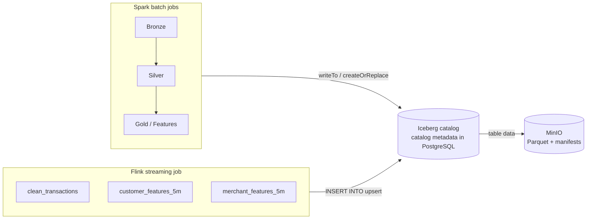

# Lakehouse: Apache Iceberg On MinIO

Every Bronze, Silver, Gold, and offline-feature Spark table, plus three
real-time Flink tables, live in one Apache Iceberg catalog on MinIO. Iceberg
is a table-format metadata layer, not a separate storage system: table data is
still plain Parquet in MinIO, but a versioned metadata tree on top of it gives
both engines schema, snapshots, and row-level upserts that a bare `s3a://`
Parquet directory can't.

## Why This Exists

Fraud labels arrive late — a transaction happens now, its confirmed
fraud/chargeback label might not land for weeks. A later batch job needs to
attach that label to the *exact* streaming feature snapshot that existed when
the transaction happened. A Kafka topic with finite retention can't do that;
a durable, queryable Iceberg table can.

## Catalog Design



- **Catalog type: JDBC, backed by the existing PostgreSQL instance.** No new
  Docker service needed — Iceberg's `JdbcCatalog` auto-creates its own
  bookkeeping tables in the same `fraudstream` database, separate from the
  `bronze`/`silver`/`gold` serving schemas.
- **`io-impl`: `HadoopFileIO`**, riding the same `spark.hadoop.fs.s3a.*` /
  Hadoop `core-site.xml` settings both engines already use for MinIO.
- **Table naming** mirrors the existing PostgreSQL tables under the `iceberg`
  catalog: `iceberg.bronze.raw_transactions`, `iceberg.silver.*`,
  `iceberg.gold.*`, and `iceberg.streaming.*` for Flink's three tables.

PostgreSQL's `bronze`/`silver`/`gold` schemas are unchanged and still written
directly over JDBC, same as before. Iceberg tables are additionally queryable
through **Trino** (below), Spark, or Flink SQL — the JDBC catalog only tracks
*which files make up which table version*, it never stores table rows.

## Spark Side

`src/fraudstream/jobs/warehouse.py` adds `IcebergCatalogConfig`,
`configure_iceberg_catalog(builder, iceberg, postgres)`, and
`write_iceberg_table(dataframe, table, partition_columns, mode)`. Every
Bronze/Silver/Gold/offline-feature job now reads with
`spark.table("iceberg.<layer>.<name>")` and writes with
`write_iceberg_table(...)` instead of raw Parquet. `catalog_type="hadoop"`
(local `file://` metadata, no database) is what every unit test uses instead
of the real `"jdbc"` catalog, so tests don't need a running Postgres.

## Flink Side

PyFlink's DataStream API has no native Iceberg sink — only the Table API
does. `src/fraudstream/jobs/flink/iceberg_sink.py` bridges the two: it wraps
the streaming job's `StreamExecutionEnvironment` in a `StreamTableEnvironment`,
creates the three Iceberg tables with `'write.upsert.enabled' = 'true'` (a
late correction replaces its window's row instead of duplicating it), and
combines the Iceberg inserts with the existing Kafka sinks into one
`StatementSet` — still a single Flink job, not a second one.

### Version pins this required

- **Flink is pinned to `apache-flink==2.1.3`**, not 2.2.x — Iceberg 1.11.0
  only ships an `iceberg-flink-runtime` jar for the Flink 2.1 line.
- **Spark's Iceberg runtime is `iceberg-spark-runtime-4.0_2.13:1.11.0`**,
  matching `pyspark==4.1.2` (Spark 4.x, Scala 2.13).

## Trino: Querying Iceberg Tables

DBeaver's direct PostgreSQL connection only sees the serving schemas, not
Iceberg's metadata tree. **Trino** closes that gap, reading Iceberg tables
straight from MinIO through the same JDBC catalog Spark/Flink write —
`iceberg.catalog.type=jdbc` means no separate Hive Metastore service is
needed. Config: `infra/trino/catalog/iceberg.properties`.

```bash
docker compose up -d minio minio-bucket-init postgres postgres-schema-init trino
docker exec -it fraudstream-trino trino --catalog iceberg --schema bronze
trino:bronze> SELECT count(*) FROM raw_transactions;
```

Or connect any JDBC client to `localhost:18082`, catalog `iceberg`, and query
`bronze.*`, `silver.*`, `gold.*`, or `streaming.*`.

## Running It Locally

Bronze → Silver → Gold → Features run the same way they always did (see
`docs/01`–`docs/06` and the README's Quick Start) — the Iceberg catalog
settings are the command defaults, nothing extra to pass. The Flink job needs
the extra Iceberg/Postgres/hadoop-aws jars described in
[docs/07](07_flink_streaming_pipeline.md#run-locally).

One gotcha: a full offline run can exceed PySpark's default driver heap once
Iceberg's extra JVM classloading is added on top. If a job or the full test
suite dies with `java.lang.OutOfMemoryError`, rerun with:

```bash
PYSPARK_SUBMIT_ARGS="--driver-memory 4g pyspark-shell" PYTHONPATH=src python -m ...
```

## Implementation Map

| Area | Location |
|---|---|
| Shared Iceberg/warehouse config (Spark and Flink) | `src/fraudstream/jobs/warehouse.py` |
| Flink Table API bridge | `src/fraudstream/jobs/flink/iceberg_sink.py` |
| Trino Iceberg JDBC catalog config | `infra/trino/catalog/iceberg.properties` |
| Unit tests (Hadoop catalog, no Postgres needed) | `tests/unit/test_warehouse.py`, `test_flink_iceberg_sink.py` |
