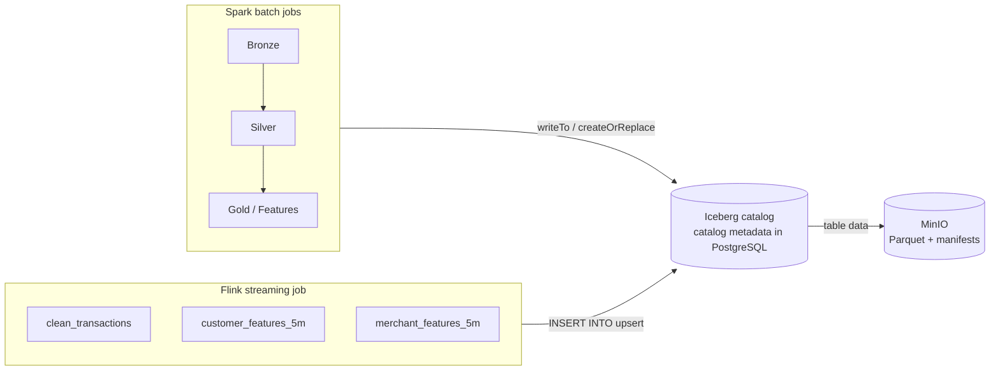

# Lakehouse: Apache Iceberg On MinIO

Every Bronze, Silver, Gold, and offline-feature Spark table, and three
real-time Flink tables, live in one Apache Iceberg catalog on MinIO. Iceberg
is a table-format metadata layer, not a separate storage system: table data is
still plain Parquet in MinIO, but a versioned metadata tree on top of it gives
both engines schema, snapshots, and row-level upserts that a bare `s3a://`
Parquet directory can't.

## Why This Exists

Fraud labels arrive late. A transaction happens now; the confirmed
fraud/chargeback label for it might not arrive for weeks. Today's streaming
features (`fraud_features_customer_5m`, `fraud_features_merchant_5m` on
Kafka) need to land somewhere durable and joinable so a later batch job can
attach that label to the *exact* streaming feature snapshot that existed when
the transaction happened -- a Kafka topic with finite retention can't do that;
an Iceberg table can. Spark's `feat_transaction_training` build is the batch
half of that join; the Flink Iceberg sink is what makes the streaming half
available to join against in the first place.

## Catalog Design



- **Catalog type: JDBC, backed by the existing PostgreSQL instance.**
  Iceberg's `JdbcCatalog` needs nothing but a JDBC URL -- it auto-creates its
  own `iceberg_tables` / `iceberg_namespace_properties` bookkeeping tables in
  `fraudstream`'s database, entirely separate from the `bronze`/`silver`/`gold`
  serving schemas. This is why there's no new Docker service for this feature:
  the catalog reuses `postgres`, and table data reuses `minio`.
- **`io-impl`: `HadoopFileIO`**, riding on the same `spark.hadoop.fs.s3a.*` /
  Hadoop `core-site.xml` settings both engines already need for MinIO, instead
  of a second S3 client stack (`iceberg-aws-bundle`).
- **Warehouse root:** `s3a://fraudstream/warehouse` (same bucket the old
  plain-Parquet layout used) -- Iceberg manages its own file layout under it.
- **Table naming** mirrors the existing PostgreSQL tables exactly, just under
  the `iceberg` catalog: `iceberg.bronze.raw_transactions`,
  `iceberg.silver.stg_transactions`, `iceberg.silver.stg_transaction_quality_issues`,
  `iceberg.gold.<table_name>`, and the three new streaming tables under
  `iceberg.streaming.*` (`clean_transactions`, `customer_features_5m`,
  `merchant_features_5m`).

PostgreSQL's `bronze`/`silver`/`gold` schemas are unchanged and still populated
by direct JDBC writes, same as before -- DBeaver keeps querying those
directly for the serving tables. Iceberg tables are queryable through **Trino**
(see below) as well as Spark or Flink SQL. The JDBC catalog only stores *which
files make up which table version*; it never stores table rows.

## Spark Side

`src/fraudstream/jobs/warehouse.py` adds, alongside the existing
`WarehouseConfig`/`PostgresJdbcConfig` helpers:

- `IcebergCatalogConfig` (`catalog_name`, `catalog_type`, `warehouse_uri`).
  `catalog_type="jdbc"` (the default, every real job) uses the shared
  Postgres catalog described above. `catalog_type="hadoop"` stores catalog
  metadata directly under a local `file://` `warehouse_uri` instead, with no
  database involved -- this is what every unit test uses, so they exercise
  real Iceberg reads/writes without needing a running Postgres.
- `configure_iceberg_catalog(builder, iceberg, postgres)` -- registers the
  catalog on a `SparkSession.builder`, called right after
  `configure_object_storage`.
- `write_iceberg_table(dataframe, table, partition_columns, mode)` --
  `mode="overwrite"` calls `.writeTo(table).using("iceberg").createOrReplace()`
  (creates the table on the first run, replaces its data on every later run,
  matching every job's existing full-refresh `write_mode`); `mode="append"`
  creates the table if missing, then appends.

Every Bronze/Silver/Gold/offline-feature job now reads upstream tables with
`spark.table("iceberg.<layer>.<name>")` instead of `spark.read.parquet(...)`,
and writes with `write_iceberg_table(...)` instead of `.write.parquet(...)`.
The PostgreSQL JDBC writes are untouched.

## Flink Side

PyFlink's DataStream API (what `fraudstream.jobs.flink.runtime` is built on)
has no native Iceberg sink -- Iceberg's supported Flink integration is the
**Table API/SQL connector**. `src/fraudstream/jobs/flink/iceberg_sink.py`
bridges the two:

1. Wraps the existing `StreamExecutionEnvironment` in a `StreamTableEnvironment`.
2. Runs `CREATE CATALOG` / `CREATE TABLE IF NOT EXISTS` SQL for the three
   streaming tables, each declared with a primary key
   (`clean_transactions` on `event_id`; both feature tables on `feature_id`)
   and `'write.upsert.enabled' = 'true'` -- a late correction for a window
   that already emitted a feature row replaces it instead of duplicating it.
3. Maps each JSON-string DataStream (`deduplicated_events`, `customer_features`,
   `merchant_features`) through a small `.map()` into a typed
   `Types.ROW_NAMED(...)` stream, then `t_env.from_data_stream(...)`.
4. Combines the three Table API inserts with the existing Kafka `DataStream`
   sinks into **one** job via `create_statement_set()` +
   `.attach_as_datastream()`, so `environment.execute(...)` in
   `execute_streaming_feature_job` still drives everything as a single Flink
   job -- not a second one.

Kafka topics stay the low-latency contract for downstream consumers/alerts;
Iceberg is the durable, joinable copy.

### Version pins this required

- **Flink is pinned to `apache-flink==2.1.3`, not `2.2.x`.** Apache Iceberg
  only ships a Flink runtime jar (`iceberg-flink-runtime-2.1`) for the Flink
  2.1 line as of Iceberg 1.11.0 -- there is no `iceberg-flink-runtime-2.2`
  yet. This is pinned in the isolated `flink/pyproject.toml`, so it doesn't
  touch the main project's Python/Spark environment.
- **Spark's Iceberg runtime is `iceberg-spark-runtime-4.0_2.13:1.11.0`**,
  matching `pyspark==4.1.2` (Spark 4.x, Scala 2.13). Verified against Maven
  Central, not guessed.

## Trino: Querying Iceberg Tables

Iceberg tables aren't queryable through DBeaver's direct PostgreSQL
connection -- that connection only sees the `bronze`/`silver`/`gold` serving
schemas, not Iceberg's own metadata tree. **Trino** closes that gap: it's a
SQL query engine that reads Iceberg tables straight from MinIO, using the
same JDBC catalog Spark and Flink already write through.

**No Hive Metastore.** Trino's Iceberg connector supports
`iceberg.catalog.type=jdbc` (since Trino 406) as a first-class option
alongside `hive_metastore`/`glue`/`rest`/`nessie` -- it talks to the exact
same `iceberg_tables`/`iceberg_namespace_properties` bookkeeping tables in
PostgreSQL that `JdbcCatalog` already created for Spark/Flink. Standing up a
Hive Metastore would mean a second stateful service (it always needs its own
relational database backend) purely to duplicate a catalog role Postgres
already fills, so it isn't part of this stack.

Config (`infra/trino/catalog/iceberg.properties`, mounted read-only into the
`trino` container):

```properties
connector.name=iceberg
iceberg.catalog.type=jdbc
iceberg.jdbc-catalog.catalog-name=iceberg
iceberg.jdbc-catalog.driver-class=org.postgresql.Driver
iceberg.jdbc-catalog.connection-url=jdbc:postgresql://postgres:5432/fraudstream
iceberg.jdbc-catalog.connection-user=fraudstream
iceberg.jdbc-catalog.connection-password=fraudstream_local_password
iceberg.jdbc-catalog.default-warehouse-dir=s3://fraudstream/warehouse
iceberg.jdbc-catalog.schema-version=V1
fs.s3.enabled=true
s3.endpoint=http://minio:9000
s3.aws-access-key=fraudstream
s3.aws-secret-key=fraudstream_local_password
s3.path-style-access=true
s3.region=us-east-1
```

`s3.region` is required even though MinIO ignores it -- the AWS SDK v2 client
Trino's native S3 filesystem uses fails region resolution without one.

Start Trino alongside the rest of the stack:

```bash
docker compose up -d minio minio-bucket-init postgres postgres-schema-init trino
```

Query from the container's CLI:

```bash
docker exec -it fraudstream-trino trino --catalog iceberg --schema bronze

trino:bronze> SELECT count(*) FROM raw_transactions;
```

Or connect DBeaver/any JDBC client to `localhost:18082` with Trino's JDBC
driver, catalog `iceberg`, and query `bronze.raw_transactions`,
`silver.stg_transactions`, `gold.*`, or `streaming.*` the same way you would
in a Spark/Flink SQL session. This is additive -- DBeaver's existing direct
Postgres connection for the serving schemas is untouched.

## Running It Locally

### Spark (Bronze -> Silver -> Gold -> Features)

No extra setup beyond what MinIO/PostgreSQL already need -- the Iceberg
runtime jar is fetched automatically via `spark.jars.packages`, same as
`hadoop-aws`/`postgresql` already are.

```bash
docker compose up -d minio minio-bucket-init postgres postgres-schema-init

PYTHONPATH=src python -m fraudstream.jobs.bronze.ingest_transactions \
  --source-dir data/raw_source/offline_transactions \
  --source-uri s3a://fraudstream/raw/offline_transactions \
  --output-dir data/bronze/raw_transactions \
  --write-mode overwrite

PYTHONPATH=src python -m fraudstream.jobs.silver.transactions \
  --output-dir data/silver/transactions --write-mode overwrite

PYTHONPATH=src python -m fraudstream.jobs.gold.transactions \
  --output-dir data/gold --write-mode overwrite --core-only

PYTHONPATH=src python -m fraudstream.jobs.gold.offline_features \
  --gold-dir data/gold --write-mode overwrite
```

Each command defaults `--iceberg-catalog-name`/`--iceberg-warehouse-uri`/
`--iceberg-catalog-type` to the values above -- nothing extra to pass locally.

A real offline dataset (hundreds of thousands of rows) can exceed PySpark's
default local driver heap once Iceberg's extra JVM classloading is added on
top of the existing MinIO/Postgres session config. If a job dies with
`java.lang.OutOfMemoryError: Java heap space`, rerun with:

```bash
PYSPARK_SUBMIT_ARGS="--driver-memory 4g pyspark-shell" \
  PYTHONPATH=src python -m fraudstream.jobs.bronze.ingest_transactions ...
```

The same applies to `python -m unittest discover -s tests/unit -p 'test_*.py'`
run as one process -- running every Spark-backed test file's session
create/stop cycle back to back in one JVM is more failure-prone with Iceberg's
extra jars than it was on plain Parquet; the memory override above fixes it.

### Verify

```bash
docker compose exec postgres psql -U fraudstream -d fraudstream \
  -c "SELECT catalog_name, table_namespace, table_name FROM iceberg_tables;"
```

Or query the tables directly from a PySpark shell configured the same way
`configure_iceberg_catalog` configures the jobs:

```python
spark.sql("SELECT count(*) FROM iceberg.bronze.raw_transactions").show()
spark.sql("SELECT count(*) FROM iceberg.gold.feat_transaction_training").show()
```

### Flink (streaming Iceberg sink)

Follow [docs/07's Run Locally section](07_flink_streaming_pipeline.md#run-locally)
for the full jar setup -- it now includes, alongside the Kafka connector jar,
the Iceberg Flink runtime, the PostgreSQL JDBC driver (for the catalog), and
`hadoop-aws` + its transitive Hadoop/AWS-SDK dependencies (for `HadoopFileIO`).
That last group is resolved through a scratch Maven project rather than a
single `mvn dependency:copy`, since `hadoop-aws` alone doesn't bundle
`hadoop-common`/`hadoop-hdfs-client`/the AWS SDK it needs at runtime -- expect
this download to be several hundred MB, a one-time local setup cost.

None of these jars are committed to the repo (`flink/.gitignore` excludes
`lib/**/*.jar`); every environment downloads them once.

Once `docker compose up -d minio minio-bucket-init postgres postgres-schema-init`
and the jars are in place, starting the Flink job (`docs/07`'s existing
`python -m fraudstream.jobs.flink.transactions --flink-ui` command) also
creates the catalog and the three `iceberg.streaming.*` tables and starts
upserting into them -- no separate flag needed, this isn't optional the way
`--skip-postgres-write` is on the Spark side.

## Implementation Map

| Area | Location |
|---|---|
| Shared Iceberg/warehouse config, used by both Spark jobs and the Flink job | `src/fraudstream/jobs/warehouse.py` |
| Flink Table API bridge (row typing, catalog/table DDL, `StatementSet`) | `src/fraudstream/jobs/flink/iceberg_sink.py` |
| Flink jar/classpath/Hadoop-conf wiring | `src/fraudstream/jobs/flink/runtime.py` (`_register_hadoop_environment`) |
| Per-job Iceberg reads/writes | `src/fraudstream/jobs/{bronze,silver,gold}/*.py` |
| Trino Iceberg JDBC catalog config | `infra/trino/catalog/iceberg.properties` |
| MinIO object-storage helper (`s3a://`/`file://` dispatch) shared by generators and Bronze | `src/fraudstream/storage.py` |
| Unit tests (Hadoop catalog, no Postgres needed) | `tests/unit/test_warehouse.py`, `tests/unit/test_flink_iceberg_sink.py`, and the existing `test_bronze_*`/`test_silver_*`/`test_gold_*` suites |
