# Feature Store: Feast Over the Iceberg Lakehouse

A [Feast](https://feast.dev) feature store sits on top of the existing Iceberg
lakehouse (`docs/15_lakehouse_iceberg.md`): Gold's batch snapshots are served
through Feast's Spark offline store into Redis via an Airflow DAG, and Flink's
5-minute streaming windows are pushed into both an offline landing table and
Redis by a standalone deployment job. Nothing in Bronze, Silver, Gold, or the
Flink job changes.

## Architecture

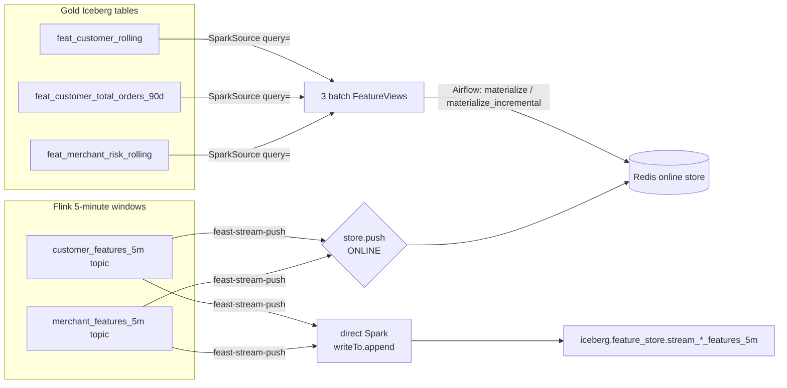

**Why the offline push is a direct Spark write, not `store.push(..., to=OFFLINE)`:**
Feast's Spark offline store can only write parquet/csv/json/avro batch
sources — it has no Iceberg writer, so it cannot be the thing that commits to
`iceberg.feature_store.*`. `feast-stream-push` therefore does two writes per
flush: `store.push(..., to=PushMode.ONLINE)` for Redis (Feast owns this half),
and a plain Spark `writeTo(table).append()` for the Iceberg landing table
(Spark owns this half, using the exact same Iceberg catalog session the batch
jobs use). Both writes still land in the batch source the three offline
feature views read from at training time.

**Why batch sources add one day to `event_timestamp`:** Gold's daily snapshots
are timestamped at the *start* of the day they aggregate, but a snapshot only
becomes knowable once that day closes (`docs/06_feature_engineering.md`'s
cutoff rule). Each batch source query adds `+ INTERVAL 1 DAY` so Feast's
point-in-time join never hands a snapshot back to a transaction it wasn't
allowed to see.

## TTL Rationale

| Feature view | TTL | Widest window | Why |
|---|---|---|---|
| `customer_rolling_features` | 31 days | 30 days | A snapshot older than its own window no longer describes "the last 30 days." +1 day absorbs the daily cadence. |
| `customer_orders_90d_features` | 91 days | 90 days | Same rule; a near-lifetime order count just decays slower. |
| `merchant_risk_features` | 31 days | 30 days | Same rule. Merchants get far more coverage from it than customers (see below). |
| `customer_features_5m_stream` | 1 hour | 5 min | Set by Flink's 40-minute allowed-lateness (`docs/07_flink_streaming_pipeline.md`), not the window size: a late correction must still be joinable, so TTL > lateness budget, plus slack. |
| `merchant_features_5m_stream` | 1 hour | 5 min | Same producer, same lateness budget. |

TTLs come from what each feature's name promises to mean, not a curve fit.
One measured number makes the coverage consequence concrete — average
snapshots per entity, from a live Trino query against Gold:

| Entity | Distinct entities | Snapshots per entity |
|---|---|---|
| customer | 197,405 | 2.51 |
| merchant | 40,000 | 11.88 |

Merchants are ~5x denser than customers for the same transaction volume, so
the same 31-day TTL gives merchant lookups much better coverage. This phase
picked correctness over coverage: a read returns the real number or nothing,
never a stale value relabeled as current.

**One operational catch:** `materialize_incremental` falls back to
`now - ttl` for a view that's never been materialized, which would load zero
rows here (the dataset ends months before "now"). `fraudstream_feast.materialize`
works around it — the first run per view does an explicit full-range
`materialize()`, every run after resumes incrementally. See
`data/gold/_feature_store_materialization_summary.json` for the `mode` flip
from `"full"` to `"incremental"` across runs.

## How to Run

### Streaming push (offline + online)

```bash
docker compose up -d kafka postgres minio redis
cd feature_store/feature_repo && uv run feast apply && cd -
docker compose --profile feature-store up feast-stream-push
```

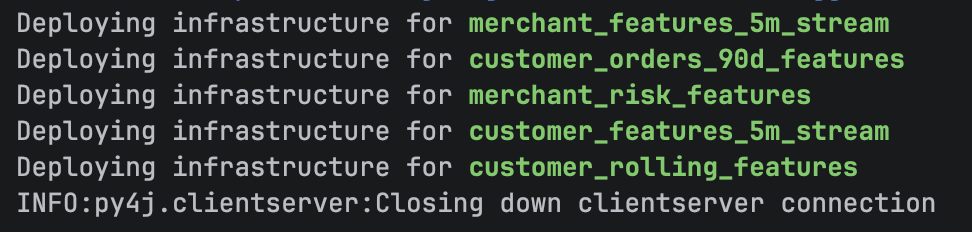
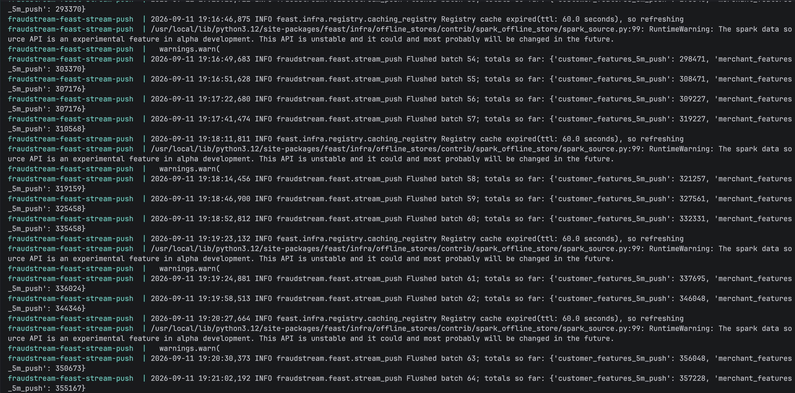

Verify both stores independently:

```bash
docker exec fraudstream-redis redis-cli DBSIZE
docker exec -it fraudstream-trino trino --execute \
  "SELECT count(*) FROM iceberg.feature_store.stream_customer_features_5m"
```

| Online store (Redis) | Offline store (Iceberg on MinIO / Trino) |
|---|---|
| 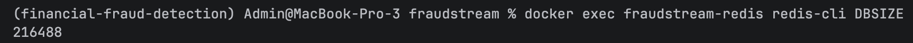 | 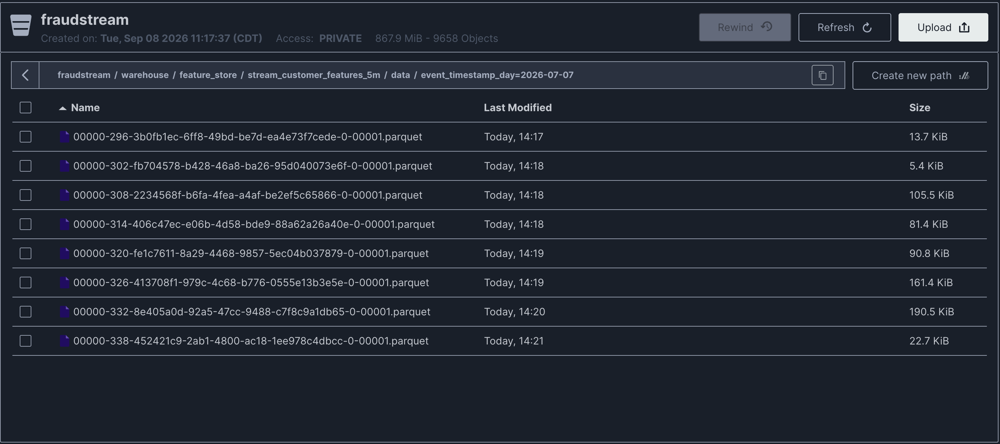 |
| 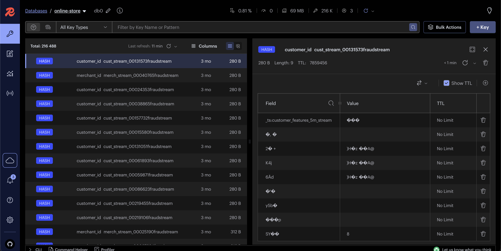 | 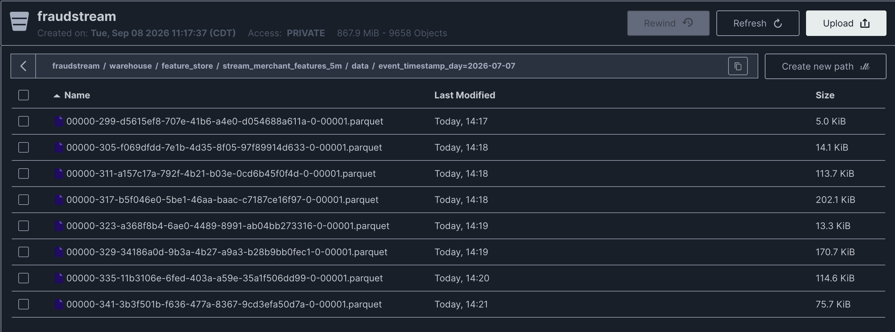 |
| | 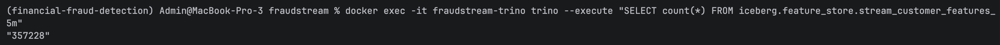 |

### Incremental materialization DAG

```bash
docker compose --profile orchestration up -d
```

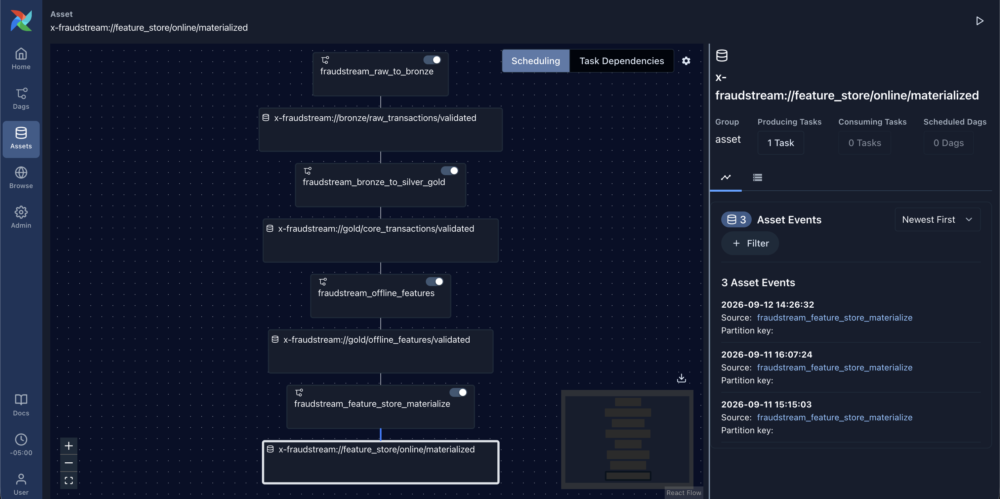
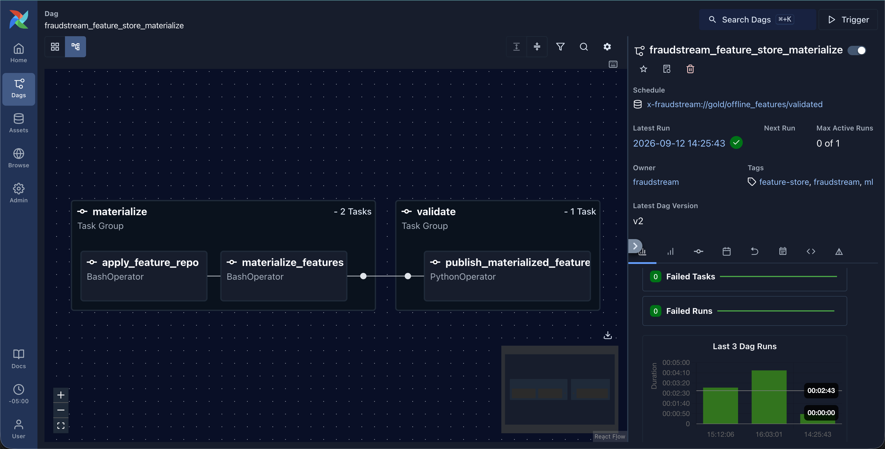

Unpause and trigger `fraudstream_feature_store_materialize` in the Airflow UI,
then check `data/gold/_feature_store_materialization_summary.json`.

### Incremental materialization, demonstrated

A new row inserted straight into Gold, then walked through the DAG, proves
the pipeline is genuinely incremental rather than a full reload each time:

1. Baseline: the online store has never heard of the demo customer, and its key count is noted.
   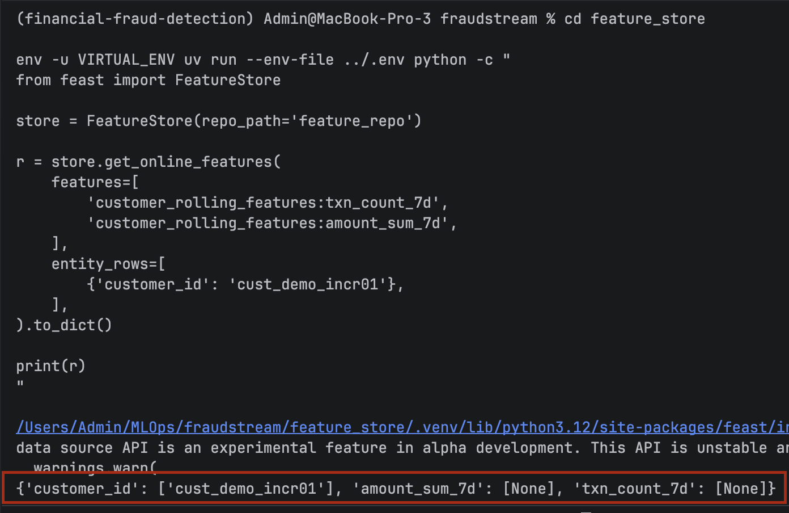
   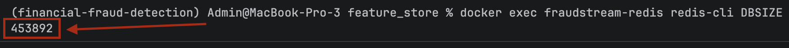
2. A new snapshot is inserted directly into `iceberg.gold.feat_customer_rolling` and confirmed present.
   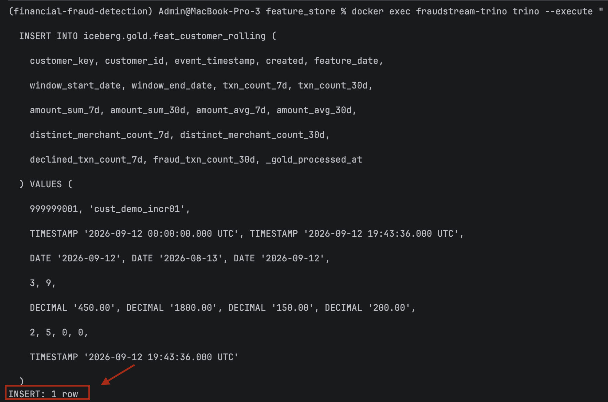
   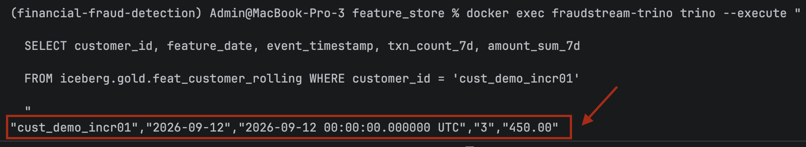
3. Triggering the DAG.
   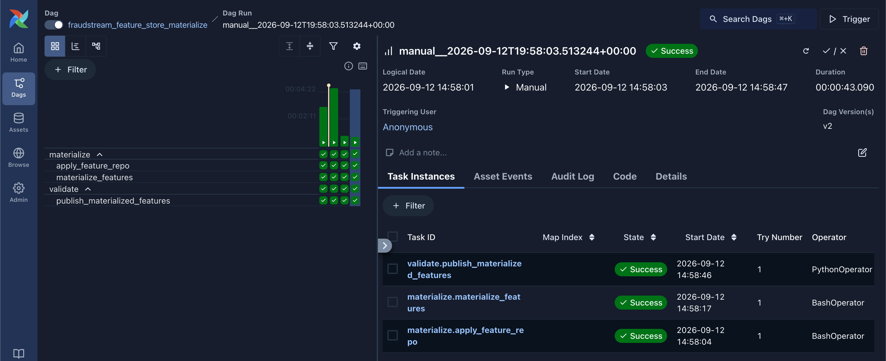
4. The online store now returns the latest values, and Redis's key count grows by exactly one.
   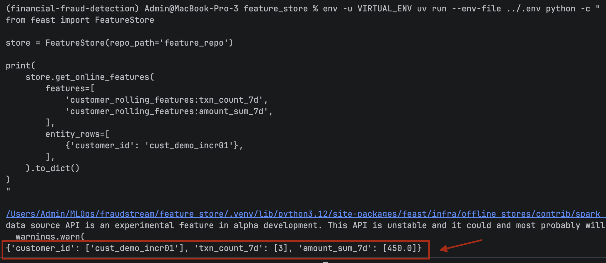
   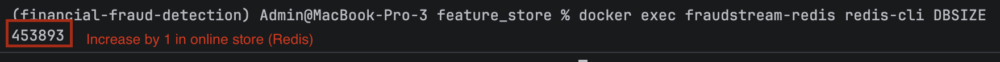
5. The run summary confirms every feature view resumed in `"incremental"` mode with a non-null `watermark_before` — a full reload, not a resume.
   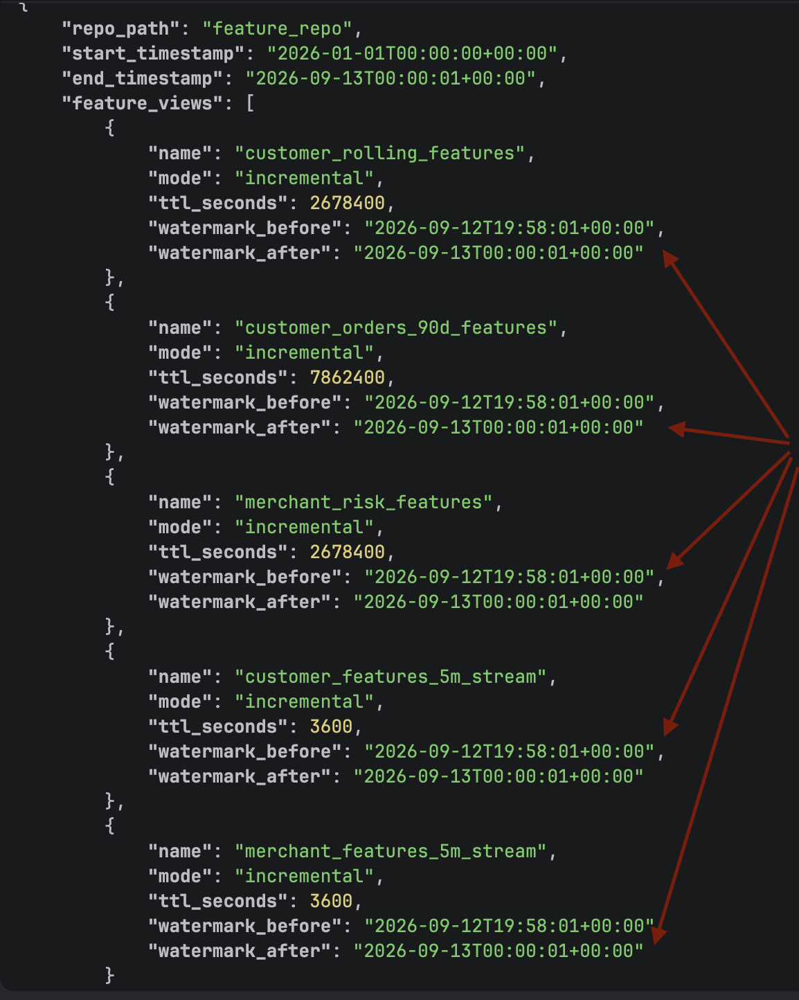
