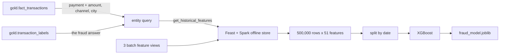
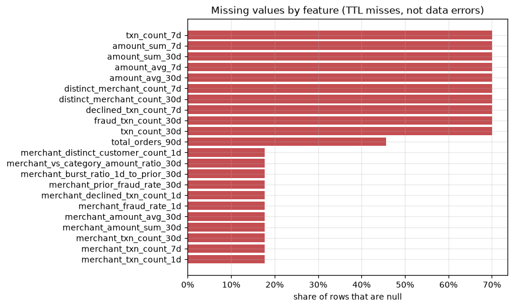
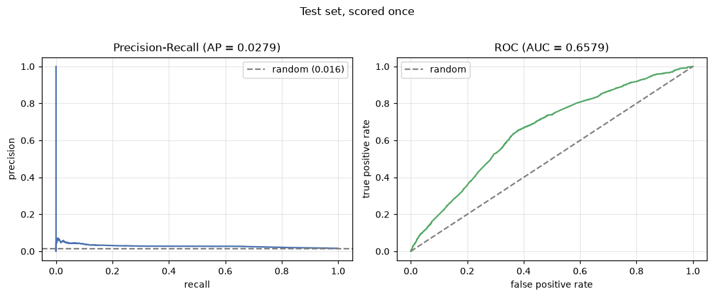
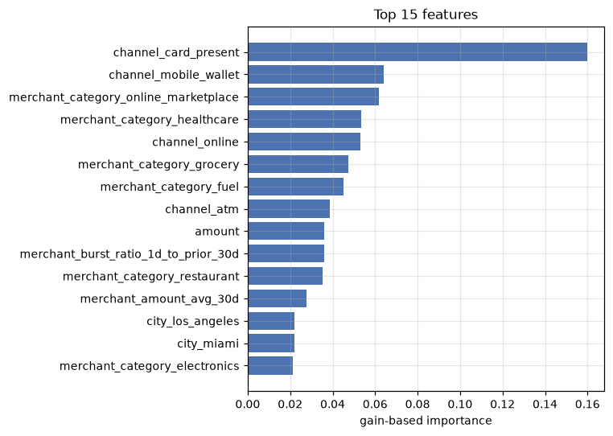

# Training a Fraud Model on the Feature Store

Can we tell whether a payment is fraud, using only what we would have known at the
moment it happened?

That second half is the hard part. It is easy to build a model that looks brilliant
because it quietly peeked at the future, so most of the care here goes into not
doing that. The training code lives in `ml/` and the walkthrough with real output
is `ml/notebooks/fraud_model_training.ipynb`.

## How the training set is built



We hand Feast a SQL query rather than a table of rows. The data already lives in
Spark, so it is far quicker to let the join happen there than to drag half a
million rows out and push them back in.

Two choices in that query are deliberate:

**The fraud answer comes from its own table.** `fact_transactions` has an
`is_fraud` column sitting right there, so joining to `gold.transaction_labels`
looks like pointless extra work. It is not. Keeping the answer in its own place is
what stops it leaking into somewhere it should not be, and a test fails if the
query ever reaches for the local column instead.

**We ignore `transaction_status`.** It says whether a payment was approved,
declined or reversed, but that is decided *after* the fact. Train on it and every
score below would look wonderful and mean nothing.

## How often the store actually has an answer

When we ask what a customer looked like back then, Feast often replies "I don't
know" and hands back blanks. Measured across all 500,000 payments:

| Feature group | Has an answer | Why |
|---|---|---|
| `customer_rolling_features` | **29.9%** | Stats go stale after 31 days, and most customers here shop only a couple of times in six months |
| `customer_orders_90d_features` | **54.3%** | Same idea, but a 91-day shelf life catches far more people |
| `merchant_risk_features` | **82.3%** | Merchants are busy every single day, so their numbers are nearly always fresh |

This is deliberate, not broken. Every feature has a shelf life, and a stale number
is worse than no number. The pattern is simply *longer shelf life plus busier
entity equals more answers* — merchants average 11.9 daily snapshots each against a
customer's 2.5, so the same 31-day limit treats them very differently.



**This one measurement decided the model.** With 22 of 51 features carrying blanks
and 10 of them more than half blank, we need something that copes with missing
values on its own. The alternatives are both worse: throwing those rows away would
train the model only on frequent shoppers, and filling the gaps with averages would
tell it "this customer spent a normal amount" when the truth is "we have no idea".

Instead we keep the blanks and add a *do we know anything about this customer?*
flag beside them. Knowing nothing about someone is itself a real fact worth
learning from.

## Splitting by date, not at random

Train on the earliest months, tune on the next few weeks, test on the final
stretch. No shuffling.

| Split | Rows | Dates | Fraud |
|---|---|---|---|
| train | 348,184 (69.6%) | Jan 1 – May 4 | 1.524% |
| validation | 74,782 (15.0%) | May 5 – May 29 | 1.575% |
| test | 77,034 (15.4%) | May 30 – Jun 29 | 1.575% |

Shuffling would quietly break it in four ways:

- **Our features summarise the past.** "Spend in the last 30 days" on a June payment
  is partly built from May payments. Shuffle, and May lands in test while June sits
  in training — the model has already seen the answer.
- **Some features count past frauds.** So a fraud we are meant to be predicting can
  end up having helped build a training row.
- **The rows are not independent.** 500,000 payments across ~40,000 merchants means
  the same merchant appears on both sides, carrying its history with it.
- **It asks an easier question than the real one.** In production a model trains on
  the past and predicts the future. Shuffling asks "can it fill a gap in a period it
  have already seen?", which flatters the score.

Validation and test do different jobs. Validation picks the settings and the
cut-off. Test is scored exactly once, at the very end, and never gets a vote.

## Which numbers to trust

Only 1.5% of these payments are fraud, so a model that says "not fraud" to
everything is right **98.43%** of the time while catching nothing at all. Accuracy
rewards guessing the common answer, which makes it useless here.

So we judge on **PR-AUC**, which only cares about how well we find the rare thing.
The fair yardstick for it is the fraud rate itself, since that is roughly what pure
guesswork scores.

## What the model scored

A plain logistic regression goes first as a yardstick — if the tree model cannot
beat it, it is not earning its keep. It needs the blanks filled in before it will
run at all, which is exactly the hassle XGBoost saves us.

| On validation | PR-AUC | ROC-AUC |
|---|---|---|
| Logistic regression | 0.0284 | **0.6657** |
| XGBoost, best of 10 settings | **0.0288** | 0.6622 |

XGBoost wins on the metric that matters, but only just, and the baseline actually
edges it on ROC-AUC. Worth saying plainly rather than hiding.

Scoring the test set once, with the cut-off chosen on validation:

| | |
|---|---|
| PR-AUC | **0.0279** — 1.77x better than guessing |
| ROC-AUC | **0.6579** |
| Precision / Recall / F1 | 0.033 / 0.144 / 0.054 |
| Accuracy | 92.06% *(and "never fraud" would score 98.43%)* |





**Being honest: this is a weak detector, and the data explains why.** The fraud
answers in this dataset were built from a few hidden traits — most of all whether a
payment belonged to a coordinated ring, plus how risky a customer or merchant was
rated. None of those were ever written into the data we can read. They shaped the
answer but were never saved.

Everything we *can* see is already in the model, which is why the useful signal
comes from the payment itself (channel, amount, category) rather than from
behavioural history. The rest is simply not in the data, so there is a hard ceiling
here. The only way past it would be to go back and record those hidden traits,
which would improve the score without improving the model.

## What gets saved

`ml/artifacts/fraud_model.joblib` holds more than the model:

| Inside the file | Why it has to be there |
|---|---|
| the trained model | the obvious part |
| `feature_names` | the exact 51 columns in the exact order |
| `threshold` | the cut-off we chose, 0.628 — not the usual 0.5 |
| `metrics`, `trained_at` | what it scored and when |

The last two matter more than they look. At this fraud rate the model rarely pushes
a score past 0.5, so keeping that default would flag almost nothing. And a column
order that is silently different is the kind of bug that produces confident,
completely wrong answers — so the order travels with the model rather than being
guessed later.

## One bug worth writing down

The lakehouse stores event times in UTC, but Spark was reading them into the
machine's local zone. Every timestamp came back shifted five or six hours, 130
payments fell outside the window and vanished, and the hour-of-day feature drifted
by an extra hour partway through the data when daylight saving changed.

The fix is one line in `feature_store/feature_repo/feature_store.yaml`:

```yaml
spark.sql.session.timeZone: UTC
```

Worth knowing that this setting is shared with materialization, so anything written
to the online store before the fix used day boundaries shifted by the same amount.

## How to run it

```bash
docker compose up -d postgres minio redis
cd ml && uv sync
uv run --env-file ../.env jupyter lab notebooks/fraud_model_training.ipynb
```

Run the tests with:

```bash
cd ml && PYTHONPATH=../src:src uv run python -m unittest discover -s tests
```
