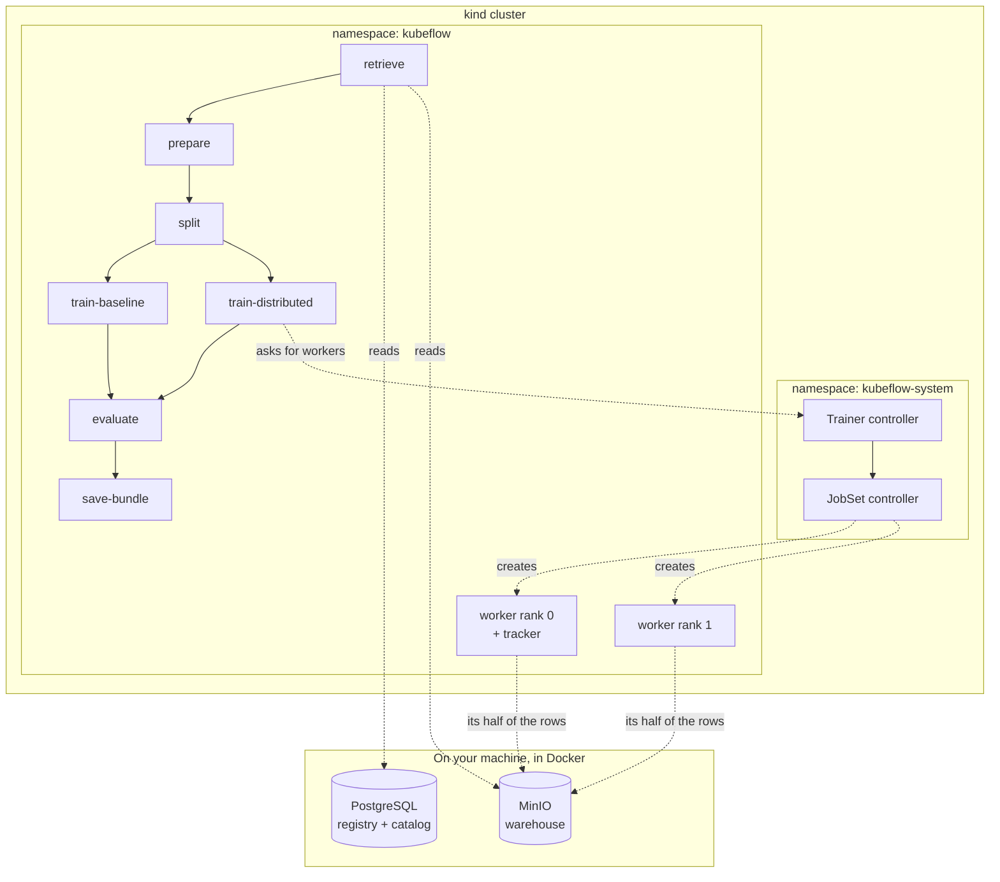
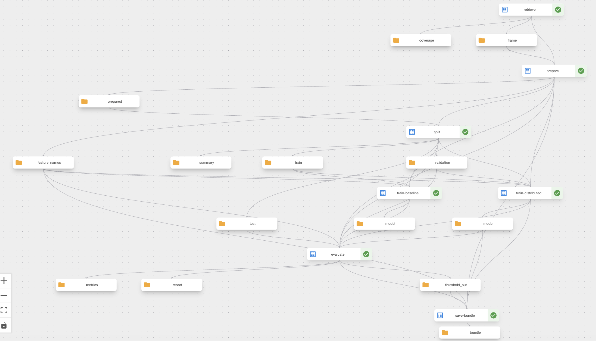
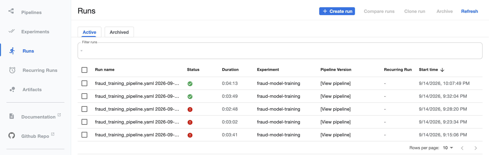
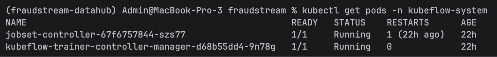
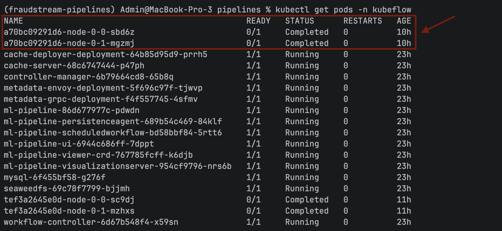
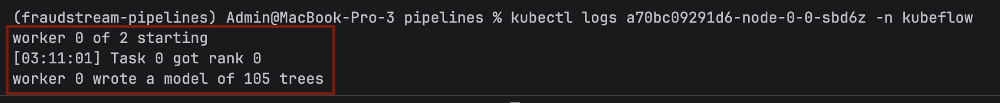
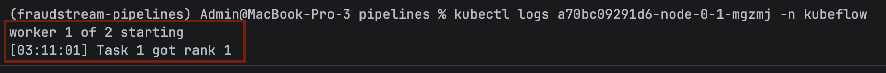
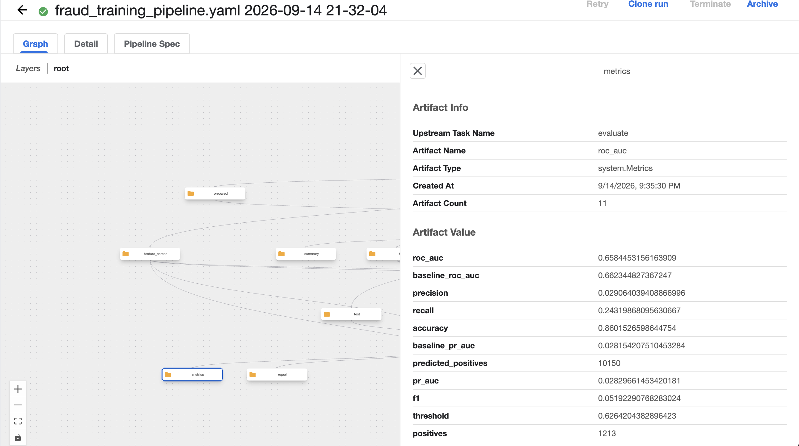

# Running the Training as a Pipeline

The notebook proves the model works. It also only works on one laptop, in one
session, in the right order.

This runs the same seven steps on Kubernetes, where each one is a container that
records what it produced, and the training step is spread across several workers
that build one model together. The pipeline lives in `pipelines/`, the cluster it
needs is set up by `k8s/bootstrap.sh`.

## What runs where



Two separate pieces of Kubeflow are installed, and neither drags in the rest of
the platform. **Pipelines** runs the seven steps in order. **Trainer** knows how
to start a group of workers that train together. The lakehouse stays where it
already was, in Docker on the host, and the cluster joins its network so the pods
can reach it by name.



Each step reads the artifacts of the ones before it and writes its own, so the
graph above is not a drawing of what should happen — it is what did.

| Step | What it does |
|---|---|
| `retrieve` | asks the feature store for 500,000 labelled payments |
| `prepare` | adds the availability flags and encodes the categories |
| `split` | cuts the rows into train, validation and test by date |
| `train-baseline` | fits the logistic regression, as a yardstick |
| `train-distributed` | hands the real training to a group of workers |
| `evaluate` | picks the cut-off on validation, scores test once |
| `save-bundle` | saves the model with its column order and threshold |



A full run takes about four minutes, most of it the first step pulling features
out of Spark.

## The one step that is different

Six of the steps are ordinary containers. `train-distributed` is not: it does no
training itself. It asks Kubeflow Trainer to start a group of worker pods, waits
for them, and collects what they made.

Two controllers make that happen, and they are running long before any training
does:



The chain is `TrainJob` → `JobSet` → `Job` → pods. The trainer controller turns
the request into a group; the JobSet controller makes sure the group starts
*together*, which matters because a worker that starts alone waits forever for
peers that never arrive.

**The workers cannot read pipeline artifacts.** They are not pipeline pods, so
the usual plumbing is not there. The training step therefore copies the split
data into MinIO first and tells the workers where to look. That is the only
reason object storage appears in the middle of this pipeline.

## Proof that it is really distributed

Two worker pods, one per rank, created for the run and finished afterwards:



Each one reports the rank it was given, and rank 0 writes the model:





**Each worker holds a different half of the rows.** They are dealt out one at a
time — worker 0 takes rows 0, 2, 4, worker 1 takes 1, 3, 5 — rather than in
blocks, because the data is in date order and blocks would hand each worker a
different few weeks. Fraud clusters in time, so a worker drawing a quiet stretch
would contribute close to nothing.

The workers then exchange summaries of their own rows at every step, and the sum
of those summaries is exactly what one machine would have computed over all the
rows. That is the whole trick, and it only works because the halves do not
overlap. A test asserts they never do.

## What it scored



| | Notebook | Pipeline, 2 workers |
|---|---|---|
| PR-AUC | 0.0279 | **0.0283** |
| ROC-AUC | 0.6579 | **0.6584** |
| Threshold | 0.628 | **0.626** |

Matching the notebook *is* the result. A jump would have meant something leaked,
not that the model improved, so the graph is checked structurally: the test split
is wired to `evaluate` and to nothing else, and the test suite fails if that
changes.

Two things worth saying plainly. The logistic-regression baseline scored PR-AUC
0.0282 and ROC-AUC 0.6623, so it ties on one and wins on the other — the ceiling
here is a property of the data, as `docs/18_ml_training.md` explains, and moving
the training onto a cluster does not change that.

And at 348,000 training rows, splitting the work across two workers is very
likely **slower** than one. They synchronise after every round, which costs more
than the work it saves — and on this single-node cluster they are also competing
for the same CPUs, so there is no extra hardware to win back. This earns its keep
at tens of millions of rows on a cluster with machines to spare. What is shown
here is that the mechanism works, not that it is faster.

## How to run it

```bash
docker compose up -d postgres minio redis      # the lakehouse
./k8s/bootstrap.sh                             # cluster, Pipelines, Trainer

docker build -f k8s/Dockerfile.ml -t fraudstream-ml:dev .
kind load docker-image fraudstream-ml:dev --name fraudstream
kubectl apply -f k8s/rbac/trainjob-access.yaml
```

Then, in one terminal:

```bash
kubectl port-forward -n kubeflow svc/ml-pipeline-ui 8080:80
```

And in another:

```bash
cd pipelines && PYTHONPATH=src uv run python -m fraudstream_pipelines.submit --num-nodes 2
```

Tests need no cluster — they compile the pipeline and inspect the result:

```bash
cd pipelines && PYTHONPATH=src uv run python -m unittest discover -s tests
```

## Notice

**Two Pipelines components have no build for Apple Silicon.** `metadata-writer`
and `proxy-agent` are published for Intel only, at every version, so they can
never start here. The bootstrap script scales them to zero. Nothing is lost:
`proxy-agent` only exists to expose the UI on Google Cloud, and pipelines record
their metadata through `metadata-grpc` instead.

**A permission error can look like a missing runtime.** The Trainer client checks
for a runtime in the namespace first and falls back to the cluster-wide one only
when that lookup says *not found*. Without read access it says *forbidden*
instead, the fallback never happens, and the error claims the runtime does not
exist while it sits there perfectly healthy. The rules in
`k8s/rbac/trainjob-access.yaml` grant that read purely so the lookup can fail the
right way.

**Constants defined at the top of the file do not exist inside a step.** Each
step is shipped to the cluster as standalone source, so anything it needs must be
imported inside the function or passed in as a parameter. This compiles happily
and fails only once a pod runs it.
