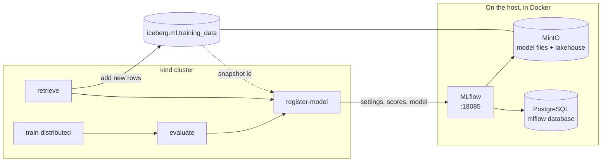
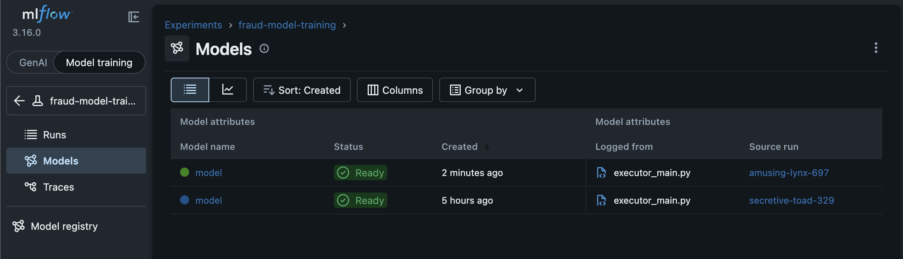
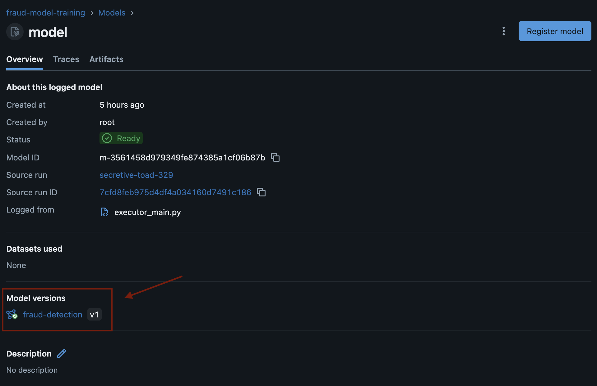
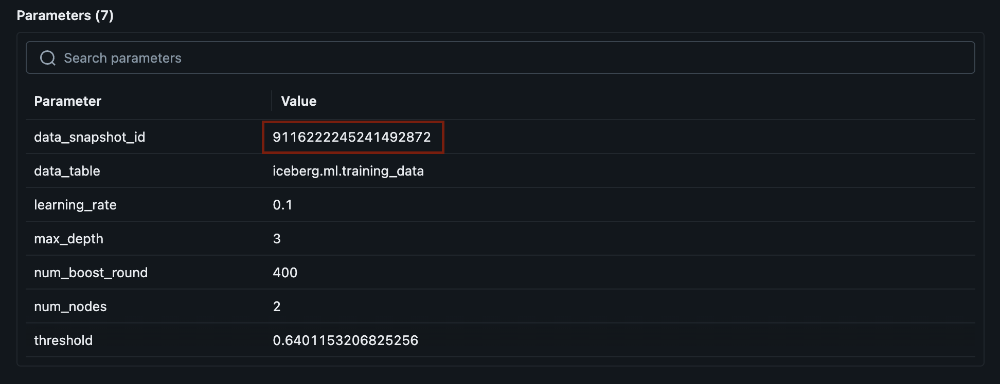
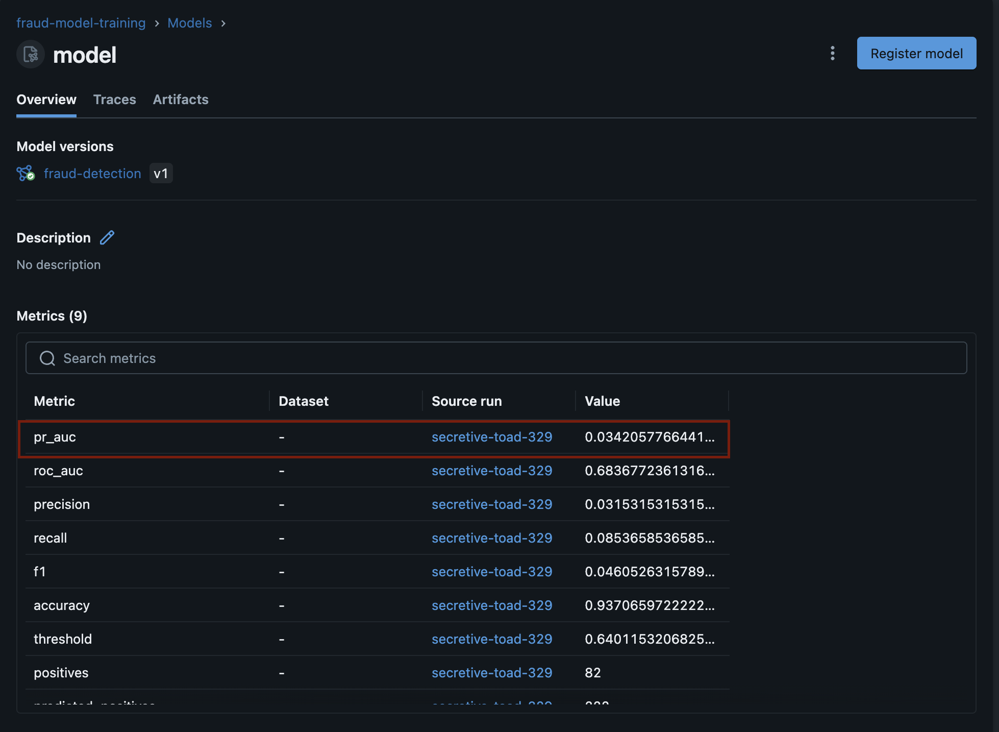
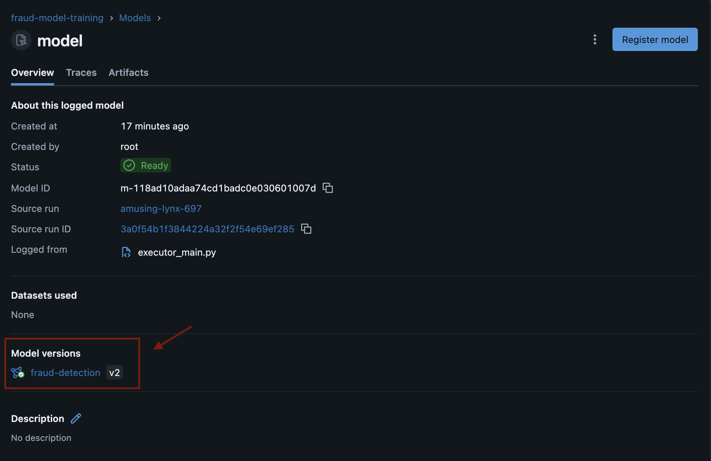
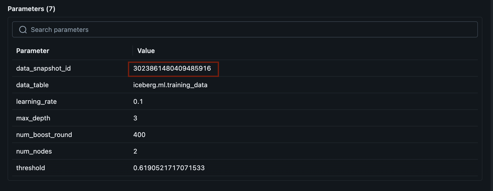
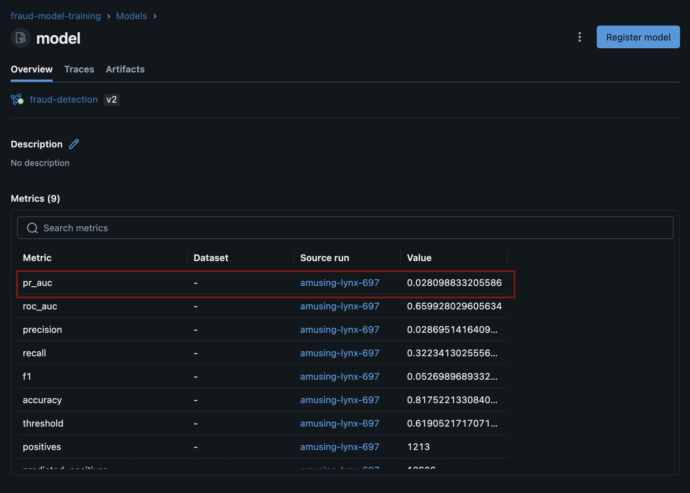
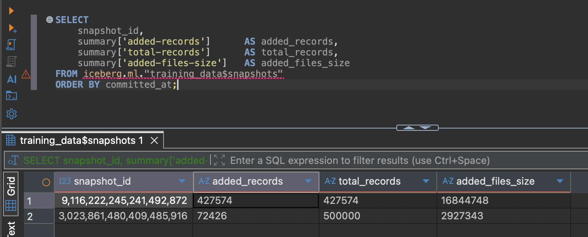
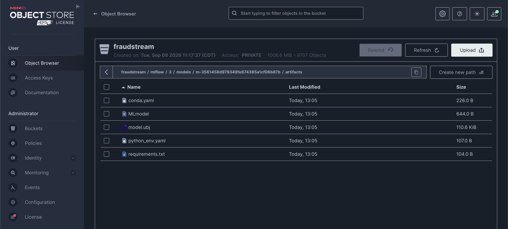

# Keeping Track of Models and the Data They Came From

A model on its own says very little. Six months later the question is never
"what is this file", it is "which rows made this, and what did it score".

So every training run now records two things and ties them together. The model,
its settings and its scores go into MLflow. The exact rows it trained on get
saved as a version of one table. The run stores the id of that version, so the
same rows can always be read back.

## What runs where



Nothing new was installed to store the data versions. The lakehouse already
uses Iceberg, and an Iceberg table already keeps a history of every change.

## Two runs, two versions

The evidence below comes from two runs of the same pipeline. The only difference
is how much data they asked for: the first stopped at 1 June, the second at
30 June.



### Version 1







### Version 2







| | Version 1 | Version 2 |
|---|---|---|
| Rows | 427,574 | 500,000 |
| Data snapshot | `9116222245241492872` | `3023861480409485916` |
| PR-AUC | 0.0342 | 0.0281 |
| ROC-AUC | 0.6837 | 0.6599 |
| Threshold | 0.640 | 0.619 |

The two versions point at different snapshots. That is the whole idea: a model
version and a data version, joined by one number.

Version 2 scores lower, and that is expected. It was tested on a longer and
harder stretch of time. Its 0.0281 lines up with the notebook's 0.0279 in
`docs/18_ml_training.md`, which used the same full period.

## Only the new rows get stored

This is the part worth checking rather than believing.



| Commit | Rows added | Rows in table | Size written |
|---|---|---|---|
| First run | 427,574 | 427,574 | 16.8 MB |
| Second run | **72,426** | 500,000 | **2.9 MB** |

The second run asked for all 500,000 rows. It stored 72,426 of them, because the
other 427,574 were already there and unchanged. Saving a second full copy would
have cost around 19.7 MB. It cost 2.9 MB.

Two things make that work. Rows are matched on transaction id, so a row that is
already present is recognised. And the merge only rewrites a row when a value
has actually changed, so re-running the same window costs nothing at all.

## Where the model itself lives



MLflow writes these to MinIO. `model.ubj` is the model. The rest describe how to
load it and what it needs to run, which is what lets anyone use it without
knowing how it was trained:

```python
model = mlflow.pyfunc.load_model("models:/fraud-detection/2")
```

The pipeline pods never touch MinIO for this. They upload to the MLflow server
and it writes the files, so no pipeline step needs storage credentials.

## Getting back the exact data

Take the snapshot id from a model version and read the table as it was then:

```sql
SELECT count(*) FROM iceberg.ml.training_data
FOR VERSION AS OF 9116222245241492872;
```

That returns 427,574 rows, the same set version 1 was trained on, even though
the table now holds 500,000.

The same question can be asked in SQL against MLflow's own database:

```sql
SELECT mv.name, mv.version, p.value AS data_snapshot_id
FROM model_versions mv
JOIN params p ON p.run_uuid = mv.run_id AND p.key = 'data_snapshot_id'
ORDER BY mv.version;
```

## Choosing which model serves predictions

Training never does this on its own. Every run adds a version and stops there.
Picking one is a decision someone makes after looking at the numbers:

```python
from fraudstream_ml.registry import promote
promote(version=2, tracking_uri="http://localhost:18085")
```

## How to run it

```bash
docker compose up -d postgres minio redis mlflow
cd pipelines && PYTHONPATH=src uv run python -m fraudstream_pipelines.submit --num-nodes 2
```

MLflow's own pages are at `http://localhost:18085`.

Tests need no server. They use a local database and a temporary table:

```bash
cd ml && PYTHONPATH=src uv run python -m unittest discover -s tests
```

## Things that catch people out

**MLflow must be running before the pipeline starts.** If it is not, the last
step cannot resolve the name `mlflow` and fails after retrying for two minutes.
The error says name resolution, which sounds like a network problem rather than
a container that was never started.

**Snapshot ids are too big to be numbers.** They are 19 digits. Kubeflow stores
numeric values as floating point, which cannot hold that many digits exactly, so
the id would be silently rounded and point at nothing. They are passed and
stored as text everywhere.

**Spark cannot read the timestamps pandas writes.** pandas uses nanoseconds by
default and Spark's parquet reader only accepts milliseconds and microseconds.
The retrieval step asks for microseconds when it writes, which is still far finer
than payment times need.
