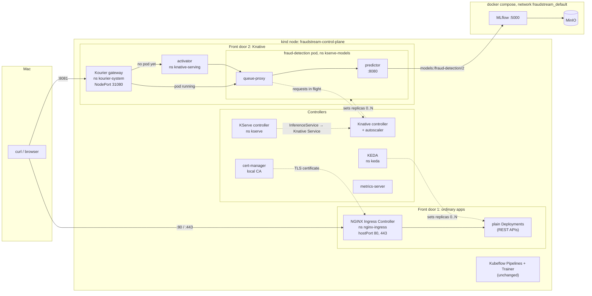
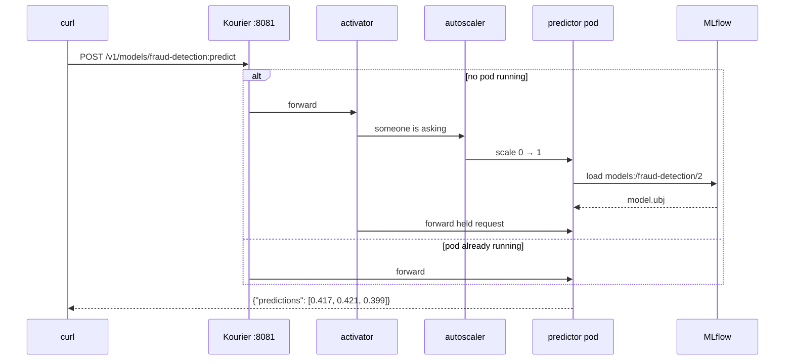

# The Local Kubernetes Platform

The kind cluster started with one job: run the training pipeline. It now also
takes web traffic, scales workloads on demand, and serves the fraud model over
HTTP. Later phases build their APIs, gateway and A/B tests on top of this.

Everything is installed by one script, and every part was checked with a real
request rather than trusted from its install log.

```bash
./k8s/bootstrap.sh
```

## What runs where



Solid lines carry requests. Dotted lines are controllers acting on something.

The kind node is joined to the compose network, so pods reach MLflow at
`http://mlflow:5000` by name. Nothing on the compose side changed.

### Ports

| Host port | Lands on | Goes to | Used for |
|-----------|---|---|---|
| `80`      | node `80` | NGINX (hostPort) | HTTP, redirects to HTTPS when the Ingress has a certificate |
| `443`     | node `443` | NGINX (hostPort) | HTTPS with the local CA |
| `8081`    | node `31080` | Kourier (NodePort) | every Knative service, KServe models included |

These mappings are set when the cluster is created and cannot be added later.
They are in `k8s/kind-cluster.yaml`.

Which app answers is decided by the `Host` header, not the port:

| Host | Door | Answered by |
|---|---|---|
| `echo.localhost` | 80 / 443 | smoke-test echo app |
| `protected.localhost` | 80 | same app, behind basic auth and a rate limit |
| `inference.fraudstream.localhost`, `drift-detection.fraudstream.localhost` | 443 | the web APIs, behind the [gateway](24_gateway.md) |
| `<name>-<namespace>.knative.localhost` | 8081 | a Knative service |
| `fraud-detection-predictor.kserve-models.knative.localhost` | 8081 | the fraud model |

## Why two front doors

NGINX could sit in front of Kourier to give one entry point. That needs a
wildcard rule, two proxies in a row, and a changed Knative domain setting. What
sits behind NGINX is the web APIs now, and Grafana, Kibana and Jaeger later
(see [the gateway](24_gateway.md)). None of them run on Knative.

So ordinary apps use 80/443 and anything Knative runs uses 8081. Each door can
be tested and debugged on its own.

## One request to the fraud model



| | Measured |
|---|---|
| first request after idle (cold start) | 3.5 – 5.8 s |
| request to a running pod | 9 – 15 ms |
| idle time before the pod is removed | about 90 s |
| memory while running | 219 Mi |
| memory while idle | 0 |

The image was already on the node for these numbers. A first pull adds much
more.

**The model is served by project code, not a KServe runtime.** KServe's MLflow
runtime has no image for Apple Silicon. Its XGBoost runtime sends columns without
names, and the model refuses them. The predictor in `serving/` is about 40 lines.
It matches fields by name and puts them in the model's own order, so a request
that lists its fields in a different order still gets the right score. A missing
field is refused with HTTP 400 and named.

Served scores match the model run locally, checked on three real rows from the
data version 2 was trained on. One score differs in the 8th decimal. The same
difference appears when scoring inside the Linux container without KServe, so it
comes from XGBoost's macOS and Linux builds, not from serving.

## What each part is for

| Part | Job here | Needed by                        |
|---|---|----------------------------------|
| NGINX Ingress Controller | routes by host name, basic auth, rate limiting | Gateway                          |
| cert-manager | issues HTTPS certificates from a local CA | HTTPS                            |
| metrics-server | CPU and memory numbers for `kubectl top` and autoscaling | Web APIs                         |
| KEDA | scales plain Deployments on events, down to zero | Web APIs                         |
| Knative Serving + Kourier | runs services that scale to zero, splits traffic between versions | CI/CD, A/B testing               |
| KServe | turns "serve this model" into a Knative service | KServe inference engine in CI/CD |

**Each workload has exactly one autoscaler.** Knative scales what it runs. KEDA
scales plain Deployments. Pointing both at the same Deployment makes them fight
over the replica count.

## Memory

Measured with `kubectl top` after the platform was idle.

| Namespace | Memory |
|---|---|
| kube-system (Kubernetes itself) | 2502 Mi |
| kubeflow (Pipelines) | 1076 Mi |
| cert-manager | 209 Mi |
| knative-serving | 158 Mi |
| kserve | 114 Mi |
| keda | 78 Mi |
| kubeflow-system (Trainer) | 77 Mi |
| nginx-ingress | 58 Mi |
| kourier-system | 29 Mi |
| **All pods** | **4.22 GiB** |

**This phase added 646 Mi.**

With the training pipeline running beside all of it, two workers:

| | Node | All pods |
|---|---|---|
| idle | 7.7 GiB | 4.2 GiB |
| peak during training | **10.6 GiB** | **7.4 GiB** |

Peak is 10.6 GiB out of the 19.5 GiB given to Docker. Training and serving fit on
this machine together. The run succeeded in 6 m 37 s and registered version 3.

## Checking it works

Get the CA certificate once, so curl trusts the local HTTPS:

```bash
kubectl -n cert-manager get secret local-ca -o jsonpath='{.data.ca\.crt}' | base64 -d > local-ca.crt
```

**Ingress, HTTPS, basic auth, rate limit**

```bash
kubectl apply -f k8s/smoke/echo.yaml -f k8s/smoke/echo-protected.yaml
PW=$(openssl rand -base64 12)
kubectl -n platform-smoke create secret generic echo-htpasswd \
  --type=nginx.org/htpasswd --from-literal=htpasswd="smoke:$(openssl passwd -apr1 "$PW")"

curl --cacert local-ca.crt --resolve echo.localhost:443:127.0.0.1 https://echo.localhost/   # hello from echo
curl -o /dev/null -w "%{http_code}\n" -H "Host: protected.localhost" http://localhost/      # 401
curl -o /dev/null -w "%{http_code}\n" -u "smoke:$PW" -H "Host: protected.localhost" http://localhost/   # 200
for i in $(seq 50); do curl -s -o /dev/null -w "%{http_code}\n" -u "smoke:$PW" \
  -H "Host: protected.localhost" http://localhost/ & done | sort | uniq -c   # 1 × 200, 49 × 429
```

**KEDA** scales to 2 from minute 0 to minute 2 of every 4 (UTC), then back to 0:

```bash
kubectl apply -f k8s/smoke/keda-cron.yaml
kubectl -n platform-smoke get deploy keda-target -w
kubectl -n platform-smoke delete scaledobject,deploy keda-target   # afterwards, both together
```

**Knative scale to zero and an 80/20 split**

```bash
kubectl apply -f k8s/smoke/knative-hello.yaml
curl -H "Host: hello.platform-smoke.knative.localhost" http://localhost:8081/

kubectl apply -f k8s/smoke/knative-split-v1.yaml     # wait until Ready
kubectl apply -f k8s/smoke/knative-split-v2.yaml
for i in $(seq 100); do curl -s -H "Host: split.platform-smoke.knative.localhost" \
  http://localhost:8081/; echo; done | sort | uniq -c    # about 80 v1, 20 v2
```

**The fraud detection model**

```bash
docker build -f k8s/Dockerfile.serving -t dev.local/fraudstream-serving:dev .
kind load docker-image dev.local/fraudstream-serving:dev --name fraudstream
kubectl apply -f k8s/models/fraud-detection.yaml

curl -H "Host: fraud-detection-predictor.kserve-models.knative.localhost" \
  -H "Content-Type: application/json" -d @request.json \
  http://localhost:8081/v1/models/fraud-detection:predict
```

`request.json` is `{"instances": [{...51 named features...}]}`, the output of
`prepare_features` for each row.

Watch the pod appear and disappear in a second terminal:

```bash
kubectl -n kserve-models get pod -w
```

## Versions

| Component | Version | Note |
|---|---|---|
| kind node | `v1.34.3` | the highest Kubernetes KServe 0.20 supports |
| NGINX Ingress Controller (F5) | 5.6.3, chart 2.7.3 | |
| cert-manager | v1.21.2 | |
| metrics-server | v0.9.0, chart 3.14.0 | |
| KEDA | v2.20.2 | |
| Knative Serving | 1.20.3 | not the newest, see below |
| net-kourier | 1.20.1 | |
| KServe | v0.20.0 | Serverless mode |

All pinned at the top of `k8s/bootstrap.sh`.

## Things worth notice

**ingress-nginx is retired.** Maintenance ended in March 2026. This platform uses
F5's NGINX Ingress Controller, which is maintained and still counts as NGINX
Ingress.

**Its annotations use a different prefix.** Most tutorials describe the retired
project. A wrong prefix gives no error. The setting is just ignored.

| Retired ingress-nginx | Used here |
|---|---|
| `nginx.ingress.kubernetes.io/auth-secret` | `nginx.org/basic-auth-secret` |
| `nginx.ingress.kubernetes.io/limit-rps` | `nginx.org/limit-req-rate` |

The htpasswd Secret must also have type `nginx.org/htpasswd`.

**The newest Knative does not work with KServe.** Knative's install page gives
1.23. KServe 0.20 supports only Knative 1.19–1.20 on Kubernetes up to 1.34. That
is also why the node image must stay at `v1.34.3`.

**Kourier waits forever for a load balancer.** Its Service ships as
`LoadBalancer`, and kind has none, so the address stays pending. The bootstrap
changes it to NodePort 31080, which the kind port mapping points at.

**Two KServe runtimes cannot serve this model.** The MLflow runtime image has no
Apple Silicon build. The XGBoost runtime drops column names, which this model
requires. Hence the custom predictor.

**KServe keeps one pod running unless told otherwise.** Its default is
`minReplicas: 1`. Scale to zero needs `minReplicas: 0` on the predictor.

**Knative refuses local images under a normal name.** It asks the registry for
the image's digest before starting a pod, and gets 401 for an image that only
exists on the node. Names starting with `dev.local/` skip that lookup.

**A KEDA ScaledObject does not recover when its target returns.** If the
Deployment is deleted and recreated, the ScaledObject stays stuck on "not found".
Delete and recreate the ScaledObject as well.

**`docker stats` overstates the node's memory.** It counts page cache from the
downloaded images. Here it reported 7.7 GiB when pods used 4.2 GiB. Use
`kubectl top`.
