# Web APIs: Scoring and Drift Detection

Two small services run on the local Kubernetes platform.

The **inference API** takes a payment, looks up the customer's and merchant's
history, asks the fraud model for a score and answers. The **drift detection
API** receives every row the model scored and reports how far the last hour of
traffic has moved from the data the model was trained on.

Both are async FastAPI apps with Pydantic validation, one image each, deployed
by one Helm chart.

## What runs where

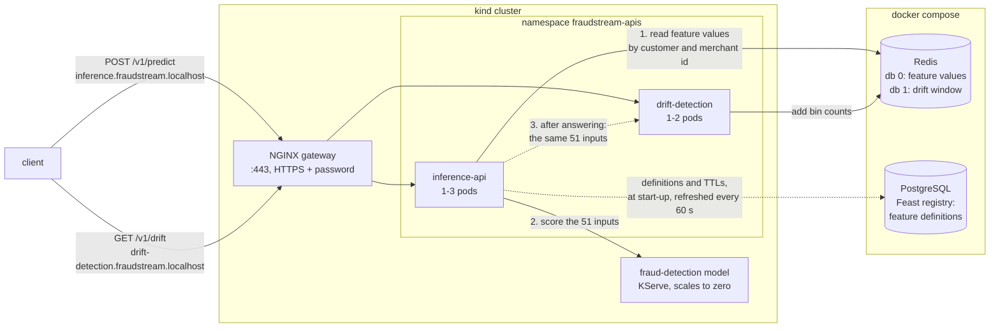

Solid lines happen while a request waits for its answer. Dotted lines never make
a request wait: the registry is read at start-up and refreshed in the
background, and the drift detection API is sent its row after the caller has
been answered.

The **Feast registry** is a catalog, not data. It lists the feature views, the
entity each belongs to, their fields and their TTLs. The feature values
themselves are in Redis, and the registry tells the inference API how to read
them. The API loads it once at start-up, which is most of the 2.5 s warm-up,
and keeps it in memory, so no request goes to PostgreSQL.

| | Inference API | Drift detection API |
|---|---|---|
| Endpoints | `POST /v1/predict` | `POST /v1/observations`, `GET /v1/drift` |
| Host through the [gateway](24_gateway.md) | `inference.fraudstream.localhost` | `drift-detection.fraudstream.localhost` |
| Image | 972 MB | 335 MB |
| Memory per pod | 142 Mi | 43 Mi |
| Pods, scaled by KEDA on CPU | 1 to 3 | 1 to 2 |

Both live in `api/`, one project with one package per service. Each service has
its own dependency set, so the drift image carries neither Feast nor pandas.
Containers run as a non-root user on a read-only filesystem with every
capability dropped.

## One prediction

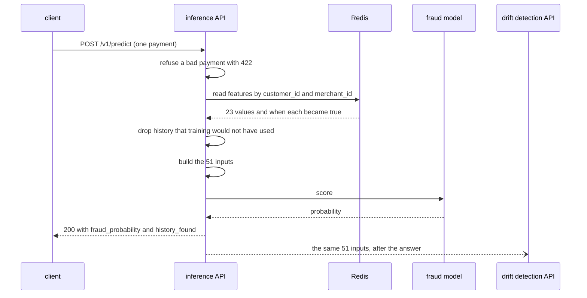

An ID alone cannot be scored, so the request carries the whole payment. The
model takes 51 inputs:

| Source | Inputs |
|---|---|
| Online store, found by customer and merchant id | 22 numbers, 8 merchant-category columns, 3 "history found" flags: **33** |
| The payment itself | amount, hour, 4 channel columns, 12 city columns: **18** |

Two rules keep the model away from inputs it never saw in training.

**The inputs are built by the training code.** The API imports
`prepare_features` from the training pipeline instead of copying it, and a test
checks a real training row comes out identical both ways.

**Stored history is used only if training would have used it.** A value must
have become true before the payment and within its feature view's TTL, measured
from the payment's own time. The online store keeps the last value it received,
however old, and one Redis key holds every view, so expiry cannot do this. The
online store returned values 99 and 136 days old, past the 31 and 91 day TTLs of
their views. The API applies the rule itself. A payment with no history is still
scored, and `history_found` says which views had any.

The stored values are dated 2026-06-30 at the latest, so test payments are
stamped that day.

```json
{"transaction_id": "demo-000001",
 "fraud_probability": 0.4251362681388855,
 "history_found": {"customer_features_available": true,
                   "customer_orders_90d_available": true,
                   "merchant_features_available": true}}
```

## Health checks

| Probe | Path | Asks | Checks |
|---|---|---|---|
| startup | `/livez` | has it finished starting? | the port is open, which happens after the registry is loaded |
| liveness | `/livez` | is the process stuck? | nothing else |
| readiness | `/readyz` | should it receive traffic? | Redis answers a `PING` within 1 s |

Liveness checks no dependency, because restarting a pod cannot repair Redis.
With Redis stopped, `/livez` answers 200 in 1 ms and `/readyz` answers 503 in
1.0 s.

**Readiness never calls the model.** The model scales to zero after about 90
idle seconds, and a probe every 5 seconds would keep it awake. With the API idle
and probing, the model still scaled to zero while the API stayed Ready.

## Autoscaling

KEDA scales each Deployment when CPU passes 60% of its request. The chart sets
no replica count, so KEDA alone owns it. Load of 100 requests a second:

```bash
cd api && set -a && . ../.env && set +a
uv run python tools/traffic.py \
  --host inference.fraudstream.localhost \
  --body tools/transaction.json \
  --rate 100 \
  --seconds 300
```

One pod of each service before the load:

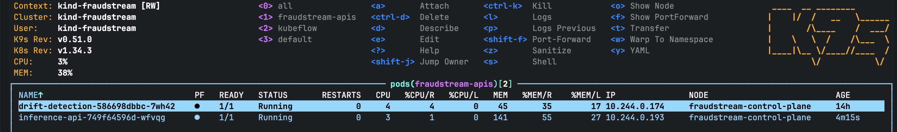

A new pod of each starts within seconds:

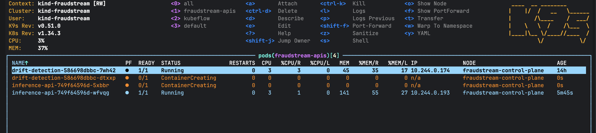

The inference API reaches three pods:

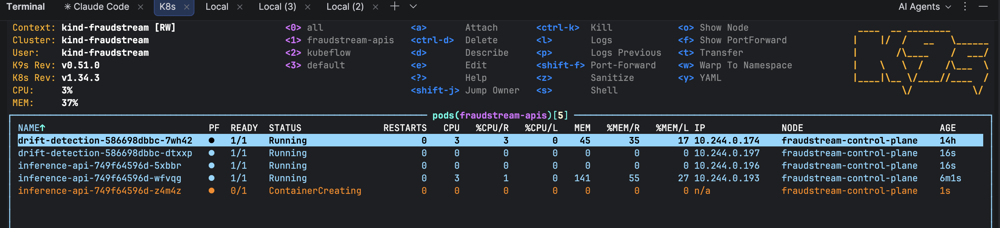

The drift detection API scales too, because every prediction sends it a row. It
reached 132% of its CPU request at this load.

Measured on the inference API over 30,000 requests: the autoscaler asked for
three pods 38 s after the load began and all three were ready 11 s later. It
returned to one pod 104 s after CPU fell. At 100 requests a second the three
pods used about 370m of CPU each, roughly 11 ms per request. No pod restarted
while saturated.

## Rolling update

| Setting | Value | Why |
|---|---|---|
| `maxSurge` / `maxUnavailable` | 1 / 0 | a ready pod is never removed before its replacement is ready |
| `minReadySeconds` | 5 | a pod that turns ready and then crashes does not count |
| `preStop` sleep | 5 s | NGINX stops routing to the pod before it stops accepting |
| `terminationGracePeriodSeconds` | 30 | 5 s of `preStop` plus 20 s of graceful shutdown |
| `progressDeadlineSeconds` | 600 | must stay above Helm's timeout, see below |

Upgrading to a new image tag under the load above:

```bash
helm upgrade inference-api k8s/charts/fraudstream-api \
  -n fraudstream-apis \
  -f k8s/apis/inference-api.yaml \
  --set-string image.tag=v6 \
  --rollback-on-failure \
  --timeout 2m
```

The first pod of the new template (`85fc8949b4`) is Ready while the old pods
(`749f64596d`) still serve:

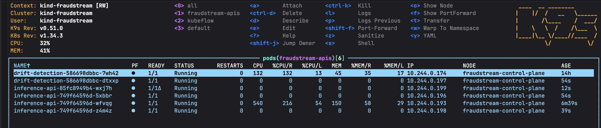

An old pod terminates only once its replacement is up:

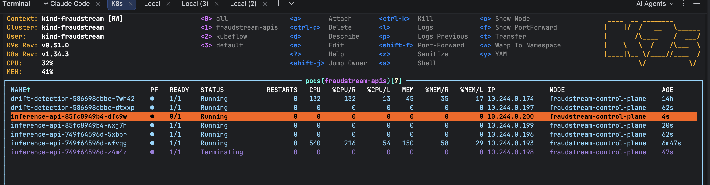

Each line of the traffic tool counts the answers that arrived in that second,
grouped by the version that gave them. Both versions answer, and every answer is
`ok`:

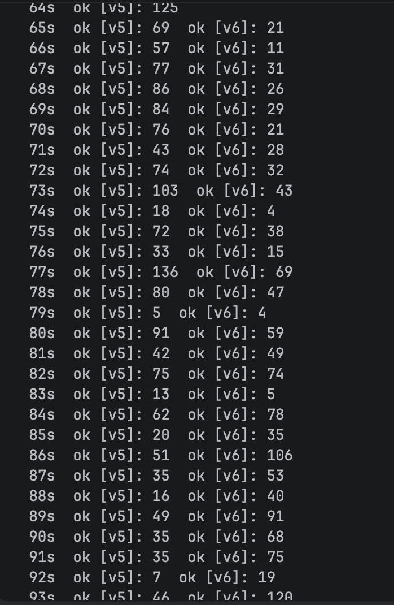

At 10 requests a second, an upgrade took 12 seconds and all 1,200 requests
succeeded.

## Automatic rollback

`--rollback-on-failure` is Helm 4's name for `--atomic`. A release pointed at a
Redis that does not exist cannot finish its start-up warm-up, so the new pod
restarts in a loop and never becomes ready:

```bash
helm upgrade inference-api k8s/charts/fraudstream-api \
  -n fraudstream-apis \
  -f k8s/apis/inference-api.yaml \
  --set-string image.tag=v5 \
  --set env.REDIS_HOST=redis-that-does-not-exist \
  --rollback-on-failure \
  --timeout 2m
```

The crashing pod (`d797846db`) restarts in a loop while the three healthy pods
keep serving:

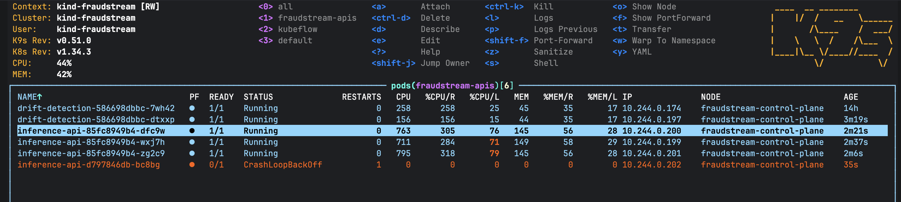

Checking the release and the setting it was given:

```bash
helm history inference-api -n fraudstream-apis

kubectl -n fraudstream-apis get deploy inference-api \
  -o jsonpath='{.spec.template.spec.containers[0].env[?(@.name=="REDIS_HOST")].value}{"\n"}'
```

Captured while the broken release was still being applied, revision 25 is
`pending-upgrade` and `REDIS_HOST` is the missing host. Revisions 17, 19 and 21
are earlier attempts interrupted by hand:

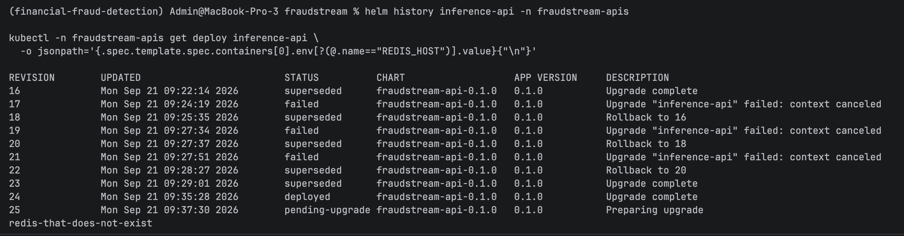

Helm gave up at its own 2 minute timeout and rolled back:

```text
24  09:35:28  superseded  Upgrade complete
25  09:37:30  failed      Upgrade "inference-api" failed: resource Deployment/fraudstream-apis/inference-api
                          not ready. status: InProgress, message: Updated: 1/3 context deadline exceeded
26  09:39:30  deployed    Rollback to 24
```

`REDIS_HOST` reads `redis` again. After the load stopped, KEDA returned to one
pod per service and only the good pod remained:

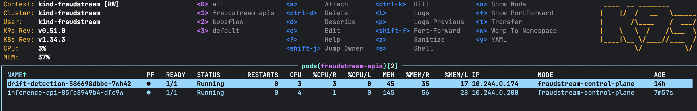

Requests measured through a failed release and its rollback: 2,000 of 2,000
succeeded. The drift detection API uses the same chart and behaved the same way:
1,500 of 1,500 through its upgrade, then a failed release rolled back to a
`deployed` revision.

## Drift detection

Each of the 51 inputs is compared with its distribution in the training data
using the population stability index (PSI). Under 0.10 is stable, 0.10 to 0.25 a
warning, 0.25 and over drift. No verdict is given below 1,000 observations.

The reference is `api/reference/fraud-detection-v2.json`, 12 KB, built from the
348,184 rows of the exact data version model 2 trained on. It is copied into the
image. Inputs with ten or fewer distinct values get one bin per value, and
missing values get a bin of their own. Nineteen of the model's 27 yes/no inputs
are 1 in under 10% of rows, and ordinary decile bins would hide any change in
them.

The window is bin counts, not rows: one Redis hash per minute, summed over the
last 60. Every replica adds to the same window, a restart loses nothing, and
memory stays fixed however much traffic arrives.

The inference API sends the drift detection API the same 51 inputs after it has
answered, with a 2 second timeout. Only scored payments are sent. Fifty
predictions produced exactly 50 observations. With the drift detection API
stopped, 100 predictions all succeeded and the log read
`drift detector unreachable: ConnectError('All connection attempts failed')`.

Two windows of real rows replayed through the deployed API. Its PSI matched the
same sums worked out offline to within 0.001, and every row was counted.

| Window | Rows | Status | `amount` | `total_orders_90d` |
|---|---|---|---|---|
| 1 to 20 April | 69,758 | warning | 0.000 stable | 0.186 warning |
| 15 to 30 June | 40,468 | **drift** | 0.151 warning | **0.440 drift** |

The generator raises `amount` from May, so it is stable in April and a warning
by late June. The largest score belongs to `total_orders_90d`, which moves
because the generated history starts on 1 January and 90-day counts are still
filling in during the early months. A drift detector reports what moved, not why.

## Checking it works

```bash
# tests, no services needed
cd api && PYTHONPATH=src:../ml/src uv run python -m unittest discover -s tests

# build, load and deploy the inference API
docker build -f k8s/Dockerfile.inference -t fraudstream-inference:v1 .
kind load docker-image fraudstream-inference:v1 --name fraudstream
kubectl create namespace fraudstream-apis
set -a && . ./.env && set +a
kubectl -n fraudstream-apis create secret generic feature-store-registry \
  --from-literal=POSTGRES_USER="$POSTGRES_USER" \
  --from-literal=POSTGRES_PASSWORD="$POSTGRES_PASSWORD"
helm upgrade --install inference-api k8s/charts/fraudstream-api -n fraudstream-apis \
  -f k8s/apis/inference-api.yaml --set-string image.tag=v1 --rollback-on-failure --timeout 2m

# score one payment through the gateway (local-ca.crt: see docs/24_gateway.md)
curl --cacert local-ca.crt -u "$GATEWAY_USER:$GATEWAY_PASSWORD" -H "Content-Type: application/json" \
  -d @api/tools/transaction.json https://inference.fraudstream.localhost/v1/predict

# the API must return the model's own answer
cd api && POSTGRES_HOST=localhost REDIS_HOST=localhost PYTHONPATH=src:../ml/src \
  uv run python tools/check_prediction.py

# replay a real window through drift detection
docker exec fraudstream-redis redis-cli -n 1 FLUSHDB
cd api && PYTHONPATH=src:../ml/src uv run --group reference \
  python tools/replay.py --start 2026-06-15 --end 2026-07-01
```

The drift detection API deploys the same way from `k8s/Dockerfile.drift-detection`
and `k8s/apis/drift-detection.yaml`. The first request after the model has been
idle takes 3.5 s to about 14 s while it starts, so the client timeout is 30 s.

## Things worth noticing

**The Deployment must not give up before Helm does.** With
`progressDeadlineSeconds` below Helm's `--timeout`, the Deployment failed first,
the rollback read its failed condition and was itself marked `failed`, and the
release had no `deployed` revision. The Deployment's deadline is 600 s and
Helm's is 2 minutes.

**The chart must never set `replicas`.** KEDA owns the count, and under
server-side apply Helm and the autoscaler would fight over it.

**A KEDA `ScaledObject` does not recover when its target is recreated.** After a
Deployment is deleted and applied again, the `ScaledObject` stays on "not found".
Delete and recreate it too.

**`FeatureStore.teardown()` deletes the feature store's infrastructure.** The API
calls `close()`.

**NGINX's default body limit is 1 MB.** A batch of 5,000 rows is about 7 MB, so
the drift ingress allows 8 MB. Larger bodies were refused with 413 before the
API saw them.

**One failed request takes a pod out of rotation for 10 seconds.** The upstream
is configured with `max_fails=1 fail_timeout=10s`. Under load about one request
in 30,000 was answered 502 (`Connection reset by peer`) with no restart or
scaling at the time, and one in a few thousand was reset during rollouts. The
cause was not found. NGINX does not pool upstream connections here, so a
keep-alive race is ruled out. Callers should retry.

**Kind-loaded images need explicit tags.** With `latest` the kubelet tries to
pull from Docker Hub and fails.

**The registry Secret is created by command, not stored in git.** A fresh
cluster needs the `kubectl create secret` line above.
