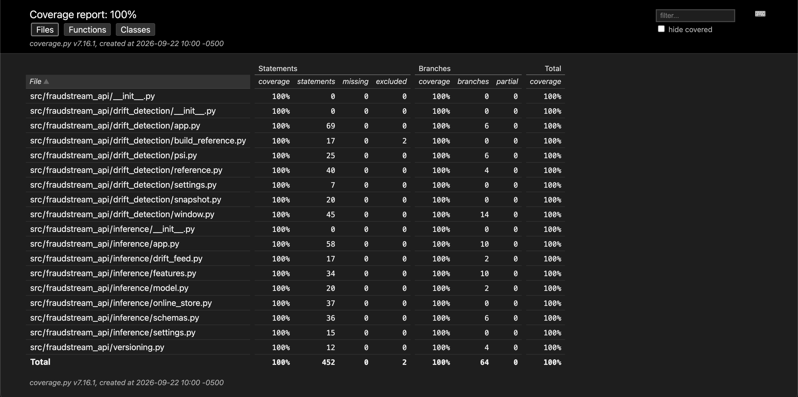
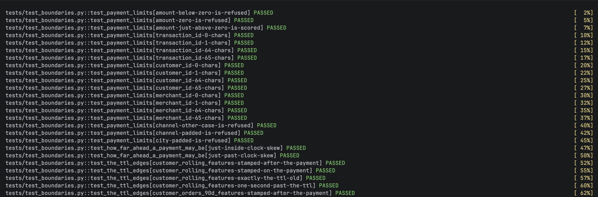
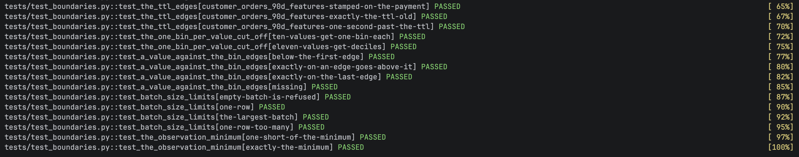
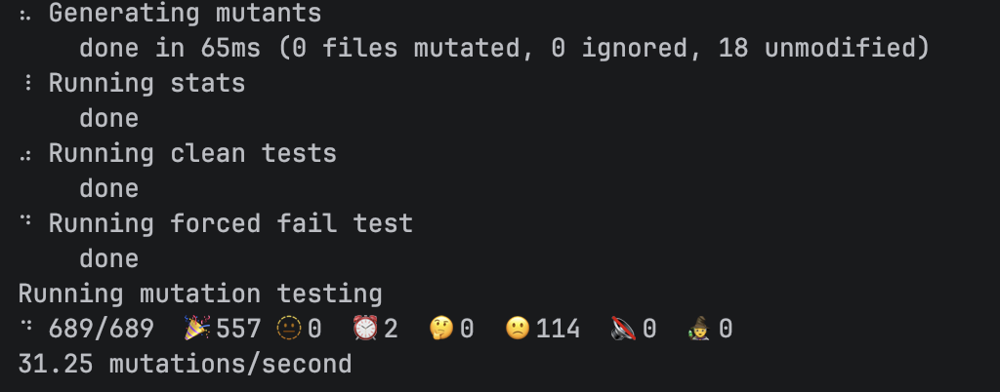
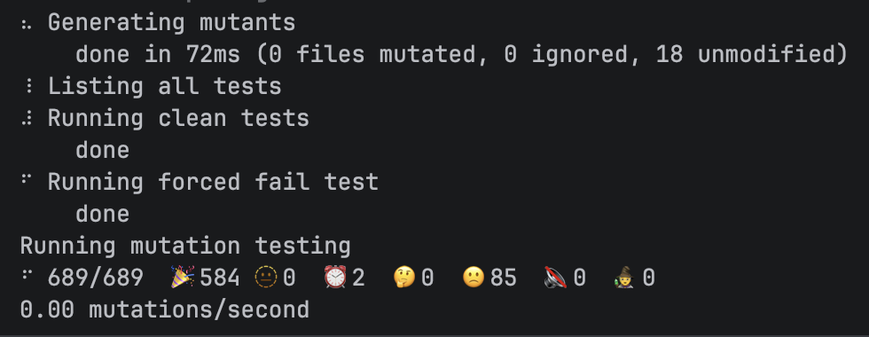
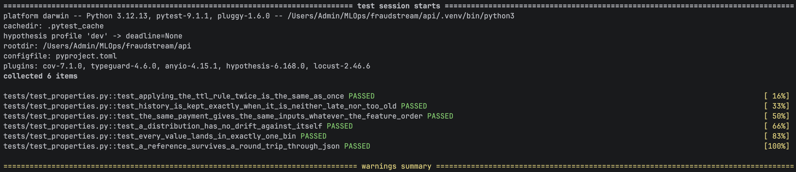
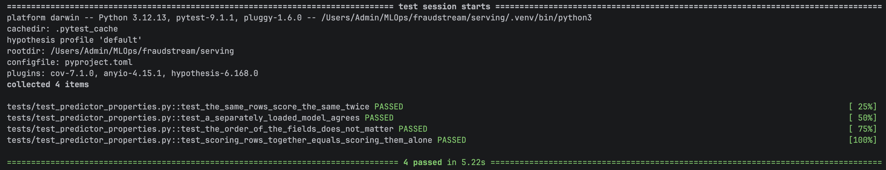
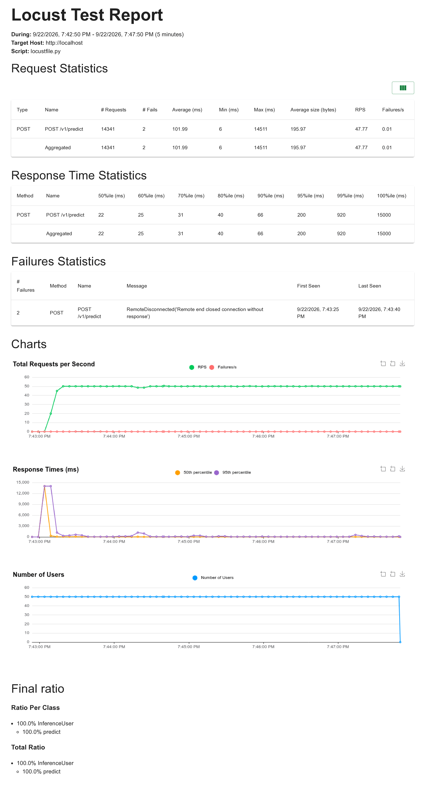
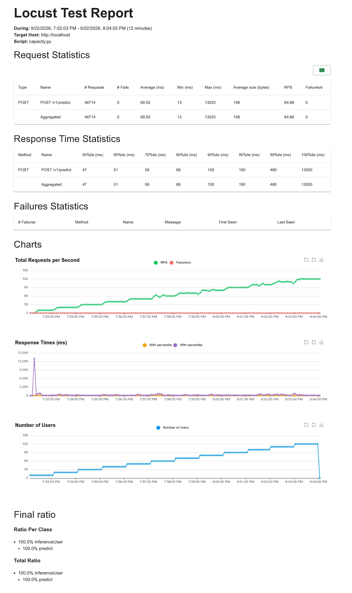

# Validating the Web APIs

Five checks on the two APIs and the model behind them: coverage, boundary
cases, mutation testing, properties, and a load test with a fixed SLA.

| Check | Result |
|---|---|
| Line and branch coverage | **100%** for `api/`, **100%** for `serving/` |
| Tests | 140 in `api/`, 14 in `serving/` |
| Mutation score | **86.2%** (594 of 689 mutants caught) |
| Properties | 10, run by Hypothesis |
| Load test | p95 200 ms, p99 920 ms at 48 req/s — **SLA met** |

Everything runs on a Mac with `uv`. No test needs a database or a cluster; the
load test needs the deployed APIs.

## Coverage



```bash
cd api && uv run pytest --cov --cov-report=html
```

Three modules used to sit at 0–46% because they need a live Feast, Redis or
Trino. They are covered now by replacing only what the code does not own:

| Replaced | With |
|---|---|
| Feast's `FeatureStore` | `unittest.mock.patch` where the reader looks it up |
| Redis | fakeredis, so pipelines and expiry really run |
| Trino | a mocked `connect`, with two real training rows behind it |
| KServe's `ModelServer` | a mock, so `main()` can be tested without a port |

The bar is 90% and counts branches. `if __name__ == "__main__":` is excluded,
since it only runs when a file is executed as a script.

One test is there purely as a guard: `close()` must never call Feast's
`teardown()`, which deletes the feature store's infrastructure.

## Boundary cases

Classes like "unknown channel" or "stale history" already had tests. What was
missing were the values sitting exactly on each limit, so `test_boundaries.py`
adds 40 named cases for nine rules.





```bash
cd api && uv run pytest -v tests/test_boundaries.py
```

| Rule | Values |
|---|---|
| `amount > 0` | −0.01, 0, 0.01 |
| ids are 1–64 characters | 0, 1, 64, 65 |
| channel and city match exactly | `ATM`, ` atm`, `New York ` |
| at most 5 minutes ahead | +4 min 50 s, +5 min 10 s |
| history kept when `0 ≤ age ≤ ttl` | −1 s, 0, ttl, ttl + 1 s |
| ten or fewer distinct values get one bin each | 10, 11 |
| a value on a bin edge | below, on, above, missing |
| a batch holds 1–5,000 rows | 0, 1, 5,000, 5,001 |
| a verdict needs the minimum | 49, 50 |

Each case was checked by breaking its rule in the source and watching that one
case fail. For example `gt=0` to `ge=0`, or `<= ttl` to `< ttl`.

## Mutation testing

Coverage says a line ran. Mutation testing changes the line and asks whether a
test notices.

```bash
cd api
export PYTHONPATH=$(cd ../ml/src && pwd) OBJC_DISABLE_INITIALIZE_FORK_SAFETY=YES
uv run mutmut run
uv run mutmut results
```

Before, 114 mutants survived:



After six small tests, 85 survive and the score is 86.2%:



Those six tests came straight from the survivors, and each closes a real hole:

- the window summing minutes — `rows +=` could become `rows =` and only the
  last minute would count
- the drift API's Redis client — with `decode_responses=False` every field
  comes back as bytes and no count is ever found
- a JSON round trip keeping the model name, snapshot id and row count
- PSI rounded to four decimals — `round(value)` turns every warning into 0
- the model client applying its timeout — `timeout=None` never gives up
- what the drift feed logs on a refusal, and that it says nothing on success

mutmut re-tests only the functions whose code changed: a first run takes 37 s,
a run after one small change takes 8 s. Its cache keys on the source, not on
the tests, so `rm -rf mutants` is needed after adding tests.

The 85 survivors left cannot change behaviour: argparse help text in the
host-only reference CLI, app titles, log wording, JSON indentation, and ids the
model never reads.

## Properties

Ten properties, for the ways a score could quietly differ between runs.





```bash
cd api && uv run pytest tests/test_properties.py
cd serving && uv run pytest tests/test_predictor_properties.py
```

The model must give the same answer twice, after a fresh load, in any field
order, and whether rows are scored together or alone. The APIs must apply the
TTL rule the same way twice, build the same 51 inputs from the same payment,
and get PSI 0 comparing a distribution with itself.

Live, the same payment sent 100 times through the deployed API came back with
one distinct probability.

**CrossHair did not help here.** It solves branch conditions instead of
guessing values, which sounds ideal for the TTL rule. But it cannot see through
`datetime` and `timedelta`: with `<= ttl` broken to `< ttl`, CrossHair missed
it and so did random search. On the same rule written in plain integers, both
found it. It stays on two properties and costs about two seconds; the boundary
case is what actually guards that edge.

## Load test

The SLA was fixed before running anything: p95 ≤ 500 ms, p99 ≤ 1,000 ms,
failures ≤ 1%, at 50 requests a second. The locustfile checks all three when
the run ends and exits 1 if any is missed, so the HTML report is the record.

```bash
cd api && set -a && . ../.env && set +a
uv run --group loadtest locust -f loadtest/locustfile.py --headless -u 50 -r 5 -t 2m
uv run --group loadtest locust -f loadtest/locustfile.py --headless -u 50 -r 50 -t 5m \
  --html ../reports/load_test_inference_api.html
```



| Measure | Target | Measured |
|---|---|---|
| p95 | ≤ 500 ms | **200 ms** |
| p99 | ≤ 1,000 ms | **920 ms** |
| failures | ≤ 1% | 2 of 14,341 (0.01%) |

Median was 22 ms. The 15 s maximum is the first request waking the model, which
is why the run is preceded by a warm-up. The two failures are the NGINX
connection reset already described in
[docs/21_web_apis.md](21_web_apis.md#things-worth-noticing).

These runs were over plain HTTP. Since the gateway, the same test runs over HTTPS
with the password and still meets the SLA: see [docs/24_gateway.md](24_gateway.md#proof).

A second run raises the load 10 users a minute up to 120, to find where the
targets stop holding:

```bash
cd api && set -a && . ../.env && set +a
uv run --group loadtest locust -f loadtest/capacity.py --headless \
  --html ../reports/load_test_inference_api_capacity.html
```



| Users | 10 | 30 | 60 | 90 | 120 |
|---|---|---|---|---|---|
| req/s | 10 | 30 | 60 | 90 | 120 |
| p50 | 48 | 48 | 46 | 46 | 42 |
| p95 | 96 | 74 | 165 | 125 | 92 |

46,714 requests, no failures, and p95 stayed under half a second the whole way.
The median never moved, so nothing was saturating: one inference pod handles
roughly 15 requests a second and KEDA adds pods as CPU rises. Under load the
single model pod uses about as much CPU as all three inference pods together,
so it is the first thing that would need scaling. Since the gateway, one client above
60 requests a second is refused with 429, so this step-up test now measures that limit
past 60 users.

Both reports are in [reports/](../reports).

## Things worth knowing

**mutmut's `segfault` is not a verdict.** Eighteen mutants came back as
crashes. Run by hand, eight failed a test and ten passed every test. Counting
crashes as caught would have read 88.7% instead of 86.2%.

**A short load test measures the wrong thing.** A 20-second run gave p95
1.7 s, because the autoscaler needs about 50 seconds and the run was over
before it reacted.

**Coverage settings do not belong in every pytest run.** mutmut runs pytest
hundreds of times and does not need coverage each time, so `--cov` stays on the
command rather than in `addopts`.

## Running everything

```bash
cd api && uv run pytest --cov            # 140 tests, coverage gate at 90%
cd serving && uv run pytest --cov        # 14 tests

cd api && export PYTHONPATH=$(cd ../ml/src && pwd) OBJC_DISABLE_INITIALIZE_FORK_SAFETY=YES
uv run mutmut run && uv run mutmut results
```
