# CI/CD with Jenkins

Every push is tested. A push to the deploy branch is also built and deployed:
the two web APIs, the KServe model, the training pipeline, the Airflow pipelines
and the stream push job. Secrets live in Jenkins, never in the repository.

## Architecture

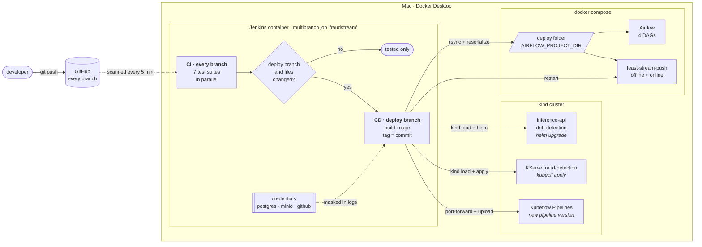

Jenkins runs in the Compose stack and joins two networks: `kind`, to reach the
cluster, and the Compose network, to reach Airflow and the stores. It builds with
the host's Docker through a mounted socket, so images never leave the machine.

| Deploys | When these change | Check after deploy |
|---|---|---|
| Inference API | `api/src`, `ml/src`, its Dockerfile, the chart | answers with `x-app-version` = commit |
| Drift detection API | `api/src`, `api/reference`, its Dockerfile, the chart | answers with `x-app-version` = commit |
| KServe model server | `serving/src`, its Dockerfile, `k8s/models` | a real payment scores through the API |
| Training pipeline | `ml/src`, `pipelines/src`, `k8s/Dockerfile.ml` | a version named after the commit exists |
| Airflow pipelines | `airflow`, `src`, `configs`, feature store code | four DAGs listed, no import errors |
| Stream push job | feature store code, `src` | still running 30 s after restart |

Deploying a pipeline registers it; it does not run it. Airflow DAGs and training
runs are still started by hand.

## Demo

### CI: a feature branch is only tested

Jenkins found the branch on its own, and all seven suites passed. The deploy
stages did not run, because this is not the deploy branch.

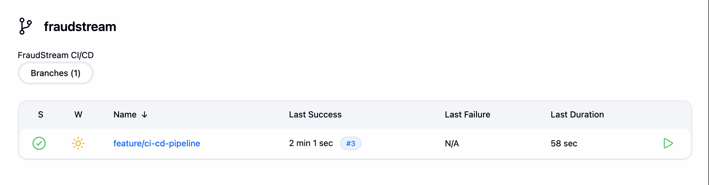

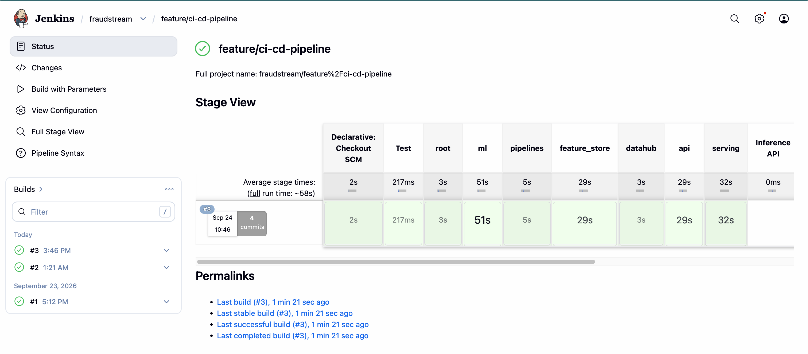

### BEFORE the merge

Images deployed by hand in earlier phases.

Inference API runs `fraudstream-inference:v6`:

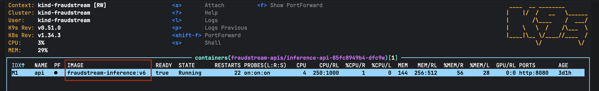

Drift detection API runs `fraudstream-drift-detection:v2`:

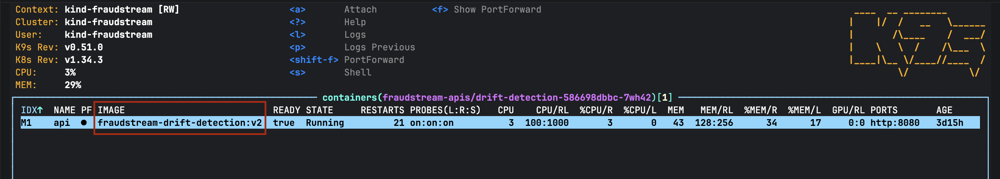

Model server runs `fraudstream-serving:dev`:

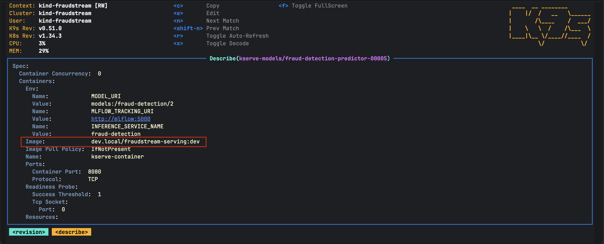

### CD: the merge into the deploy branch

The deploy branch appears as its own job. The stage view reads newest first:
build #3 (top) deployed everything green. Build #2 failed at the training pipeline,
and builds #1 and #2 at the Airflow stage, fixed as described under *Things worth
knowing*.

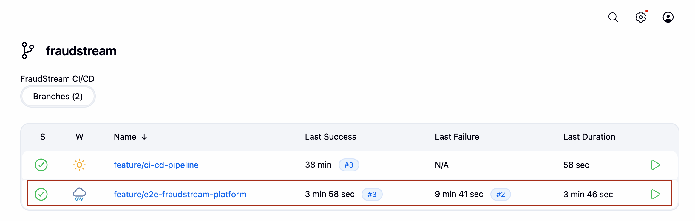

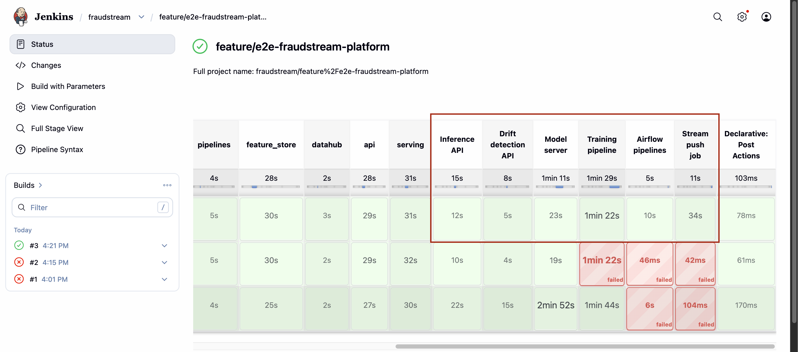

### AFTER the merge

Every deployed image now carries the commit it was built from, `b3fabea`:

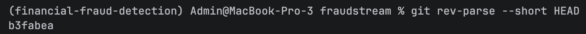

Inference API now runs `fraudstream-inference:b3fabea`:

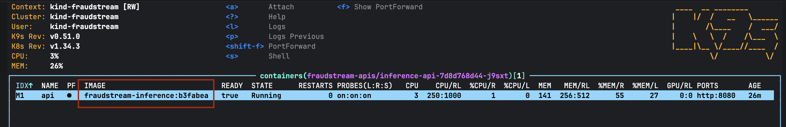

Drift detection API now runs `fraudstream-drift-detection:b3fabea`:

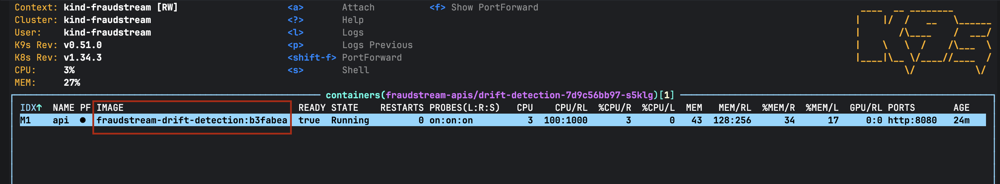

Model server now runs `fraudstream-serving:b3fabea`:

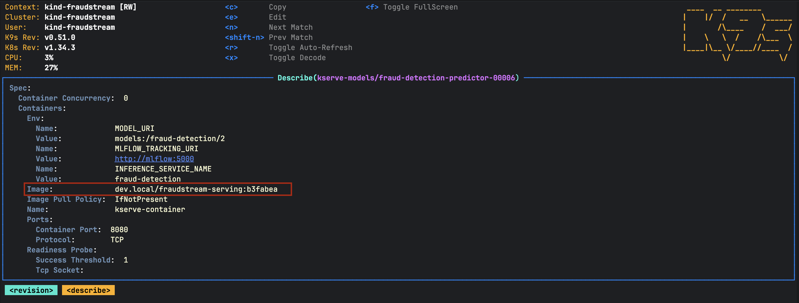

The training pipeline gained a version named after the same commit:

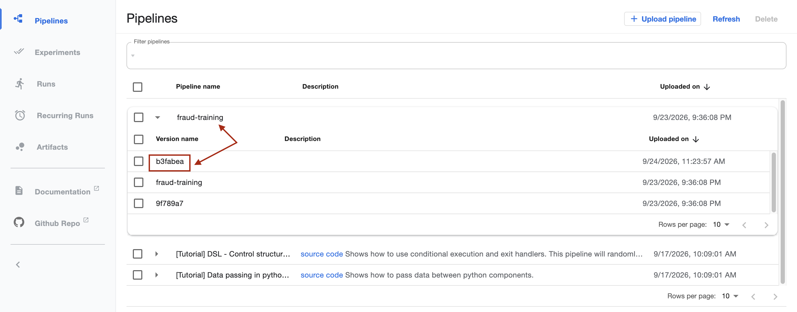

## Setup

```bash
# .env (gitignored) holds the secrets Jenkins reads at start-up
JENKINS_ADMIN_PASSWORD=...  GITHUB_USER=...  GITHUB_TOKEN=...
AIRFLOW_PROJECT_DIR=/Users/Admin/MLOps/fraudstream-deploy

docker compose --profile ci up -d jenkins          # http://localhost:18086
./ci/jenkins/kubeconfig.sh                         # point Jenkins at the kind cluster
./ci/sync_airflow.sh "$AIRFLOW_PROJECT_DIR"        # fill the deploy folder once
```

The deploy branch is `DEPLOY_BRANCH` in the `Jenkinsfile`. **Build with
Parameters → DEPLOY_ALL** redeploys everything without a code change.

## Things worth knowing

- **Secrets reach Jenkins as files**, through Docker secrets, not environment
  variables, so no build inherits them. The build log shows `POSTGRES_PASSWORD=****`.
- **Never delete the deploy folder while Airflow runs.** Airflow keeps the deleted
  folder mounted and fails with `Operation not permitted: '/opt/airflow/dags'`.
  Recreate its containers with `--force-recreate` to fix it.
- **A merge patch drops container settings.** `kubectl patch --type=merge` on the
  InferenceService replaced the container list and lost `MODEL_URI`, so the stage
  applies the manifest with only the image tag changed.
- **The JVM ignores `$HOME`.** Spark's 1.2 GB jar cache is pointed at the Jenkins
  volume with `spark.jars.ivy`; otherwise concurrent builds raced to download it.
- **A change to a Dockerfile's dependencies** for the stream push job still needs
  `docker compose --profile feature-store up -d --build feast-stream-push`.
