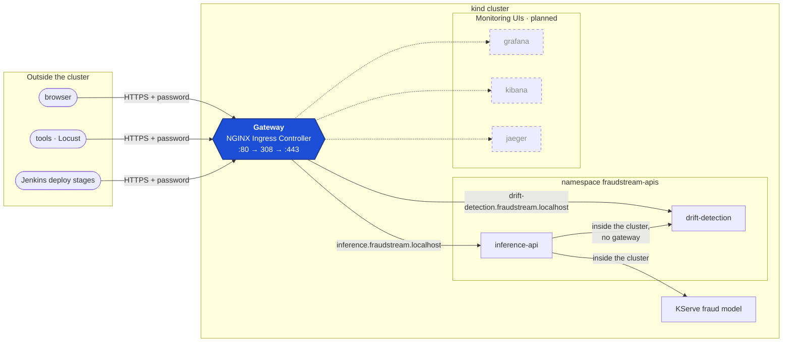
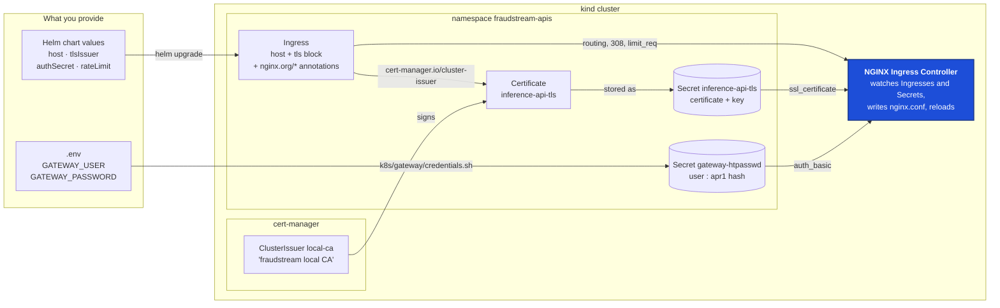
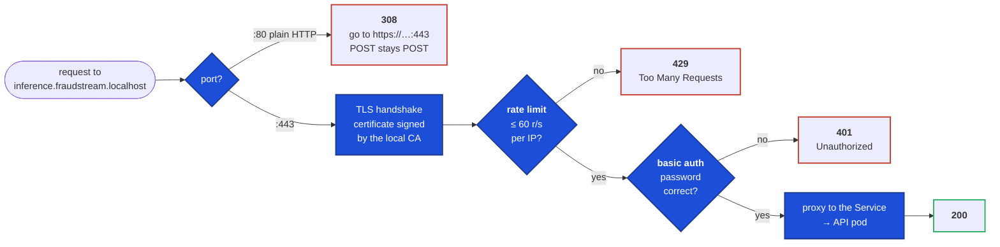
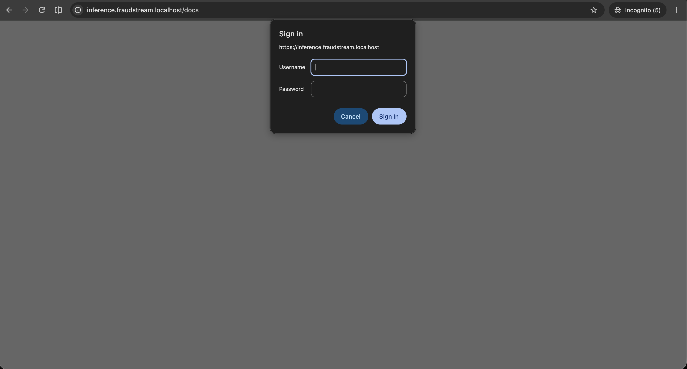
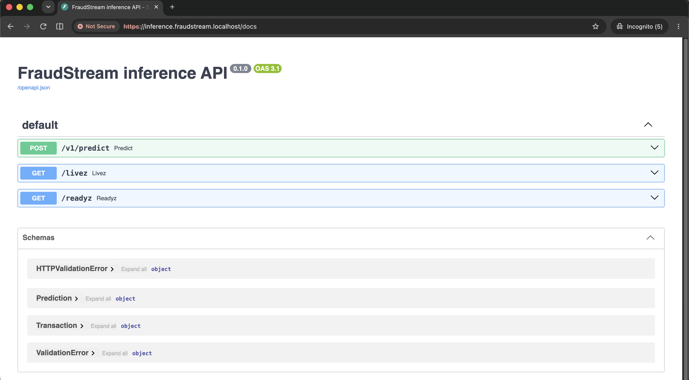
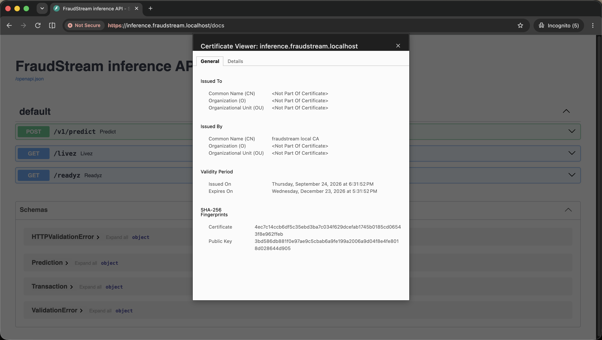
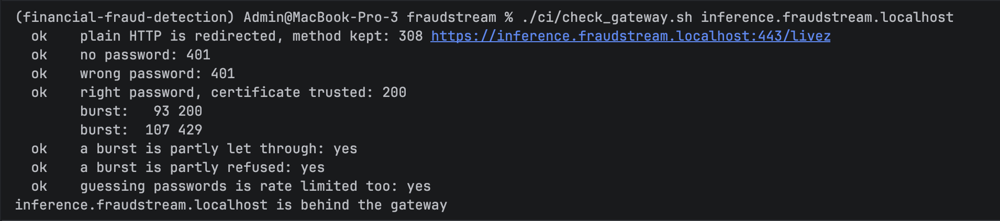
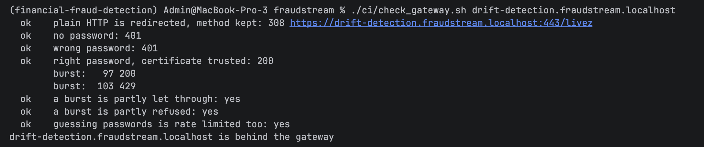
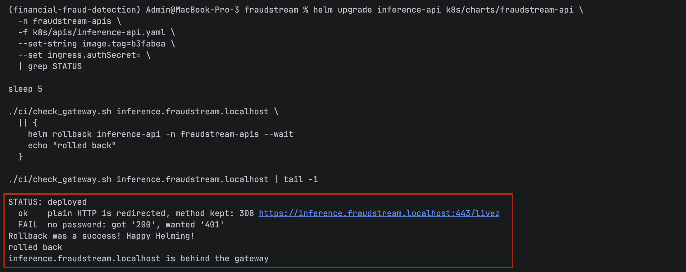

# Gateway: Domain, HTTPS, Basic Auth and Rate Limit

Every service people open goes through one door: NGINX on port 443. Each service gets
its own name under `fraudstream.localhost`. NGINX speaks HTTPS with a certificate from
the local CA, asks for a username and password, and limits how fast one client can call.
Today that covers the two web APIs. The monitoring UIs (Grafana, Kibana and Jaeger) will
run in the same cluster and come in through the same door.

## Who goes through the gateway



People and CI come in through the gateway. Services talking to each other inside the
cluster don't, so the inference API still reaches the drift API and the model by their
Service names, with no password.

| Host | Service | Status |
|---|---|---|
| `inference.fraudstream.localhost` | inference API | behind the gateway |
| `drift-detection.fraudstream.localhost` | drift detection API | behind the gateway |
| `grafana.fraudstream.localhost` | Grafana | planned |
| `kibana.fraudstream.localhost` | Kibana | planned |
| `jaeger.fraudstream.localhost` | Jaeger | planned |

`*.localhost` always points at your own machine, so these names work with no DNS server
and no hosts file.

## How the pieces are wired

Nobody writes NGINX config by hand. Three inputs go in, and Kubernetes controllers turn
them into a running gateway:



1. **The password.** `k8s/gateway/credentials.sh` hashes the password from `.env` and
   stores it as the Secret `gateway-htpasswd`, of type `nginx.org/htpasswd`. The
   password itself never enters the cluster.
2. **The Ingress.** The shared Helm chart writes one Ingress per API: its host, a `tls`
   block, and the annotations that switch on the redirect, auth and rate limit. These
   are on by default, so any service deployed with the chart is protected unless its
   values turn them off.
3. **The certificate.** cert-manager sees the `cert-manager.io/cluster-issuer: local-ca`
   annotation. It creates a Certificate for the host, has the local CA sign it, and
   renews it before it expires.
4. **NGINX.** The controller watches all of it and writes the result into `nginx.conf`:
   `ssl_certificate` from the TLS Secret, `auth_basic` from the password Secret,
   `limit_req` and the 308 from the annotations. Change any input and NGINX reloads on
   its own.

The chart annotations that do the work:

| Annotation | Becomes in nginx.conf |
|---|---|
| `cert-manager.io/cluster-issuer: local-ca` | a certificate for the host, then `ssl_certificate` |
| `nginx.org/http-redirect-code: "308"` | `return 308 https://$host:443$request_uri` on port 80 |
| `nginx.org/basic-auth-secret: gateway-htpasswd` | `auth_basic` with the Secret as the user file |
| `nginx.org/limit-req-rate: "60r/s"`, `-burst: "60"`, `-no-delay: "true"` | `limit_req zone=… burst=60 nodelay` |
| `nginx.org/limit-req-reject-code: "429"` | `limit_req_status 429` |

## What happens to one request



The order matters, and NGINX fixes it:

- **The rate limit comes before the password check,** so every request counts, including
  wrong passwords. Someone guessing passwords gets 429s after the first burst.
- **Plain HTTP gets 308, not the usual 301.** On a 301, clients resend a POST as a GET,
  which would break `POST /v1/predict`. 308 keeps the method and body.
- **The limit is per client IP.** One caller can use at most 60 requests a second: half
  the 120 a second the capacity test proved, and above the 50 a second of the SLA.

## Set it up

```bash
# 1. credentials in .env: GATEWAY_USER, GATEWAY_PASSWORD
set -a && . ./.env && set +a

# 2. the password Secret, once per namespace behind the gateway
./k8s/gateway/credentials.sh fraudstream-apis

# 3. deploy (CI does this on the deploy branch)
helm upgrade --install inference-api k8s/charts/fraudstream-api -n fraudstream-apis \
  -f k8s/apis/inference-api.yaml --set-string image.tag=<tag>

# 4. save the local CA, so curl and the tools trust the certificate
kubectl -n cert-manager get secret local-ca -o jsonpath='{.data.ca\.crt}' | base64 -d > local-ca.crt
```

To see a padlock in Safari or Chrome, trust the CA once:
`sudo security add-trusted-cert -d -r trustRoot -k /Library/Keychains/System.keychain local-ca.crt`.
Until then, the browser says "Not Secure". The connection is still encrypted, but the
browser doesn't know the CA.

## Proof

**Sign in.** Opening the API in a browser asks for the gateway's username and password first.



**After signing in**, the inference API's Swagger page loads over HTTPS on its own domain.



**The certificate** is for `inference.fraudstream.localhost`, issued by `fraudstream local CA`,
and valid for 90 days. cert-manager renews it. The host name sits in the certificate's
alternative names, which is why "Common Name" is empty.



**Every rule, checked from the outside.** `ci/check_gateway.sh` checks each rule in the
diagram above: plain HTTP gets 308, no password or a wrong one gets 401, the right one
gets 200 with the certificate trusted, and a burst of 200 requests is partly let through
and partly refused with 429. A burst of wrong passwords is also refused.

```bash
set -a && . ./.env && set +a
GATEWAY_ADDRESS=127.0.0.1 ./ci/check_gateway.sh inference.fraudstream.localhost
```





**An open deploy is rolled back.** CI runs the same check after every API deploy. Here the
chart was deployed with auth switched off, the way a mistyped annotation would silently
do it. The check caught `no password: got '200', wanted '401'`, Helm rolled back to the
last protected revision, and the next check passed.



**The SLA still holds.** The same load test as
[doc 22](22_validation_and_verification.md#load-test), 50 requests a second for 5 minutes,
now over HTTPS with the password:

| | Target | Through the gateway |
|---|---|---|
| p95 | ≤ 500 ms | **280 ms** |
| p99 | ≤ 1,000 ms | **390 ms** |
| failures | ≤ 1% | **0 of 15,000**, no 429s |

The median was 190 ms, against 22 ms in doc 22. That isn't the gateway: with every
gateway feature switched off, the same run also gave 200 ms. A single request costs 18 ms
through the gateway against 16 ms direct.

## Putting another service behind it

The recipe the monitoring UIs will use:

1. `./k8s/gateway/credentials.sh <namespace>` for the service's namespace.
2. Give the service an Ingress on `<name>.fraudstream.localhost` with the same annotations
   as `k8s/charts/fraudstream-api/templates/ingress.yaml`. Most charts accept them under
   `ingress.annotations`.
3. `GATEWAY_ADDRESS=127.0.0.1 ./ci/check_gateway.sh <name>.fraudstream.localhost`, if the
   service answers 200 on `/livez`. Otherwise, point it at a path that does.

## Things worth knowing

**A missing password Secret fails closed.** With `gateway-htpasswd` deleted, NGINX
answers 401 without a password and 403 with the right one. It never serves the API open.

**On your laptop every caller shares one budget.** Requests from your laptop all arrive from
the same IP, so the browser, the tools and Locust share one 60-a-second limit.

**The capacity test now meets the gateway.** Above 60 requests a second from one client,
[doc 22's](22_validation_and_verification.md#load-test) step-up test measures the gateway
saying no, which is the point.

**Wrong annotations fail silently.** F5's controller uses the `nginx.org/` prefix, and the
retired ingress-nginx prefix is ignored with no error. That's why `check_gateway.sh` checks
the behaviour from the outside, rather than trusting the chart.

**The model's own door stays outside.** KServe answers on port 8081 through Kourier, for
local debugging. Securing traffic between services is a separate job (mutual TLS
inside the cluster).

## Where things are

| Area | Location |
|---|---|
| Ingress with the gateway annotations | `k8s/charts/fraudstream-api/templates/ingress.yaml` |
| Gateway defaults | `k8s/charts/fraudstream-api/values.yaml` (`ingress:`) |
| Password Secret | `k8s/gateway/credentials.sh` |
| Local CA and issuer | `k8s/platform/local-ca-issuer.yaml` |
| Outside-in check | `ci/check_gateway.sh`, `ci/gateway.sh` |
| Client settings for the tools | `api/tools/gateway.py` |
