# Infrastructure as Code: Terraform, Ansible and Google Cloud

The serving path also runs on Google Cloud: the gateway, both web APIs and the fraud detection
model. One command builds it from nothing, and one command removes it again.
Terraform creates everything in the cloud. Ansible sets up the one VM that holds the
stores and loads it with the laptop's trained model and features. The cloud gives
the same score as the laptop, to the last decimal.

## What runs on Google Cloud

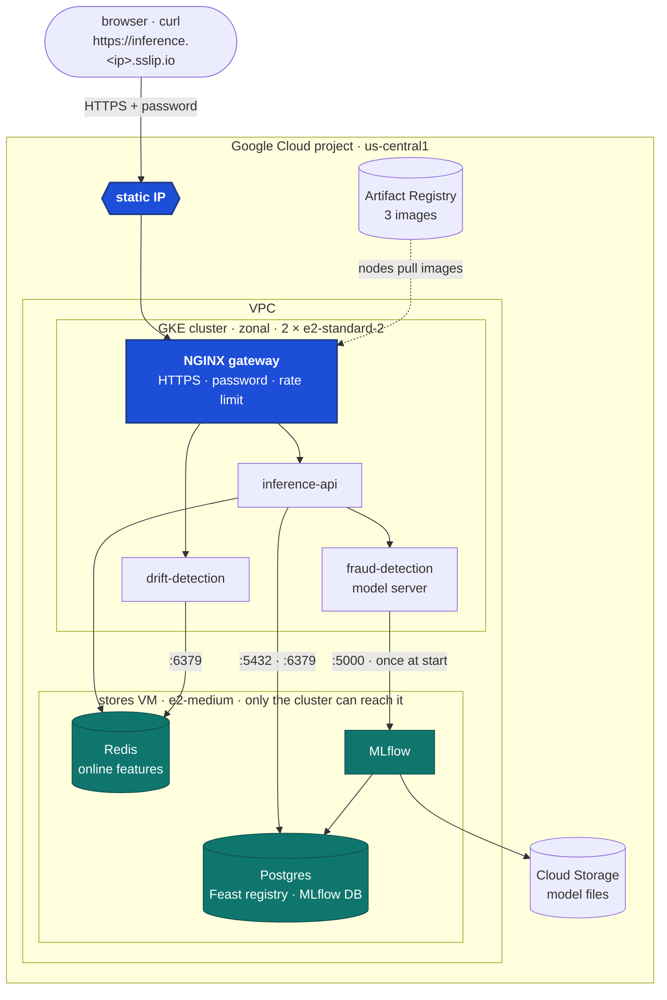

- **GKE runs the stateless part.** The NGINX gateway, the inference API, the drift detection API
  and the model server. They use the same images, chart and gateway rules as on the
  local machine.
- **One VM holds the stores.** Postgres (the Feast registry and MLflow's database),
  Redis (the online features) and MLflow, each in Docker. MLflow keeps the model files
  in a private Cloud Storage bucket that only the VM can read.
- **The stores are closed to the internet.** The firewall lets only the cluster's
  addresses reach ports 5432, 6379 and 5000. SSH is open only to the admin's current IP.
- **The model is a plain Deployment.** KServe and Knative stay on the local machine. On GKE
  the model server runs as one always-on pod, which is cheaper than the extra platform
  pods on two small nodes. It fetches model version 2 through MLflow once, at start.
- **The address is free.** `sslip.io` turns the static IP into a name, so
  `inference.34.66.7.193.sslip.io` resolves to `34.66.7.193` with no domain to buy.

## How one command builds it

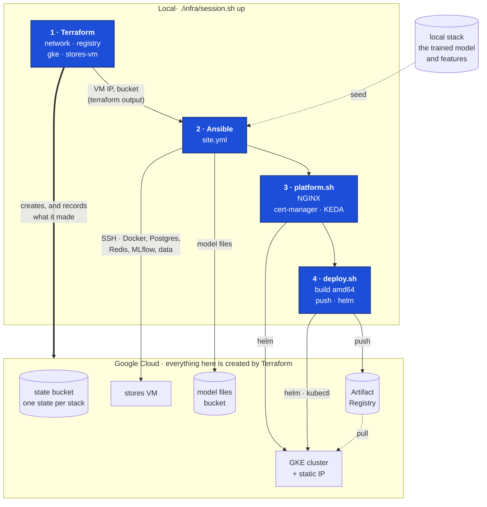

`./infra/session.sh up` runs four steps in order:

1. **Terraform** applies the stacks: the network, the image registry, the cluster and
   the VM. Each stack records what it made in the state bucket.
2. **Ansible** reads the VM's address from Terraform, connects over SSH, installs
   Docker and the stores, and loads the laptop's data. Nothing is typed in by hand.
3. **`platform.sh`** installs NGINX on the static IP, cert-manager with the local CA,
   and KEDA for autoscaling.
4. **`deploy.sh`** builds the three images for Intel machines, pushes them to Artifact
   Registry, deploys the model and both APIs, and runs the gateway check against each.

`./infra/session.sh down` works in reverse. It removes NGINX first, so Google deletes
the load balancer. Then it destroys the VM and the cluster, switches kubectl back to
the local cluster, and lists everything that could still bill. It fails if anything
is left.

## Terraform: one stack per piece

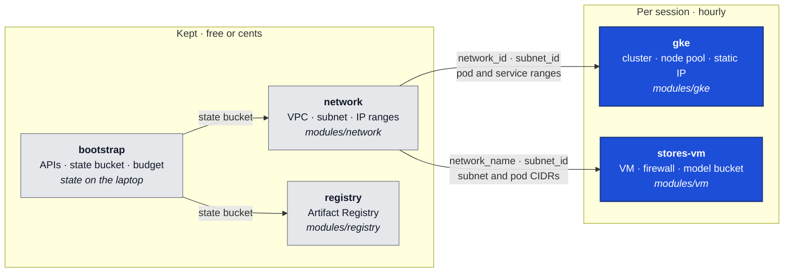

Each stack is a small folder under `envs/dev/` with its own state. So destroying the
cluster can never touch the network, and a mistake in one stack stays in that stack.
Stacks read what they need from each other's state (`terraform_remote_state`), never
from copied values. The actual resources live in reusable `modules/`.

| Stack | Created | Destroyed | Cost while it exists |
|---|---|---|---|
| bootstrap | once | never | cents (state bucket) |
| network | once | never | free |
| registry | once | never | cents (image storage, 5 kept) |
| gke | every session | every session | about $0.16/h (nodes, load balancer) |
| stores-vm | every session | every session | about $0.045/h (VM, disk, IP) |

A session costs about \$0.20/h. A $30 monthly budget with alerts at 50%, 90% and
100% sits on top, counted without the trial credits.

## Ansible: setting up the stores VM

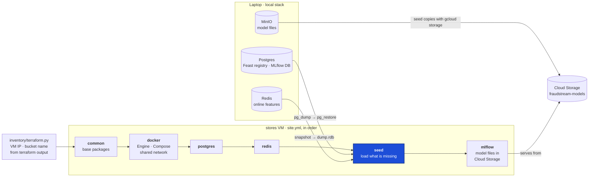

One role per job, run in order. Every role describes the end state, not the steps,
so running the playbook again changes nothing on a VM that is already right.

- **`seed` checks before it loads.** It asks the VM whether the Feast registry, the
  registered model, the Redis features and the model files are there. It copies only
  what is missing, so a second run copies nothing.
- **`seed` runs before `mlflow`.** MLflow's first start then opens a database that
  already holds the laptop's runs and the registered model. Nothing is connected to
  the database while it is replaced.
- **The inventory comes from Terraform.** The VM gets a new IP every session.
  `inventory/terraform.py` reads it from the stack's outputs, so no hosts file goes
  stale.

## Run a session

```bash
# the GKE login helper on PATH, and the local stores the VM is seeded from
export PATH="/opt/homebrew/share/google-cloud-sdk/bin:$PATH"
docker compose up -d postgres redis minio

./infra/session.sh up          # the whole serving path, ends with the two URLs
./infra/session.sh leftovers   # what is billing right now
./infra/session.sh down        # ends with "nothing billing by the hour"
```

The settings come from `.env`: `GCP_PROJECT`, `GCP_REGION`, `GCP_ZONE`,
`GCP_BILLING_ACCOUNT`, the budget, `CLOUD_POSTGRES_PASSWORD` and the gateway password.
The bootstrap stack runs once by hand, before the first session:
`./infra/terraform/tf.sh bootstrap apply`.

## Demo

### Terraform

**One state per stack.** The state bucket holds a folder for each stack: `gke`,
`network`, `registry` and `stores-vm`. Each keeps its own `default.tflock` while it
runs, so two runs can never change the same stack at once.

```bash
gcloud storage ls "gs://fraudstream-tfstate/dev/"
```

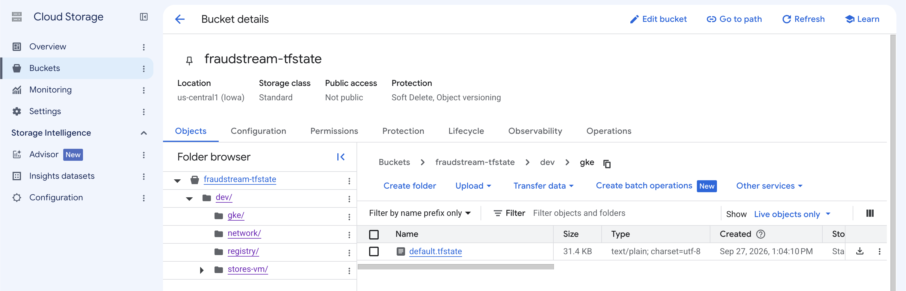

**The code matches the cloud.** Applying the gke stack a second time finds nothing to
do: `0 added, 0 changed, 0 destroyed`. Its outputs are what the other scripts read:
the cluster name, the zone and the gateway IP.

```bash
./infra/terraform/tf.sh gke apply
```

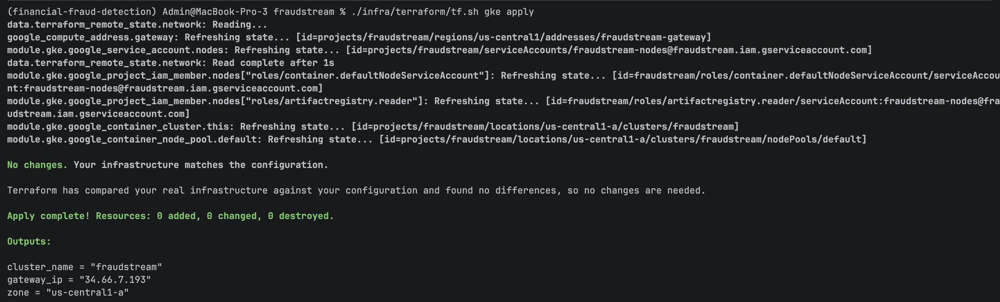

### Ansible

**A second run changes nothing.** Every task on an already-built VM answers `ok`, not
`changed`: the packages, Docker, the network and the Compose files. The seed checks
find the registry, the model and the features already loaded, and skip the copy.

```bash
cd infra/ansible && set -a && . ../../.env && set +a
ansible-playbook site.yml
```

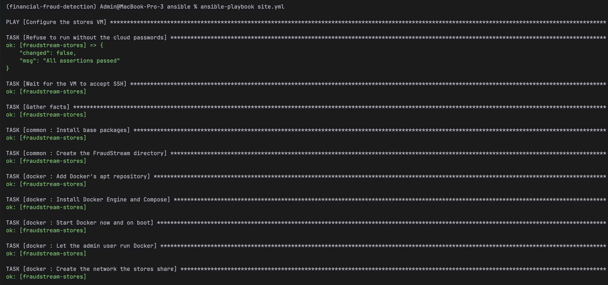

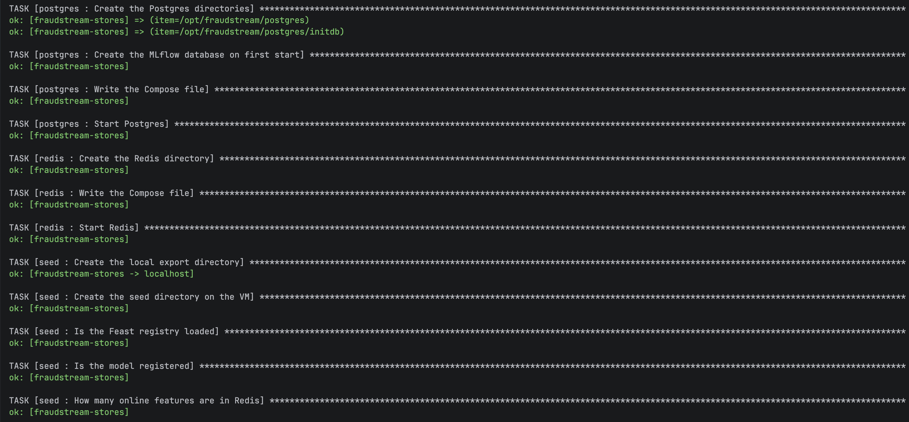

### The images

**Built on the laptop, stored in Google Cloud.** `deploy.sh` pushed the three images,
built for Intel machines and tagged with the commit. The cluster's nodes pull them
from here.

```bash
. k8s/gke/env.sh
gcloud artifacts docker images list "$REPO" --include-tags
```

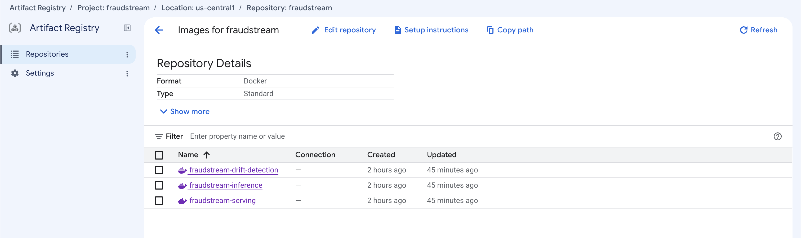

### The cluster

**The namespaces.** Next to GKE's own, the platform (`nginx-ingress`, `cert-manager`,
`keda`) and the application (`fraudstream-apis`).

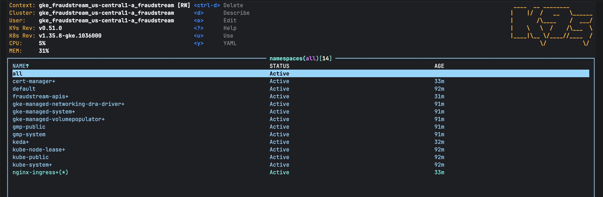

**The serving pods.** The model server and both APIs are running, spread over the two
nodes, with pod addresses from the `10.20.0.0/16` range the firewall trusts.

```bash
kubectl -n fraudstream-apis get pods -o wide
```

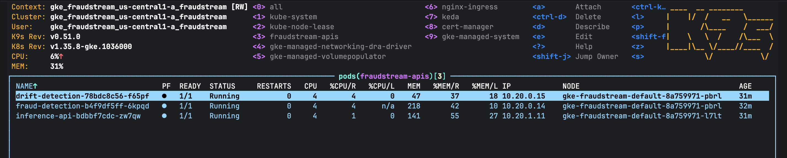

**The front door.** NGINX's Service is a Google load balancer on the reserved static
IP, `34.66.7.193`, so the address survives a redeploy.

```bash
kubectl -n nginx-ingress get svc
```

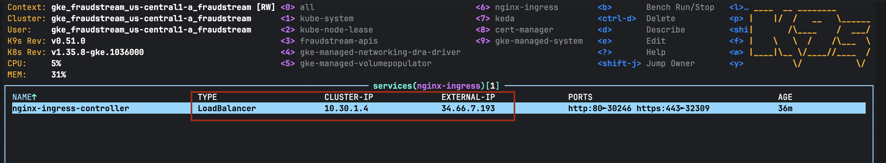

### A payment scored on Google Cloud

**The API on its public name.** The browser asks for the gateway password, then opens
Swagger over HTTPS. It says "Not Secure" because the certificate comes from the
project's own CA, not a public one.

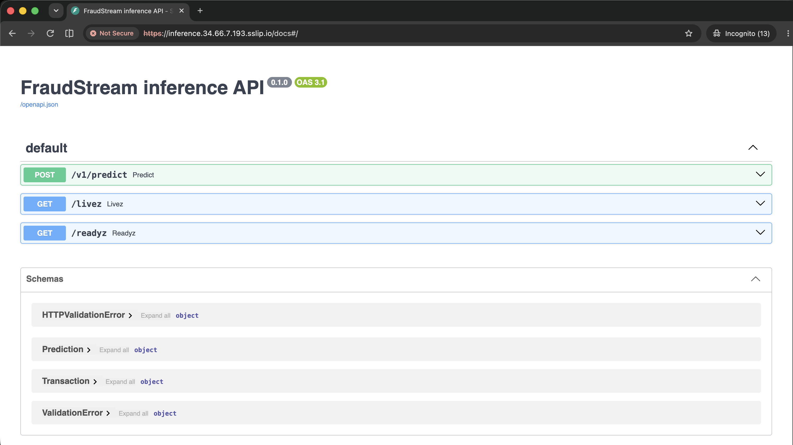

**The same score as the laptop.** The demo payment scores `0.4251362681388855`,
exactly what the laptop gives. The features were found for the customer and the
merchant. So the model, the registry and the features in the cloud are the laptop's.
`x-app-version` shows the commit the image was built from.

```bash
. k8s/gke/env.sh
export GATEWAY_ADDRESS=$GATEWAY_IP
. ci/gateway.sh
gateway_curl -s -u "$GATEWAY_USER:$GATEWAY_PASSWORD" -H 'Content-Type: application/json' \
  -d @api/tools/transaction.json "https://inference.$GATEWAY_IP.sslip.io/v1/predict"
```

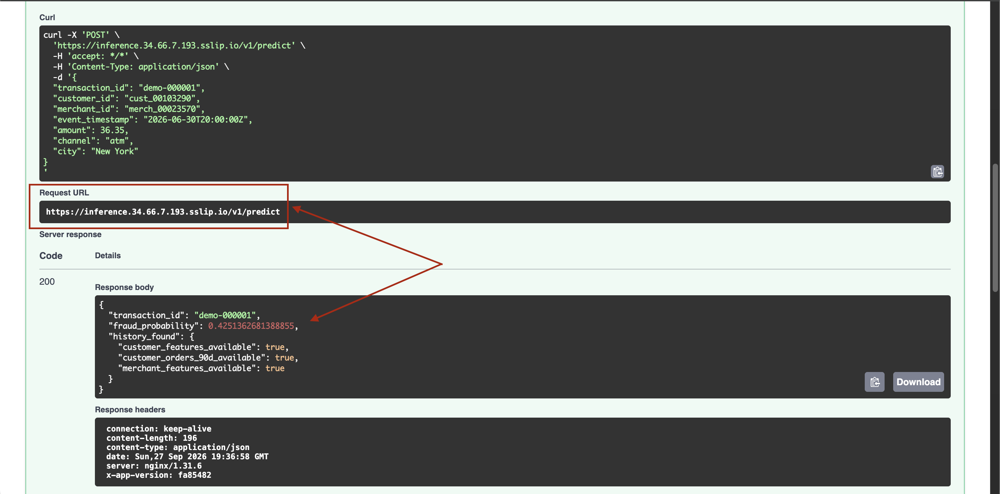

### The stores are closed to the internet

From the laptop, the VM's public IP refuses all three store ports. From a pod in the
cluster, all three answer.

```bash
. k8s/gke/env.sh
ip=$(./infra/terraform/tf.sh stores-vm output -raw external_ip)
echo "from the internet ($ip):"
for p in 5432 6379 5000; do
  nc -z -G3 "$ip" "$p" 2>/dev/null && echo "  $p OPEN" || echo "  $p closed"
done
echo "from a pod in GKE:"
kubectl -n fraudstream-apis run netcheck --rm -i --restart=Never --image=busybox:1.36 -- \
  sh -c 'for t in postgres:5432 redis:6379 mlflow:5000; do nc -z -w3 ${t%:*} ${t#*:} && echo "  $t ok"; done'
```

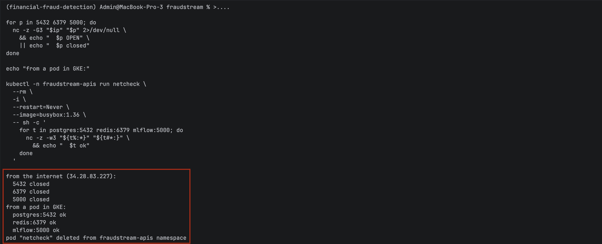

## Things worth knowing

**Trial credits hide the spend.** A budget that counts credits sees $0 and never
alerts. The budget uses `EXCLUDE_ALL_CREDITS`, so it counts what the resources really
cost.

**Only one zonal cluster is free.** GKE's free tier covers the management fee of one
zonal cluster. A regional one would cost about $0.10 an hour more.

**A Mac builds for the wrong machines.** Apple Silicon builds arm64 images, and GKE's
`e2` nodes are Intel. The pod would crash with `exec format error`, so `deploy.sh`
builds with `--platform linux/amd64`.

**The load balancer isn't in Terraform.** Google creates it for NGINX's Service, and it
holds on to the static IP. Destroying the cluster first would leave it billing and
block deleting the IP. That's why `down` removes NGINX first and waits for it to go.

**A cluster without its default pool drifts.** GKE builds a default node pool and the
stack removes it at once. Afterwards GKE reports the remaining pool's settings, and
Terraform tried to "fix" a pool that no longer exists. The cluster now ignores
`node_config` after it is created.

**An interrupted run leaves a lock.** Stopping `apply` halfway leaves the stack's lock
file behind, and the next run refuses to start. Once sure nothing else is running:
`./infra/terraform/tf.sh <stack> force-unlock <lock id>`.

**The stores rely on the firewall.** Redis has no password inside the VPC. Only the
cluster's addresses can reach it, and nothing else in the VPC runs.

**MinIO's images were removed from Docker Hub and quay.io.** So in the cloud, MLflow
keeps the model files in Cloud Storage. The VM reads the bucket with its own service
account, and no storage password exists.

**kubectl and k9s need the GKE login helper.** The kubeconfig calls
`gke-gcloud-auth-plugin` by name. If it isn't on PATH, the connection fails.

## Where things are

| Area | Location |
|---|---|
| Start, end and check a session | `infra/session.sh` |
| Run one Terraform stack with `.env` | `infra/terraform/tf.sh` |
| APIs, state bucket, budget | `infra/terraform/envs/dev/bootstrap/` |
| Stacks | `infra/terraform/envs/dev/{network,registry,gke,stores-vm}/` |
| Modules | `infra/terraform/modules/{network,registry,gke,vm}/` |
| Ansible settings and inventory | `infra/ansible/ansible.cfg`, `infra/ansible/inventory/terraform.py` |
| Playbook and roles | `infra/ansible/site.yml`, `infra/ansible/roles/` |
| VM settings | `infra/ansible/group_vars/stores.yml` |
| Platform on GKE | `k8s/gke/platform.sh`, `k8s/gke/nginx-ingress-values.yaml` |
| Deploy to GKE | `k8s/gke/deploy.sh`, `k8s/gke/env.sh` |
| Stores seen from the cluster | `k8s/gke/stores.yaml` |
| Model server on GKE | `k8s/gke/fraud-detection.yaml` |
| Version pins, shared with kind | `k8s/versions.sh` |
