# Observability: Metrics, Logs, Traces and a Drift Pipeline

The serving path can now be watched while it runs. Prometheus counts and times every
request, the model's answers, and the CPU, memory, disk and network of the cluster.
Every payment leaves a trace in Jaeger and log lines in Elasticsearch that carry the
same trace id, so one payment can be followed from a dashboard to its log lines to its
trace. Grafana shows all three, and Grafana, Kibana and Jaeger all sit behind the
gateway. Once a day, an Airflow pipeline checks whether the model's inputs still look
like its training data, and starts retraining when they don't.

## What is collected, and where it goes

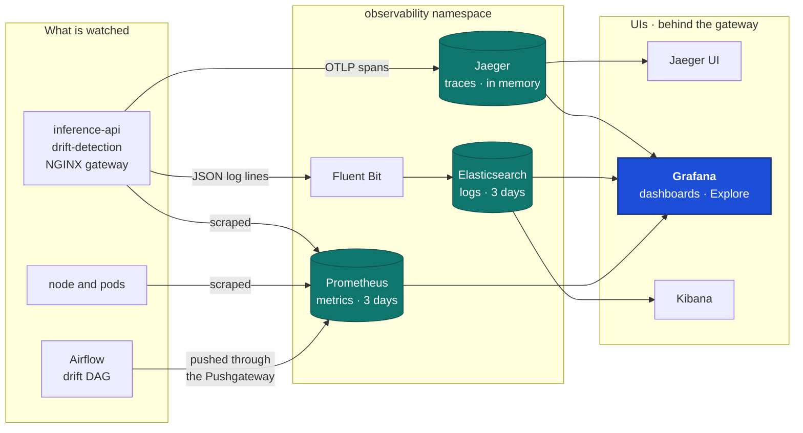

- **Metrics.** Both APIs serve `/metrics` on port 9000, a port the gateway never routes
  to. Prometheus scrapes them, NGINX, node-exporter and kube-state-metrics every 15
  seconds. Airflow can't be scraped, because its job ends, so it pushes its drift result
  to the Pushgateway and Prometheus scrapes that.
- **Logs.** The APIs write one JSON object per line. A line written during a request
  carries its `trace_id`. Fluent Bit reads the container logs of the APIs, the model,
  the gateway and Kubeflow, and ships them to one Elasticsearch node.
- **Traces.** The APIs send OpenTelemetry spans over OTLP to one Jaeger pod: one span
  per request, plus the Redis reads and the HTTP calls to the model and the drift API.
- **One place to look.** Grafana has all three as data sources. A log line links to its
  trace, and a trace links back to its log lines.
- **Small on purpose.** Everything lives in one `observability` namespace with no
  Alertmanager, 3 days of metrics and logs, and up to 20,000 traces in memory.

## One payment, three signals

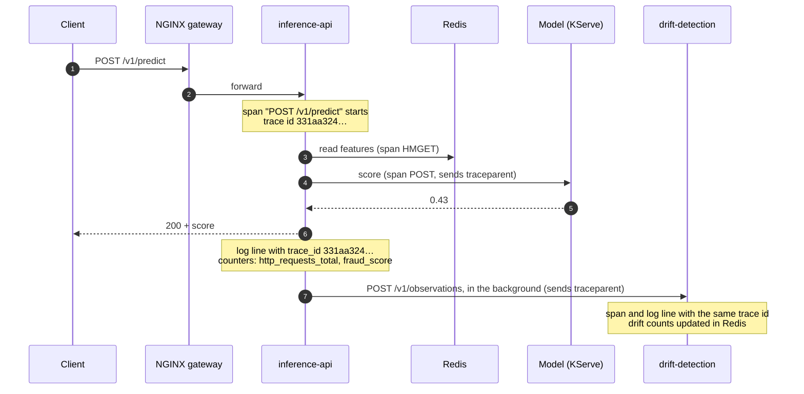

The trace id starts in the inference API and travels in the `traceparent` header, so
the drift API's span joins the same trace. The real payment above took 28 ms across
two services and 7 spans. The health checks (`/livez`, `/readyz`) are left out of all
three signals, because they come every few seconds and would bury the real traffic.

## The drift pipeline

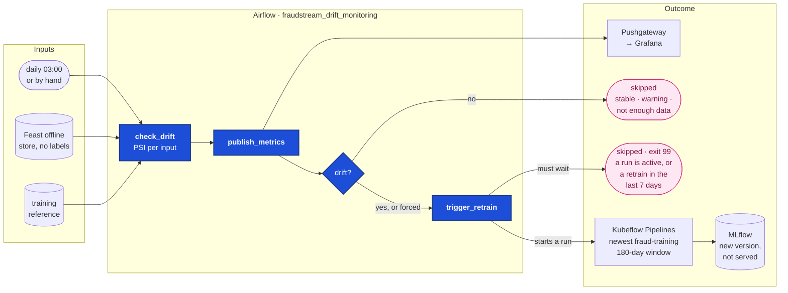

1. **`check_drift`** reads 7 days of features from the Feast offline store, ending the
   day after the newest payment, or on a chosen `window_end`. It scores all 51 model
   inputs against the served model's training reference with PSI. It uses the drift
   API's own `compare()`, so the batch check and the live API can't disagree. A window
   with fewer than 1,000 payments isn't judged.
2. **`publish_metrics`** pushes the result as one Pushgateway group per window, so a
   later check never hides an earlier one.
3. **`drift_found`** goes on only when the status is `drift`, or when `force_retrain`
   is set.
4. **`trigger_retrain`** starts the newest registered version of the training pipeline
   through the Kubeflow API, on a 180-day window that ends where the checked one ends.
   It waits while any run is active, and for 7 days after a drift retrain, so drift that
   lasts for weeks retrains once a week, not every day. The new model is registered in
   MLflow. Serving it stays a person's decision.

**Why no labels.** Fraud is confirmed weeks after a payment, so the model's accuracy
on this week's traffic can't be measured yet. The check watches the model's inputs
instead, because they change first. It never reads the label table.

## The metrics

| Metric | What it answers |
|---|---|
| `http_requests_total{route,status}` | How many requests, and how many failed? |
| `http_request_duration_seconds` | How long do answers take, against the SLA? |
| `http_requests_in_progress` | How busy is each pod right now? |
| `fraud_model_request_duration_seconds` | How much of that time is the model? |
| `fraud_model_failures_total{reason}` | Did the model time out, refuse, or not answer? |
| `fraud_score` | What scores does the model give? A shift is a warning sign. |
| `fraud_history_missing_total{flag}` | How many payments were scored without history? |
| `fraud_drift_status`, `fraud_drift_rows` | Did this window drift, and how many payments did it hold? |
| `fraud_drift_feature_psi{feature}` | Which inputs moved, and by how much? |
| `fraud_drift_history_available_ratio{flag}` | How much history did the window's payments have? |
| `fraud_retrain_started_timestamp_seconds` | When did drift last start a retrain? |

## Set it up

```bash
set -a && . ./.env && set +a
./k8s/observability/install.sh                      # Prometheus, Grafana, Jaeger, ELK, routes
./ci/sync_airflow.sh "$AIRFLOW_PROJECT_DIR"         # the drift DAG and its code
docker compose --profile orchestration up -d --build
docker exec fraudstream-airflow-scheduler airflow dags unpause fraudstream_drift_monitoring
```

Redeploy both APIs with a new image tag, as in [the web APIs doc](21_web_apis.md), so
they serve `/metrics` and send traces. Every UI opens at
`https://<name>.fraudstream.localhost` with the gateway password: `grafana`, `kibana`,
`jaeger`, `pushgateway` and `pipelines`.

## Demo

### Metrics

**Everything Prometheus collects is up.** Both APIs on port 9000, NGINX, the node,
kube-state-metrics, Grafana, Prometheus itself and the Pushgateway.

```bash
kubectl --context kind-fraudstream -n observability port-forward svc/kps-prometheus 9090:9090
# then open http://localhost:9090/targets
```

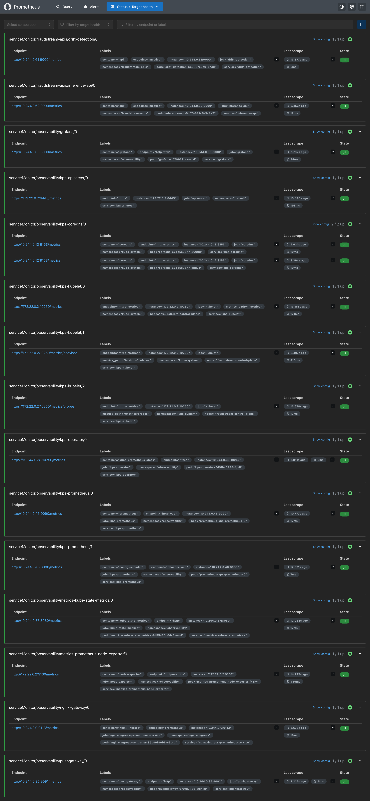

**The Web APIs dashboard during the load test.** 50 clients for 5 minutes, at 50
requests a second through the gateway, with metrics, logs and traces all on. All
13,533 payments were answered, none failed. **The latency SLA was missed in this run:**
p50 52 ms, p95 1.16 s and p99 2.45 s, against limits of 0.5 s and 1 s. The second
screenshot shows where the time went. The model's p95 was 0.71 s, and the answer time fell as KEDA
scaled the inference API from one replica to three: p95 0.84 s over the last two
minutes. The same test through the gateway, before any of this was added, measured
190 / 280 / 390 ms.

```bash
cd api && uv run --group loadtest locust -f loadtest/locustfile.py --headless -u 50 -r 50 -t 5m \
  --html ../reports/load_test_inference_api_observed.html
```

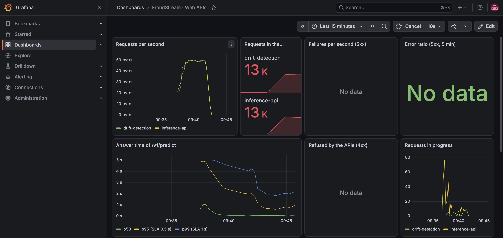

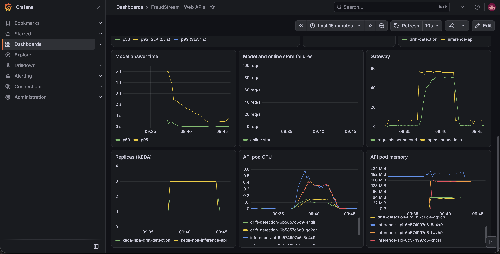

**The machine.** CPU, memory, disk and network for the node, and per namespace. The
node is the kind container, so these are the Docker VM's numbers, which the Compose
services share. During the test, CPU peaked near 60%.

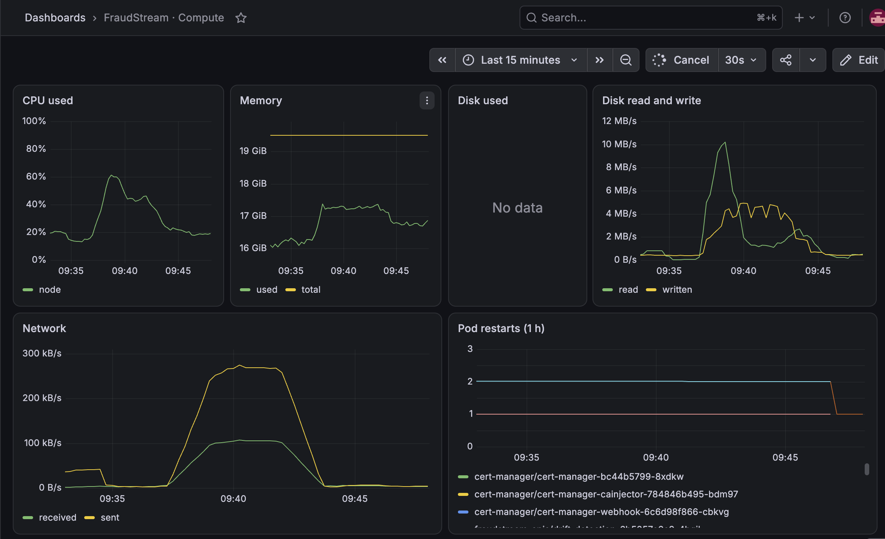

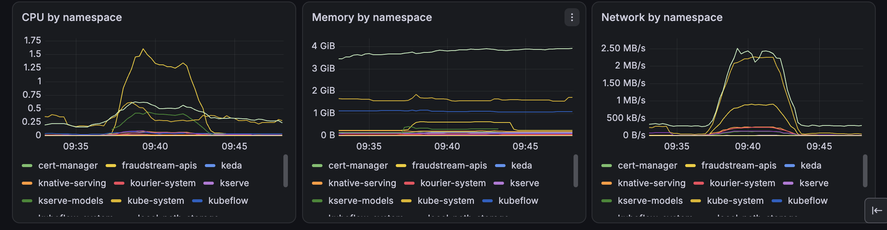

**The metrics port is internal.** Through the gateway, `/metrics` answers 404. Inside
the cluster, on port 9000, the counters are there. An unknown path is counted as
`route="unmatched"`, so random URLs from a scanner can't create new series.

```bash
GATEWAY_ADDRESS=127.0.0.1 . ci/gateway.sh
gateway_curl -s -o /dev/null -w "through the gateway: %{http_code}\n" -u "$GATEWAY_USER:$GATEWAY_PASSWORD" \
  https://inference.fraudstream.localhost/metrics
kubectl --context kind-fraudstream -n fraudstream-apis port-forward svc/inference-api 9000:9000 >/dev/null & pf=$!; sleep 2
curl -s localhost:9000/metrics | grep -E '^(http_requests_total|fraud_score_count)'; kill $pf
```

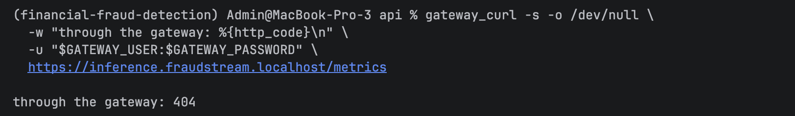

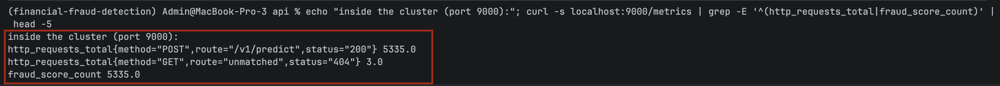

### One payment

**Its trace.** `POST /v1/predict` took 22.7 ms in the inference API: 0.5 ms reading
features from Redis, 12.3 ms waiting for the model. The drift API's span, called in the
background after the answer, is part of the same trace.

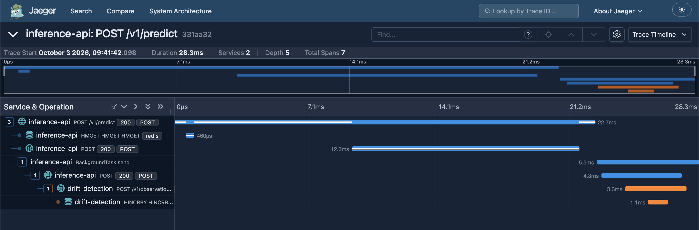

**Its log lines.** Searching Kibana for the trace id finds the access lines of both
APIs, each with its pod, path and status.

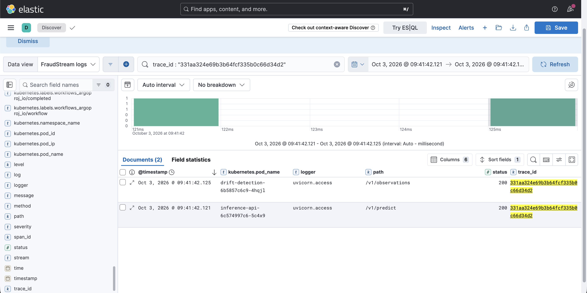

**From a log line to its trace, in Grafana.** The same search in Grafana's Logs data
source, then the `trace_id` link on a line opens the trace next to it.

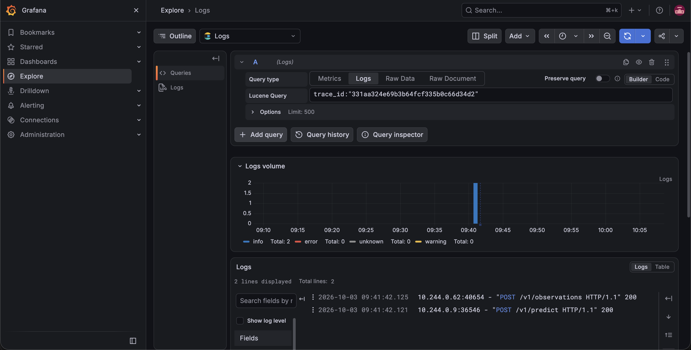

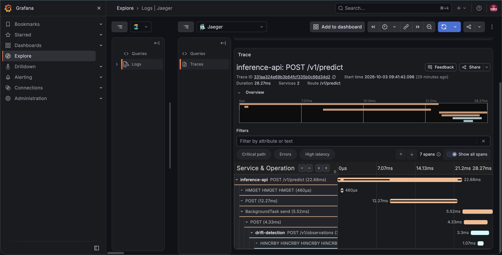

### The drift pipeline

**A window before the drift: no retrain.** The week ending 2026-03-01 held 16,024
payments. Its largest PSI was `merchant_txn_count_30d` at 0.108, a warning, not drift.
The result was published, `drift_found` stopped the run, and `trigger_retrain` was
skipped.

```bash
docker exec fraudstream-airflow-scheduler airflow dags trigger fraudstream_drift_monitoring \
  -c '{"window_end": "2026-03-01"}'
```

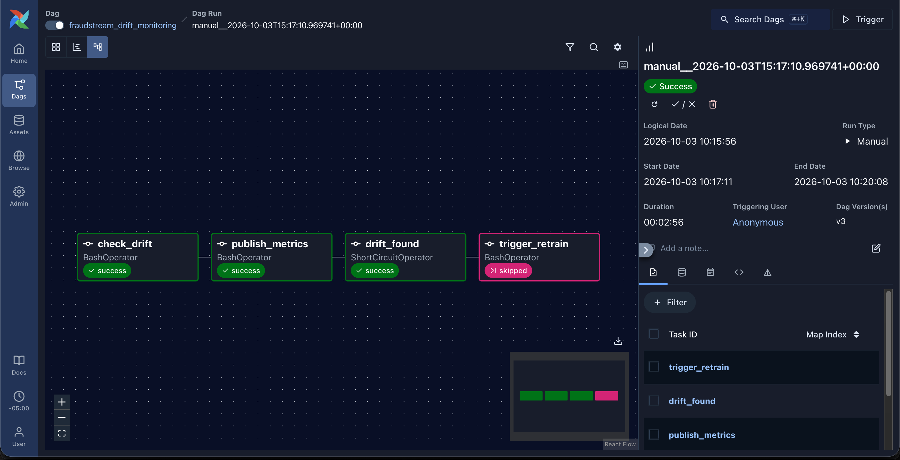

**The newest week: drift, and one retrain.** The scheduled run checked the week ending
2026-06-30: 15,943 payments, status drift. It started the training pipeline.

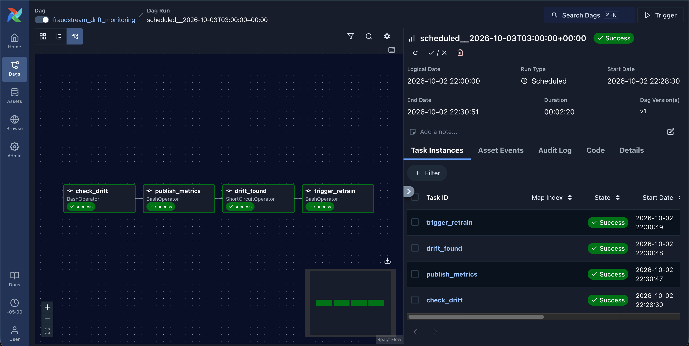

**The retrain in Kubeflow.** `drift-retrain-2026-06-30` ran the newest pipeline version,
on 2026-01-01 to 2026-06-30, and every step succeeded.

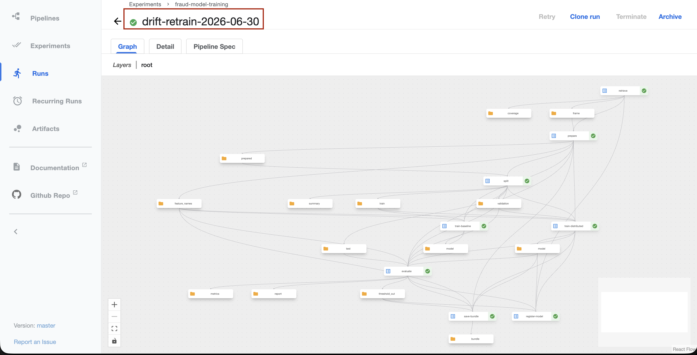

**A new model version, not served.** The run registered `fraud-detection` version 4 in
MLflow. The API keeps serving version 2 until a person moves it.

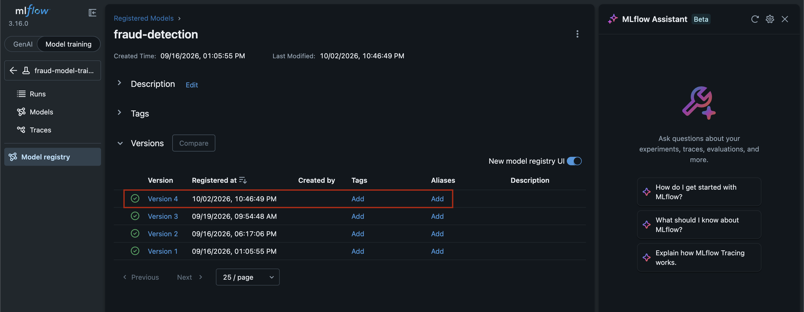

**The drift dashboard.** For the week ending 2026-06-30: one input in drift and four in
warning. The largest PSIs are `total_orders_90d` (0.445), `customer_orders_90d_available`
(0.212) and `amount` (0.169). Only 29.9% of that week's payments had a customer snapshot,
70.2% had 90-day order history and 85.2% had merchant history. Below, the live panels
show what the model answers.

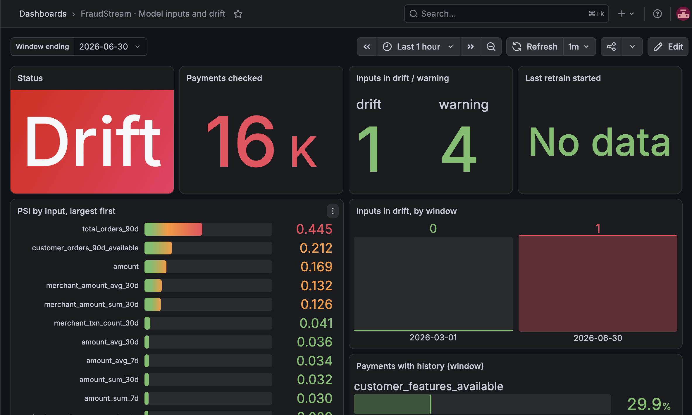

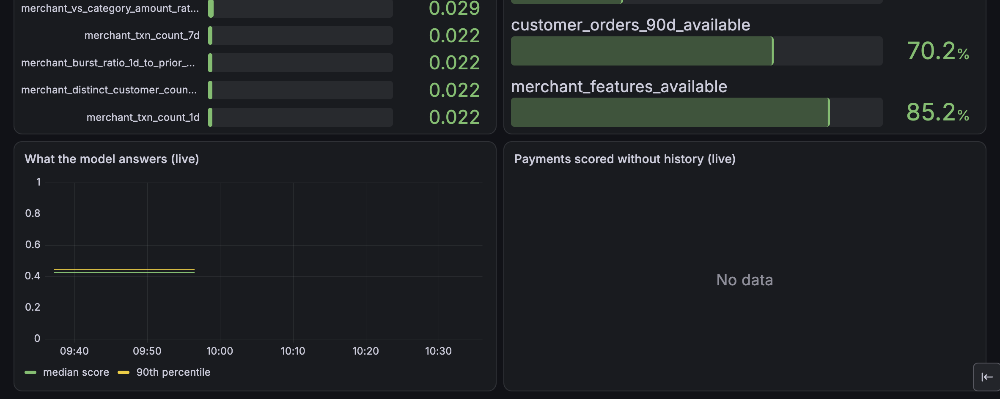

### Memory

After the load test, the `observability` pods used 3.57 GiB, above their 3 GiB
budget. Elasticsearch took 1.3 GiB, Grafana 750 MiB, Kibana 700 MiB, Prometheus 530 MiB
and Jaeger 200 MiB. The whole kind node used 9.6 GiB of Docker's 19.5 GiB.

```bash
kubectl --context kind-fraudstream -n observability top pods
kubectl --context kind-fraudstream -n observability exec elasticsearch-0 -- \
  curl -s 'localhost:9200/fraudstream-logs-*/_settings/index.lifecycle.name'   # every index: fraudstream-logs
```

## Things worth knowing

**node-exporter can't mount the host on Docker Desktop.** Its host root mount is switched
off, so the node's disk usage panel stays empty. CPU, memory, disk I/O and network work.

**kind's control plane isn't scraped.** The controller manager, scheduler, etcd and
kube-proxy listen only inside the node, so their targets are switched off instead of
showing as down.

**Pushed metrics need `honorLabels`.** Without it, Prometheus replaces the pushed `job`
and `window_end` labels with its own. Every drift panel would be empty and every run
would overwrite the last.

**The Pushgateway forgets on restart.** It keeps groups in memory. After a Docker
restart, the drift groups come back with the next daily run, but the last retrain time
only with the next retrain. A group is kept until it is replaced, so one per checked
window stays.

**Feast refuses an empty window.** It raises an error instead of returning no rows. The
drift check catches it and reports the window as not enough data.

**Manual Airflow runs have no logical date.** So the drift summary file is named after
the run id. `window_end` is a nullable param (`type: ["null", "string"]`), or the trigger
form makes it required.

**Airflow reaches the cluster through the gateway.** It runs in Docker Compose, outside
kind. `extra_hosts` points the `pushgateway` and `pipelines` names at the host's port
443, and `local-ca.crt` in the deploy folder lets it trust the certificate.

**Elasticsearch runs with four settings for a laptop.** A single node, no security (the
gateway checks the password), `allow_mmap` off so the Docker VM needs no
`vm.max_map_count`, and the disk watermark off so a full laptop disk doesn't make every
index read-only.

**UIs get a bigger burst.** One page of Grafana or Kibana fires dozens of requests at
once, so their routes allow a burst of 200. The APIs keep 60.

**Tracing is off on GKE.** There is no Jaeger there, so the GKE deploy clears the trace
endpoint, and an empty endpoint turns tracing off.

**A retrain of the same window reuses cached steps.** The registered pipeline version
has caching on. A drift retrain always slides to a new window, so it trains for real,
but forcing a second run on the same window would return the cached model.

## Where things are

| Area | Location |
|---|---|
| Install the whole stack | `k8s/observability/install.sh` |
| Prometheus, Grafana, data sources | `k8s/observability/prometheus-values.yaml` |
| Pushgateway | `k8s/observability/pushgateway-values.yaml` |
| What Prometheus scrapes beyond the charts | `k8s/observability/servicemonitors.yaml` |
| Dashboards | `k8s/observability/dashboards/{web-apis,compute,model-drift}.yaml` |
| Jaeger | `k8s/observability/jaeger.yaml` |
| Elasticsearch, Kibana, Fluent Bit | `k8s/observability/logging.yaml`, `logging-setup.yaml`, `fluent-bit-values.yaml` |
| UIs behind the gateway | `k8s/observability/ingress.yaml`, `k8s/gateway/pipelines.yaml` |
| Request metrics | `api/src/fraudstream_api/metrics.py` |
| Model metrics | `api/src/fraudstream_api/inference/telemetry.py` |
| Traces | `api/src/fraudstream_api/tracing.py` |
| JSON logs | `api/src/fraudstream_api/logs.py`, `api/logging.json` |
| Drift check | `monitoring/src/fraudstream_monitoring/drift.py`, `summary.py` |
| Publish to the Pushgateway | `monitoring/src/fraudstream_monitoring/publish.py`, `gateway.py` |
| Start a retrain | `monitoring/src/fraudstream_monitoring/retrain.py`, `kubeflow.py` |
| The drift DAG | `airflow/dags/drift_monitoring.py` |
