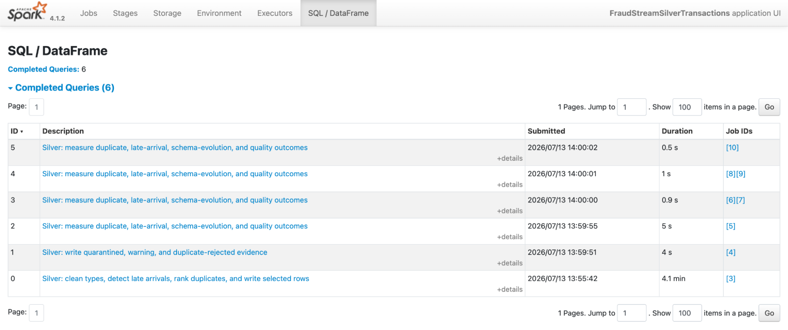
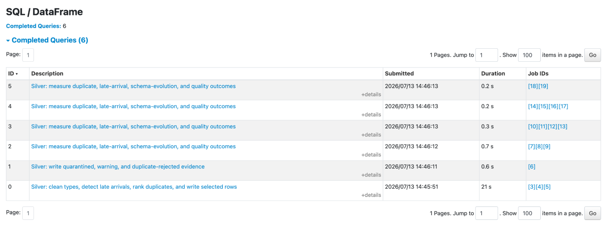
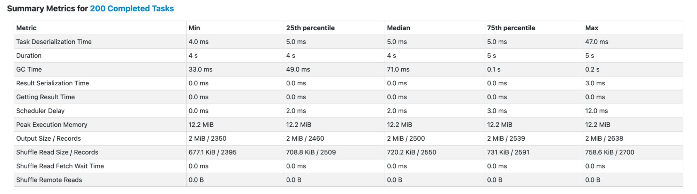
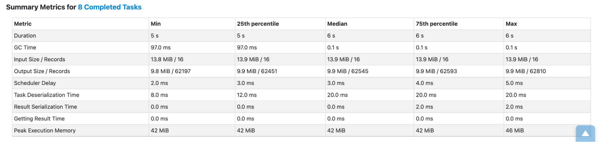

# Spark Silver Job Optimization

This benchmark optimizes the Silver transaction pipeline's most expensive work:

> Silver: clean types, detect late arrivals, rank duplicates, and write selected rows

The optimized configuration reduced the main SQL execution from **4.1 minutes to 21 seconds**—an **11.7x speedup** with the same input and output data.

## Configuration

| Setting | Baseline | Optimized |
|---|---:|---:|
| Adaptive Query Execution (AQE) | Disabled | Enabled |
| Shuffle partitions | 200 | 8 |
| Spark master | `local[4]` | `local[4]` |
| Bronze input rows | 510,000 | 510,000 |

The optimization combines two techniques:

1. **Enable AQE** so Spark can adjust the physical plan using runtime statistics.
2. **Right-size shuffle partitions** from the default 200 to 8 for a four-core local workload.

## Core Results

| Metric | Baseline | Optimized | Change |
|---|---:|---:|---:|
| Main SQL execution | 246 s | 21 s | **91.5% faster** |
| Speedup | 1.0x | **11.7x** | — |
| Shuffle-stage tasks | 200 | 8 | **96% fewer** |
| Approximate task waves on 4 cores | 50 | 2 | **25x fewer** |
| Median records per task | 2,500 | 62,545 | **25x more useful work** |
| Median peak execution memory per task | 12.2 MiB | 42 MiB | 3.4x higher |

### Baseline: 4.1-minute SQL execution

### Optimized: 21-second SQL execution

### Baseline shuffle: 200 small tasks

### Optimized shuffle: 8 larger tasks

## Why It Worked

The baseline did not show a major skew or garbage-collection problem. Its 200 tasks were balanced, but each processed only about 2,500 records. On `local[4]`, Spark needed roughly 50 waves to schedule them.

With 8 shuffle partitions, each task processed substantially more data and Spark completed the stage in about two waves. AQE then used runtime statistics to improve execution around the shuffle. The result was less scheduling and task-startup overhead while keeping all four cores busy.

The larger tasks used more memory, median peak execution memory rose from 12.2 MiB to 42 MiB, but the values remained small and balanced for this workload. This is the intended tradeoff: use a manageable amount of additional memory to eliminate excessive small-task overhead.

## Correctness Check

Performance tuning did not change the pipeline result:

| Output | Rows |
|---|---:|
| Bronze input | 510,000 |
| Silver selected transactions | 500,000 |
| Duplicate rows removed | 10,000 |
| Quality-evidence rows | 31,603 |

Because AQE and the partition count changed together, the **11.7x result measures their combined effect**. Isolating each technique would require separate AQE-only and partition-only benchmark runs.

## Conclusion

The important optimization was matching the shuffle design to the workload: **AQE enabled and 8 partitions for four local cores**. Spark processed fewer, more productive tasks and cut the dominant Silver transformation from **246 seconds to 21 seconds** without changing the data result.
